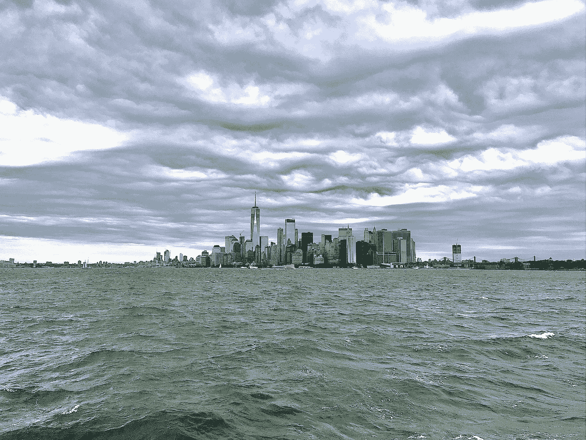

# 只有在纽约

> 原文：<https://medium.com/swlh/the-toll-of-living-life-in-nyc-929f8a733b5b>

## 作为一个大苹果城市人的代价

NYC Skyline on the Hudson / Photo by Sheri Heller

> 纽约能够运转是一个奇迹。整件事都不可信。~埃尔文·布鲁克斯·怀特

虽然我有美国和加拿大的双重国籍，但纽约一直是我的家。作为一个老派的“新纽约人”，我可以遗憾地证明，纽约已经失去了它的灵魂边缘。这些年来，我目睹了纽约市…