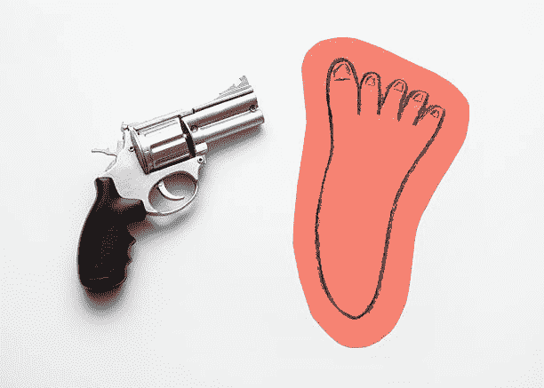
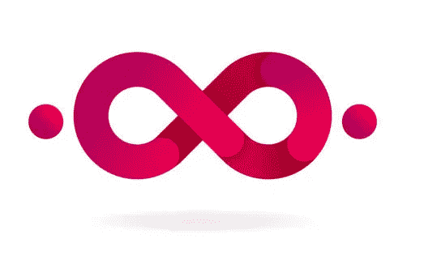
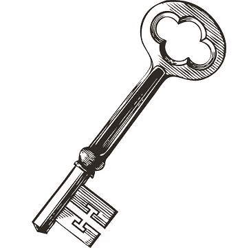

# 让你失去太多好客户的三大错误

> 原文：<https://medium.com/swlh/the-top-3-mistakes-that-cost-you-too-many-good-customers-52fdcdde0b76>

*我们在* [*保留设计*](https://www.retentiondesign.com/) *查看了 30 多个 SaaS 产品，以下是我们了解到的情况*

It’s kind of like shooting yourself in the foot

想象一下，你有两种选择:第一种——在 4 天内获得 100 万份产品注册。第二个——努力 16 个月，获得 100 万活跃用户。你会选择哪个选项？

你选择了第一个吗？你一定喜欢刺激。还记得“Yo”吗，一款在短短 4 天内就拥有 100 万用户的应用？他们早就走了。

你选择了第二个吗？你准备好真正为之努力了吗？Slack 的创始人超级努力地工作了 16 个月，让给他们机会的团队加入进来，让 Slack 成为他们合作方式中不可或缺的一部分，并获得了 100 万非常活跃和热情的用户。如你所知，Slack 已经存在了(这个想象环节是从 Des Traynor 那里借来的，他是 [Intercom](https://www.intercom.com/) 的创始人)。

那么，为什么在我们注册之后，艰苦的工作才真正开始呢？因为市场竞争超级激烈。你可能会问竞争有多激烈，竞争如此激烈，以至于在进入信用卡之前试用产品成为标准，在决定坚持使用哪种产品之前尝试多种承诺解决问题的产品也是如此。竞争如此激烈，以至于我们用户的收件箱里塞满了他们注册的所有产品的宣传活动，要引起他们的注意是极其困难的。竞争如此激烈，以至于每种产品都有替代品，转向竞争对手的障碍几乎不存在。底线是，你产品的成功取决于你能多好地留住你的顾客。

这正是我们[保留设计](http://retentiondesign.com)的专长，将精益的以用户为中心的设计方法应用于客户保留挑战。我们帮助我们的客户利用他们的用户数据和反馈来优化入职、试用到付费的转换并减少流失。

在研究和分析了 30 多种不同的 SaaS 产品后，我给你带来了 3 个最大的错误，这 3 个错误导致一个拥有伟大产品的伟大公司失去了他们努力争取的客户。不过，这也不全是坏事，也有大量的增长机会。

## **错误#1:在没有结束循环的情况下投入大量精力进行收购**

Close your acquisition loop

一家成长中的公司需要弄清楚如何面对潜在用户，这是完全有道理的。因此，很自然地，很多努力被投入到找出谁是最好的潜在客户，他们需要听到什么来给你的产品一个机会，他们正在处理什么样的问题，以及如何接近他们以使他们足够好奇来注册。

你对你的收购漏斗做过几十次优化吗？它包括你的入职流程吗？

**你的信息创造了期望，如果用户对产品的第一次体验与这些期望不一致，就会产生价值差距，使用户很快失去兴趣**。

例如，如果你向我承诺，只需 5 分钟，我就可以使用你的产品管理我所有的社交账户，我不会花半个小时来设置它。

你需要做的是缩小这个差距，确保你的产品在用户第一次使用它的时候就兑现你的承诺。他们需要从一开始就看到实现价值的直接途径。仅仅告诉他们价值是不够的，甚至告诉他们如何去实现它，我们需要带领他们去实现它。这并不总是简单的，尤其是对于复杂的软件产品和支持许多不同用例的产品。但是大幅减少第一次会议的流失率是值得的。

如果每天都有成百上千的新用户注册，那就太好了。但是在他们的第一次治疗中你失去了多少？又有多少成为付费客户？如果你只是接受 85%的流失率，那你就错过了一个巨大的增长机会。

## **错误 2:锁定对你最重要功能的访问**

Unlock your most important features

这让我大吃一惊，有些产品邀请我免费试用(不需要信用卡)，但不允许我在试用期间体验价值。

例如，一个视频创作平台让我经历整个视频创作过程，但不让我下载或分享我的第一个标准网络分辨率的视频，除非我付费。这就造成了一个尴尬的局面，一个尝试产品的新用户投入了时间和精力，而在这个过程的最后却遭到了伏击——报酬或者你所做的工作付之东流。这不是我们想让新用户进入的情况，即使我们成功地转化了他们，这个过程也很可能以不愉快和流失告终。

限制你的产品使用的正确时间是在用户开始体验到它的价值之后。以 [Typeform](https://www.typeform.com/) 为例，它是谷歌表单的付费替代品。作为一个 Typeform 用户，我可以创建一个调查，标记它，发布它，并开始得到回应，所有这些都在我支付一美元之前。一旦我达到第 100 个响应，这意味着我肯定得到了价值，只有这样我才会被要求付款。到那时，为其付费的决定是显而易见的。

所有功能都可用，但试用期太短而无法体验价值的产品试用也有同样的问题。你的用户的价值之路是怎样的？他们需要使用哪些功能来实现这一目标？你已经成功的客户花了多长时间？

如果你不知道这些问题的答案，那就是一个成长的机会。

## **错误 3:以同样的方式对待所有新用户**

No one-size-fits-all onboarding sequences

让我问你，你有在注册后的第 1、3、5 天发给新用户的入职邮件序列吗？你的打开率有多高？他们对你的应用产生了多大的参与度？

即使你的内容很棒，一刀切的入职顺序的问题是它缺乏背景。当我收到一封解释如何做我昨天做的事情的电子邮件时，或者如果我仍在配置产品时被关于高级功能的电子邮件轰炸，这些电子邮件对我来说没有价值，它们只是我邮箱中的白噪音。

不要做白噪音，有各种各样的工具可以帮助你在正确的上下文中发送电子邮件，使用触发器。收到一封电子邮件，解释如何做我刚刚陷入困境的事情，或者如果我失去了动力，我应该在产品上采取什么下一步措施，这是有价值的。

那么，你如何知道发送什么以及什么时候促使你的用户采取行动呢？首先，您需要规划用户体验产品价值所需经历的步骤，并为每一步准备高度集中的内容，通过简单的行动号召帮助他们进入下一步。剩下的就是集成一个由用户行为触发的发送电子邮件的解决方案，看着你的新用户参与度飙升。

**让我们乐观地总结一下**

如果你认同这些错误中的一个或多个，你就在好公司里。是的，这意味着你的营销资金没有发挥出全部潜力。但这也意味着你有巨大的增长机会，明天早上你就可以开始释放。

那么从哪里开始呢？去看看你的新用户的第一次会话。没有比把所有人聚集在一起，做爆米花，看着你的用户奋斗更好的团队活动了。你不会相信你能获得多少突破性的见解。

*本文原载于*[*【RetentionDesign.com】*](https://retentiondesign.com/)

## 这篇文章发表在 [The Startup](https://medium.com/swlh) 上，这是 Medium 最大的创业刊物，有+421，678 人关注。

## 订阅接收[我们的头条新闻](https://growthsupply.com/the-startup-newsletter/)。

