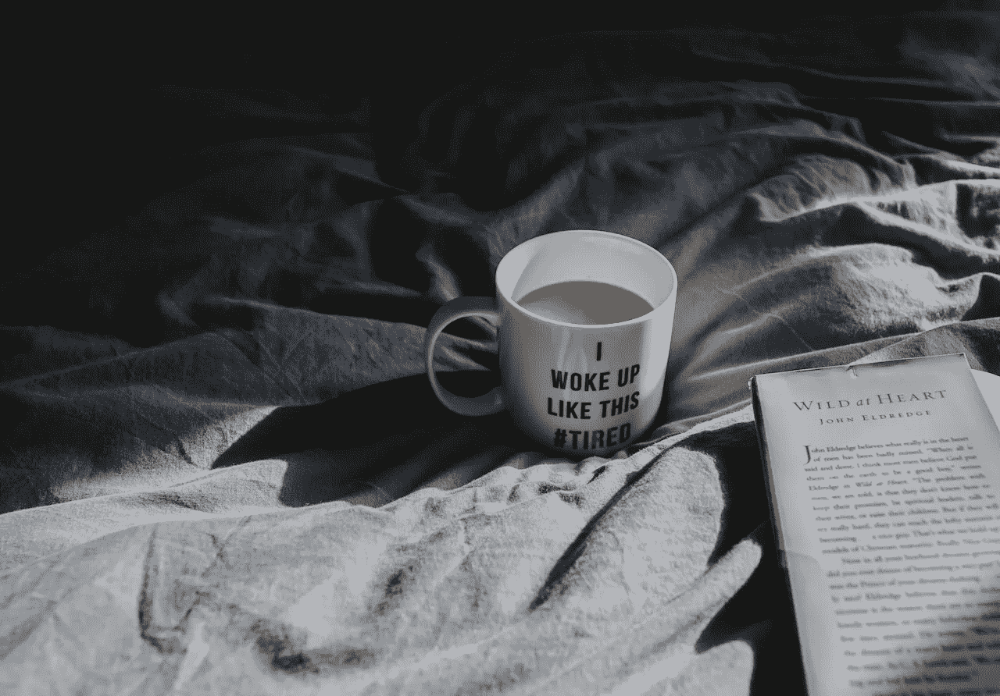
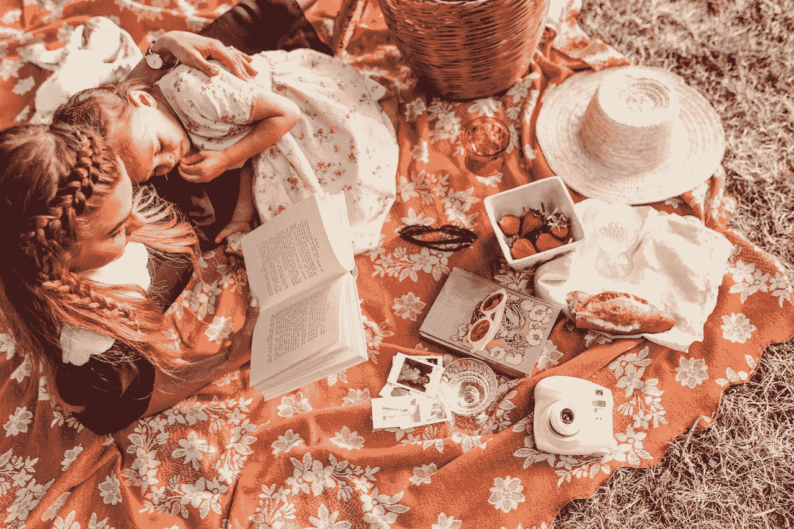
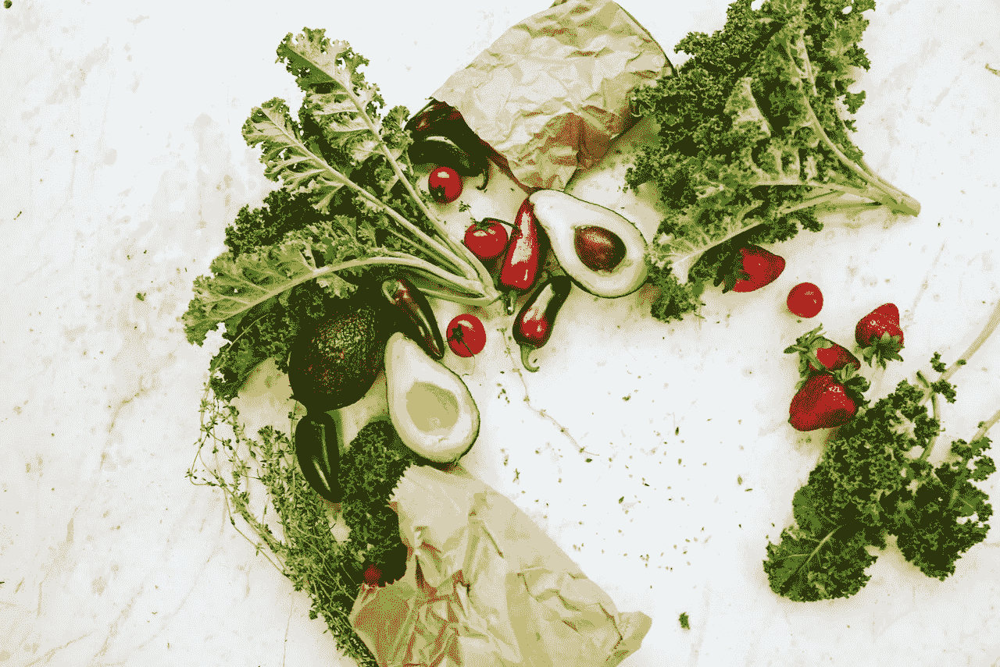
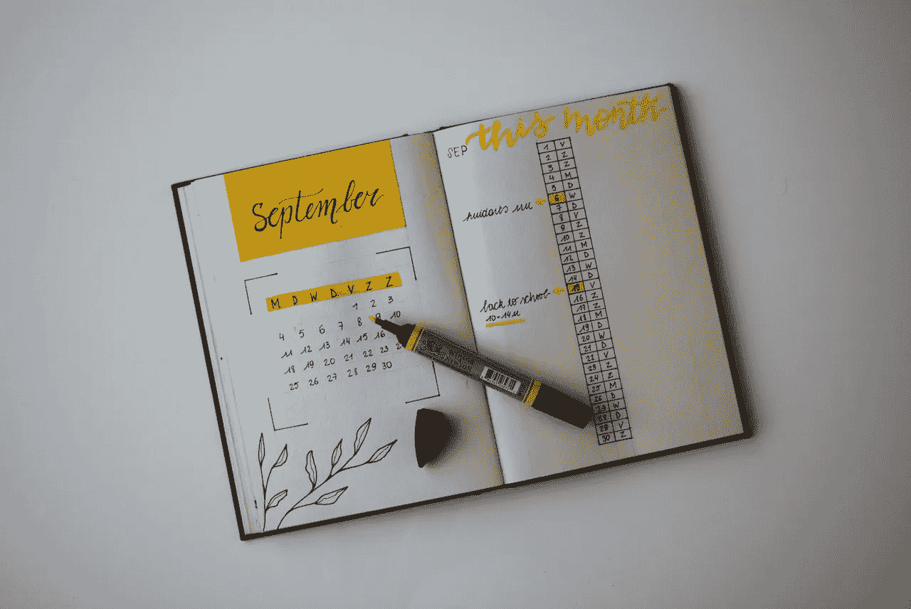
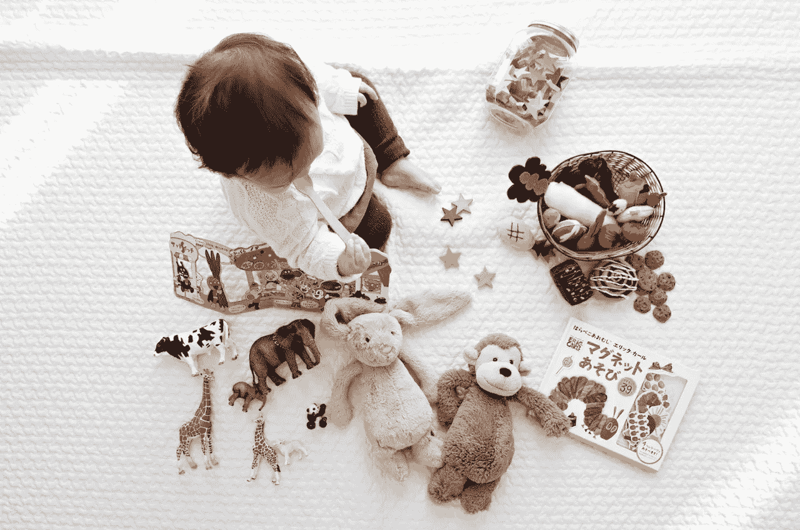

# 如何瞬间消除压力的四大秘诀

> 原文：<https://medium.com/swlh/the-top-4-tips-on-how-to-obliterate-stress-instantly-20e94573ea97>

## 让养育(和生活)成为一种快乐的经历

你不需要努力去寻找我们现代生活中所有这些压力的来源。任何导致压力的东西都是我们所说的“压力源”，它们无时无刻不在我们身边。有些是身体上的，有些是精神上的。

想想你开始一天的方式:被漆黑的夜色惊醒，被哔哔声吵醒。你知道吗，我们选择用哔哔声报警是因为这听起来不自然。这意味着大脑发出红色警报，并通过向你的身体释放皮质醇和肾上腺素来发出恐慌信号。你才刚睡醒，可能已经患了颈部扭伤！

或者也许你是一位家长，你被你尖叫的孩子吵醒，而外面仍然是黑暗的，你睡得很熟，仍然在快速眼动阶段。

然后你匆忙做好准备，心跳加速，担心如果迟到会发生什么——也许害怕那天在办公室需要处理的任何有压力的事情。然后你出发去上班，人们从你身边挤过去，向你走来。喇叭响着，浓烟弥漫在空气中，明亮的广告牌在你眼前闪烁。所有这些事情都在争夺你的注意力。所有这些都会引发更多兴奋性神经递质的峰值。

在工作中，你无疑需要应对办公室政治、最后期限、人们在电话中对你大喊大叫……如果你做得不好，就有可能丢掉工作，这些都随时笼罩着你。与此同时，你沐浴的非自然光线会引发更多的兴奋，没有维生素 D 和新鲜空气的滋养作用。

或者你是一个全职妈妈？在这种情况下，你的一天将围绕着回应孩子的尖叫和哭喊，在这期间努力保持房子整洁，在炎热的厨房里做饭，担心账单…

与此同时，当我们试图“放松”时，我们参与的大多数活动都包括观看闪烁的灯光和人们打架的图像。当我们翻阅杂志时，我们发现自己不断受到压力，要看起来更好，表现更好，花更多的钱。甚至在脸书也有很多人投射出一种虚假的成功形象——一种我们感到有压力去实现的形象。

我已经描述了一幅相当悲观的画面，描述了一些(很多？)我们过着自己的生活，但好消息是，我们有办法摆脱这种消极思想和行为的窠臼。

每当我感到不知所措的时候，我都会相信下面这些建议:

**拔下**

偶尔拔掉电源插头并关机也是享受更平静、压力更小的生活的好方法。屏幕的本质意味着它们会引发压力荷尔蒙皮质醇的释放。不仅如此，这些进入他人生活的入口给了我们不满和不断前进的感觉。如果你能花些时间远离屏幕和机器，你会发现更容易欣赏你已经拥有的，并找到其他方式来娱乐。

这在睡前变得尤其重要。因此，虽然完全不使用手机或其他小工具可能不容易，但你至少应该考虑在睡觉前有一个小时的“无手机区”。这对你的康复有很大的影响。

**回到基础**

锻炼、新鲜空气、营养、睡眠……所有这些对你感觉最佳都至关重要。不仅仅是因为锻炼会引发像血清素这样感觉良好的激素的短期释放，不仅仅是因为摆脱痛苦和充满活力的感觉很好，还因为健康实际上支持长期的平静。你知道调节我们食欲和体重的激素(如甲状腺激素和生长素)和控制我们情绪的激素之间有密切的联系吗？

全面考虑你的健康状况——如果你想表现最好，感觉最好，你需要从里到外净化自己。随着你冥想的改善，试着逐渐去除那些让你不健康的东西，给你的生活带来越来越多积极的改变。

**更少的东西，更多的空间**

我们受资本主义和商业主义的驱使，试图尽可能多地积累“东西”。我们通过购买我们在杂志上看到的东西，以及对 Instagram 上的图片的渴望来做到这一点。

但是你花的越多，你给生活带来的压力就越大。你拥有的越多，你就会觉得越需要。你越想那些你*没有的东西，你就越会错过你现在拥有的机会。*

你真的需要宽屏电视吗？它真的会让你的生活变得更好吗，还是你被聪明的营销和社会说服了？如果你不买电视，你在银行有更多的钱，让你安心。而且，你可以少花一点时间坐在它面前，多花一点时间和家人在户外玩耍或者看书。

仔细检查你的物品，想想你真正需要什么，不需要什么。扔掉一些物品将意味着更少的清洁，更少的工作，和一个更整洁，更平静的环境。

**把孩子当成主人**

孩子们对压力一无所知，他们知道如何毫无羞耻地说出自己的需求，他们需要食物和爱来感受纯粹的快乐并茁壮成长。如果我愿意在场并倾听，我总是对我的小爱每天教给我的美好事物感到惊讶。她教育我自爱，现在的重要性，以及玩耍应该如何成为我们日常活动的一部分。她移动身体直到她累了，吃到饱了，每当她需要一个温暖的拥抱时就拥抱，没有判断或比较。

我们最近去度假，我们租了一个小房子，后院有一个沙坑；里面有一个粉红色的桶，我的宝宝花了半天时间玩它，被沙子和泥土拥抱，在她自己没有判断的环境中快乐。你还记得上一次你经历同样的事情吗？