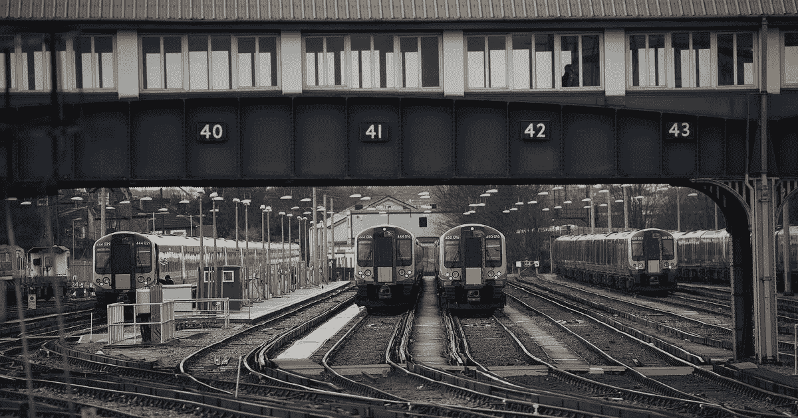

# 疲劳对你生活的有害影响

> 原文：<https://medium.com/swlh/the-toxic-effect-of-fatigue-on-your-life-75a4bc3b1c3e>

## 为什么筋疲力尽不是一种酷的生活方式

Clapham Junction ([GETTY IMAGES](https://www.gettyimages.in/photos/ben-stansall))

1988 年 12 月 12 日早上，伦敦的人们开始上班。这将是办公室新的一天。至少他们是这么认为的。

上午 8 点刚过，伦敦消防队的绿色观察通过电传打字机收到两条紧急信息。第一条写道,“这是一个重大事件——”