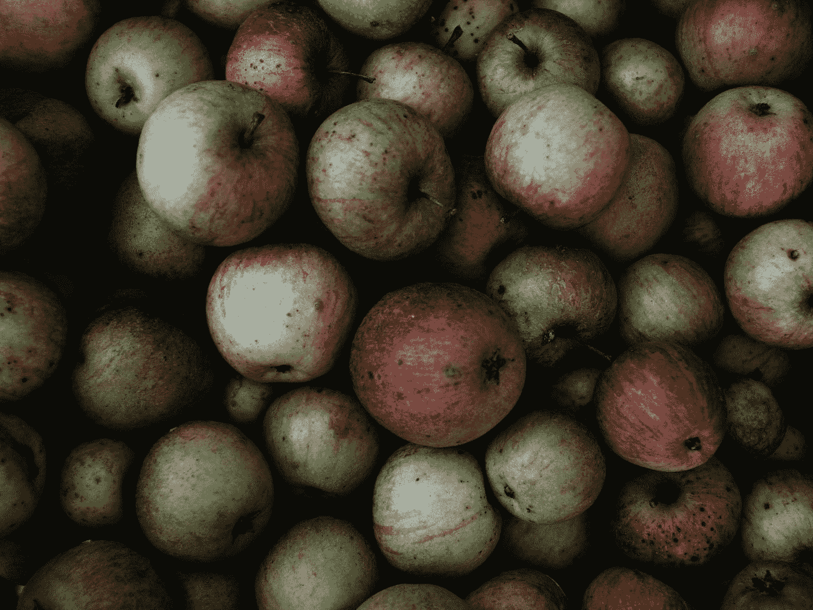

# 泛化的有毒全球灾难

> 原文：<https://medium.com/swlh/the-toxic-global-disaster-of-generalization-b582bf299a58>

Photo by [Nonki Azariah](https://unsplash.com/@nonki_azariah?utm_source=medium&utm_medium=referral) on [Unsplash](https://unsplash.com?utm_source=medium&utm_medium=referral)

如果每个人都停止概括，我们的世界会变成什么样？

有一天晚上，我和我的搭档坐在电视机前，看一个叫《北森林法律》的节目。他每周都会看几个晚上，而我会忽略它，玩我的手机。有时当他们营救小动物时，我会很感兴趣，但通常我会花一个小时翻白眼，就像戴夫口头推测的那样…