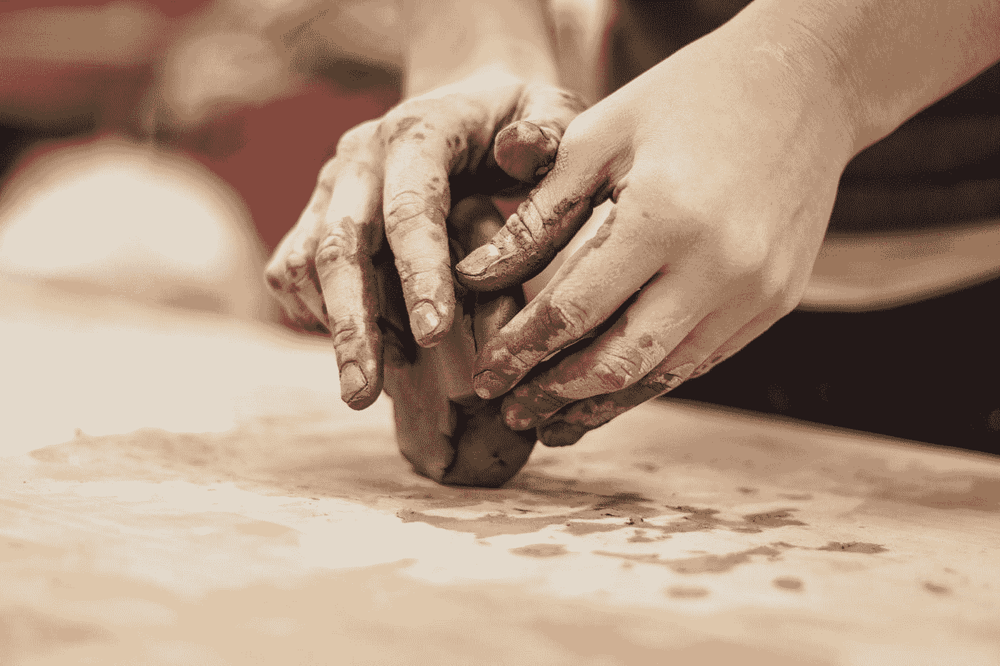

# 创造力的问题

> 原文：<https://medium.com/swlh/the-trouble-with-creativity-5002b056fbef>

## 你对新想法的沉迷是如何伤害你的。

Photo by [Alex Jones](https://unsplash.com/@alexjones?utm_source=medium&utm_medium=referral) on [Unsplash](https://unsplash.com?utm_source=medium&utm_medium=referral)

你不能不爱创意人员。创意者喜欢创意。有能力想出绝妙的解决方案，想象新的可能性，无中生有。从一口看似无底的井中获取一个又一个想法。最优秀的创造力是一件快乐的事情。