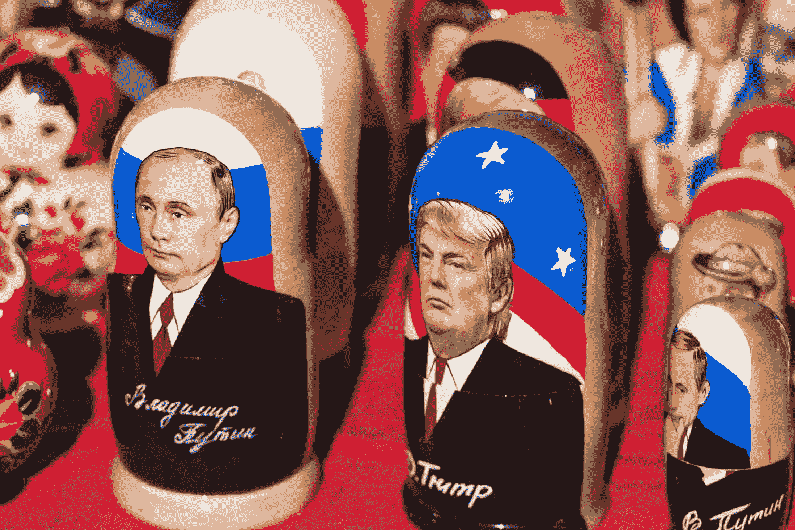

# 特朗普金融成功的真相

> 原文：<https://medium.com/swlh/the-truth-about-trumps-financial-success-b7892896fa72>

简单的数学证明唐纳德·特朗普不是商业天才。

Photo by [Jørgen Håland](https://unsplash.com/@jhaland?utm_source=medium&utm_medium=referral) on [Unsplash](https://unsplash.com?utm_source=medium&utm_medium=referral)

唐纳德·特朗普成年后一直将自己标榜为一名成功的商人。我记得看过一季《名人学徒》。我记得我当时认为整场演出是一场闹剧。教皮尔斯·摩根、吉恩·西蒙斯和崔斯·阿德金斯在曼哈顿街头卖辣椒的想法，以及这个教训将…