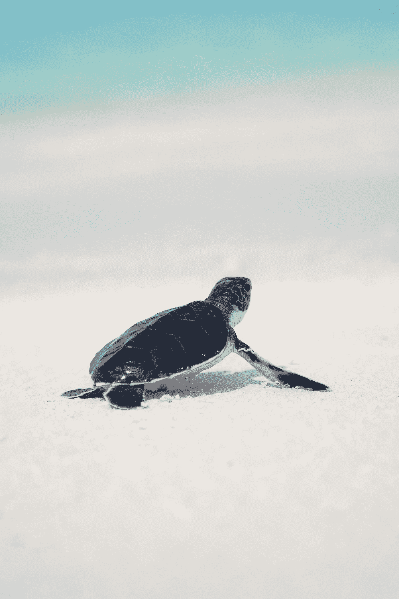

# 乌龟在写作生活中赢得了比赛。

> 原文：<https://medium.com/swlh/the-turtle-wins-the-race-in-the-writing-life-d3cfd456159f>

## 我喜欢做一只乌龟。

Photo by [jcob nasyr](https://unsplash.com/@j_cobnasyr1?utm_source=medium&utm_medium=referral) on [Unsplash](https://unsplash.com?utm_source=medium&utm_medium=referral)

## 我从来不认为写作生活是一种竞赛。我不介意缓慢稳定的向上攀登。

我读了足够多关于著名作家和作者的书。我知道这是一生的承诺。