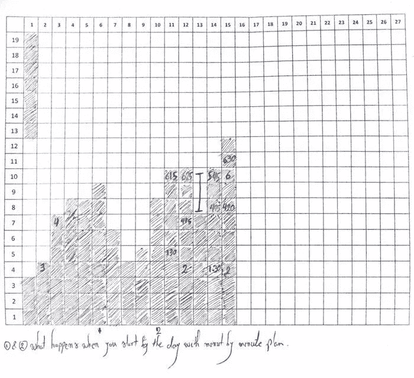

# 衡量你的生产力(并不断提高生产力)的两个最佳策略

> 原文：<https://medium.com/swlh/the-two-best-strategies-to-measure-your-productivity-and-constantly-increase-it-7af1ddb5333f>

你认为你认识的最有效率的人和其他人的区别是什么？

这里有两条线索，来自我所知道的*和*两个最有生产力的人:

> “我认为这是唯一最好的建议:不断思考如何才能把事情做得更好，并质疑自己。”——埃隆·马斯克

这是克里斯·布雷利的第二个观点，他是 [*生产力项目*](https://alifeofproductivity.com/the-productivity-project/) *:* 的作者

> 最有效率的人与其他人的区别在于，他们每周都进行路线修正，以逐渐提高他们所做的每一件事。——(由我强调。)

因此，答案似乎显而易见:**不断改变你的工作程序，看看它们如何影响你的工作效率。**

但是这里缺少了一些关键的东西。

你如何衡量自己的生产力？如果你在日常生活中做了一些改变——比如更早醒来——你如何客观地知道**它是提高了还是降低了你的生产力？**

**正如管理大师彼得·德鲁克所说:**

> ****如果你能**不能**衡量它，你就不能提高它**。**

**以下是衡量你工作效率的最佳方法，有助于你不断改进。**

# **衡量你工作效率的两个策略**

**在我寻求[提高我的生产力](https://livelikepros.com/massive-productivity/)的过程中，我发现了两个有用的方法来帮助我以一种切实的方式衡量它:**

1.  ****跟踪里程碑:**比如一个月要写的文章数量。**
2.  ****追踪完成里程碑所花费的时间:**例如，你可以追踪你写这些文章所花费的总时间。**

**但是，哪一个是衡量生产率的更好方法呢？**

**这个问题困扰了我很久，直到我发现:**

**这取决于你的目标或任务的性质**

## **1.什么时候通过跟踪里程碑来衡量生产力？**

**要知道跟踪里程碑是否是一个好的衡量标准，问自己这个简单的问题:**

****是我要完成的任务，*可预见*？****

**如果你对任务很有经验，而且任务有 ***很少的未知*** (比如写一篇文章，或者搜集销售数据等。)，那么如果你追踪里程碑，你会对自己的工作效率有更多的感觉。**

**例如，你知道，写一篇文章是你可以在有限的时间内完成的事情。因此，**你可以用你完成的文章的*号*作为衡量生产力的标尺。****

**既然你知道了如何衡量你的生产力，你可以开始尝试不同的方法，看看哪些有效，哪些无效。**

**这里有一个例子:**

## **关于我如何使用里程碑来衡量和提高我的生产力的案例研究**

**当[我开始我的博客](https://livelikepros.com)时，我每个月会写 3-4 篇文章。所以我决定采纳埃隆·马斯克的建议，努力提高效率。**

**以下是我用来提高工作效率的简单方法。多亏了我的衡量标准(每月撰写的文章数量)，我可以衡量和判断黑客是否成功:**

1.  **最初，我会在 8:30 下班回家。然后，我会吃晚饭，然后小睡 20 分钟(按小时收费)。醒来后，我会开始写作(从 9:15)直到晚上 12:00。这样，我每个月会写 3-4 篇文章。**
2.  **然后我开始改变事情。我决定睡觉(大约晚上 9:30)而不是睡午觉醒来开始写作，而是在早上 5:00 醒来开始写作。我自豪地认为这是多么了不起的一步棋。但是没有用。在我遵循这个方法的一个月里，我只写了两篇文章。**
3.  **我尝试的第三种方法，让我的生产力有了巨大的飞跃。我通常在晚上 7 点结束工作。作为改变，我决定下午 6 点离开。同样，我会回到家，吃晚饭后小睡一会儿，然后开始写作。但是，提前一个小时下班，会有很大的不同。在我尝试这种方法的那个月，我写了 6 篇文章。**

**这就是为什么我相信 ***不断提高生产率*** 的基石是一个坚实的系统来衡量它。**

**但是使用里程碑来衡量生产力有一个微妙的问题。**

**假设你的目标是证明一个新的数学公式或者理解爱因斯坦的相对论。**

**在这种情况下，你如何知道自己是有成效的，你如何客观地衡量它？**

## **2.何时通过跟踪达到里程碑的时间来衡量生产力？**

**像前面的方法一样，要知道你是否必须记录你的时间，你必须问这个问题:**

****我要完成的任务，*是可预测的*？****

**如果答案是否定的，如果你记录下完成任务的时间，你会对自己的效率有更好的感觉。**

**这也是畅销书《深度工作》的作者卡尔·纽波特遵循的一种方式:**

> **跟踪时间的好处是，[……]我追求的许多重要但不紧急的项目是不能强迫的。例如，我可以承诺在一周内完成一个证明，但这并不意味着我会成功。有些证明永远不会在一起；有些需要几个月(或几年)；其他人很快就倒下了。很难预测。**

**根据经验，如果你的任务有大量的 ***未知和不确定性，*** 你可以通过 ***跟踪在上面努力工作的时间*** 来衡量你的生产力。对我来说，这样的任务是解决一个编程问题，发现一个应用程序中的漏洞，或者为一篇学术论文做研究，等等。**

**这就是你如何实际使用这个测量系统:**

## **关于我如何使用时间追踪来衡量和提高我的工作效率的案例研究**

**为了提高我职业生涯的效率，我通常会追踪我专注时间的持续时间。以下是我用于此目的的表格:**

****

**Tracking Time Towards Finishing Tasks as A Measure of Productivity**

**纵轴是小时(每个方块代表 30 分钟的集中工作)。横轴是一个月中的每一天。**

**我每天的目标是让彩条越来越高(我发现这也是一种激励)。然后，我改变我的工作程序，看看是什么让条形增长。**

**你看到横轴上的数字 1 和 2 了吗？在这两点上，我注意到我的效率提高了，我记下了这些天我做了哪些不同的事情。**

**在这些情况下，我尝试的不同方法是通过计划一天中的每一分钟来开始我的一天。尽管我持怀疑态度，但事实证明它非常有效。(我以前写过写下你的意图和预先承诺的惊人力量[。)](https://livelikepros.com/willpower-technique-that-works-100-times/)**

**这不是跟踪里程碑或时间的全部。**

**除了是完美的测量设备之外，两者还有其他好处。**

**举例来说，追踪里程碑的好处是随之而来的一种冲动，促使你奋力拼搏，直到完成任务。**

**每当我的一项任务(可预见的)陷入停滞或陷入拖延，给它一个期限几乎可以确保我完成它。**

**但是在设定最后期限的背后隐藏着一种邪恶。**

**如果你的任务处于未知领域(比如为一个数学公式寻找证据)，并且你为它设定了一个期限，你很可能会拖延去做(我们的大脑讨厌模糊)。**

**这就是时间追踪的用处。**

**用卡尔·纽波特的话说:**

> **跟踪时间至少可以确保这些项目占用我很大一部分时间，即使我无法预测什么时候完成。**

**我相信几乎任何人都可以判断一项任务属于哪一类，这就告诉你如何衡量和优化它的执行。**

****