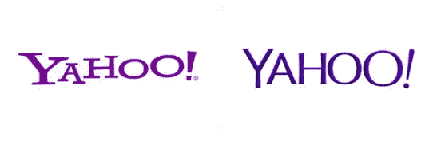

# 一个更新标志的暴政

> 原文：<https://medium.com/swlh/the-tyranny-of-an-updated-logo-ff317e1807cc>

您的虚拟工作空间刚刚进行了改进。流行的工作场所聊天应用 Slack [现在有了新的标志](https://slackhq.com/say-hello-new-logo)。熟悉的哈希标志现在被重新设计的版本取代，保留了原来的配色方案。

虽然 Slack 自己一直在说它真的需要改变，因为旧的 logo 在不同的平台上不连贯，它有 11 种不同的颜色，新的 logo 象征着 Slack 的“简单易用”，但更有趣的是全球用户对这一变化的反应。

一些人批评设计的“简单”，一些人把它比作鸭子，一些人做了更粗糙的比较。尽管有些人在盯着它看了几分钟后觉得自己有点喜欢它，但人们的反应大多是负面的。

Slack 并不是第一个因商标重新设计而受到批评的受害者。自从品牌在 1885 年左右在 T2 某处出现以来，它们就一直呈现出负面接受的标志。但有趣的是，一个标志通常不会像它被改变时那样获得那么多的关注，而且这种改变不会被接受。

## 大众受害者

雅虎也许是重新设计失败的最受欢迎的受害者。主要是因为它太小题大做了——事实上，它创造了一个 30 天倒计时，只为[带来一个失望](https://www.underconsideration.com/brandnew/archives/new_logo_for_yahoo_designed_in-house.php)。新标志本身并不坏，但它远不如新标志和品牌本身的定位那样令人兴奋。

Gap 做了完全相反的事情。它在没有任何警告的情况下改变了它的标志。这很糟糕——人们反应强烈。该品牌不得不解释说，该标志是众包，没有什么是最终决定。仅仅面对了 6 天的批评，它就恢复了旧的标志性标志，就像什么都没发生过一样。所有这些花费了 1 亿美元。

然后我们有所有品牌的牛津词典，他们设法搞砸了一个完美的商标。它放弃了其经典的商业感觉，为一个明显旨在吸引 Twitter 人群的标志让路，不知道牛津不是他们寻找定义的字典。

## 为什么需要改变？

最终，问题出现了，为什么品牌会花这么多钱去改造完美的商标，甚至在受到批评时会很快恢复原样。为什么标志重新设计很重要？

这个问题的答案可能和[为什么标识很重要](https://www.bbc.com/news/business-32495854)一样，或者至少是相关的。

> 标志对你的品牌形象很重要。他们给消费者一个符号，甚至不需要知道它的名字，就可以被识别并与你的品牌联系在一起。

如果你还没有一个好的商标，你应该开始行动了。

但是如果你真的有一个，你需要确保它与你的企业发展方向相关。随着你探索新的市场，你的公司发生变化和扩张，你的品牌形象也需要重组——包括标志。也许竞争太激烈了，他们都有相似的商标。或者你的生活永远都是一样的，你只是想要改变(耐克不同意)。甚至 Slack 的推理也站得住脚。

真正让这种改变有价值的是，新的标志应该比它的前身更好。

## 失败可以避免吗？

这样的问题在这样的创意领域永远不可能有直接的答案。艺术是主观的。吸引 Slack 商标重新设计的决策者的肯定不是互联网。

通常有两种方法来解决这个问题——刷新或重新设计。动物星球在 2018 年彻底更换了它的标志，但可口可乐公司只是偶尔调整一下标志，以保持原有的外观。

刷新当然是一个更安全的行动过程，如果你决定修改它，它会让你尝到预期的滋味。但是如果你在寻找一个新的身份，[重新设计它就是](https://99designs.com/blog/tips/logo-redesign/)。创建几个不同的版本以获得更好的选择效果最好，尽可能多地征求意见也是如此——但肯定有比雅虎更好的方式来做到这一点。或者懈怠。

## 这篇文章发表在[《创业](https://medium.com/swlh)》上，这是 Medium 最大的创业刊物，有+412，714 人关注。

## 在这里订阅接收[我们的头条新闻](http://growthsupply.com/the-startup-newsletter/)。

