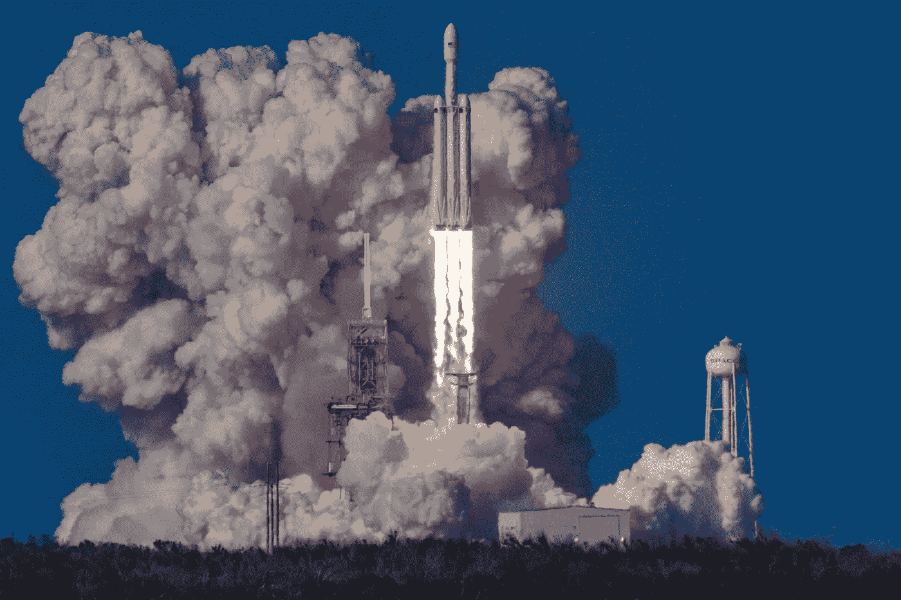

# 太空探索丑陋的一面

> 原文：<https://medium.com/swlh/the-ugly-side-of-space-exploration-973c531c651c>

## 我们可能不想谈论它；尽管如此，它还是发生了。在我们解决它之前，我们需要承认它。

Photo by Bill Jelen on Unsplash

我们正处于太空探索的新黄金时代，政府和私营企业都在争夺未来太空的位置。NASA 刚刚宣布了重返月球的 Artemis 计划，并且…