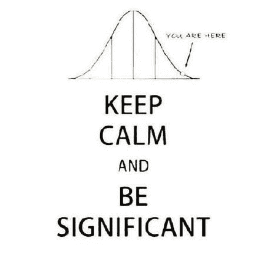

# A/B 测试终极指南。第一部分:实验设计

> 原文：<https://medium.com/swlh/the-ultimate-guide-to-a-b-testing-part-1-experiment-design-8315a2470c63>

A/B 测试是一种非常流行的技术，用于检查产品中的细微变化，而不会错误地考虑由外部因素引起的变化。在这一系列的文章中，我将尝试给出一个简单的关于如何设计、运行和评估 a/b 测试结果的操作手册，这样你就可以得到这些惊人的统计显著结果了！