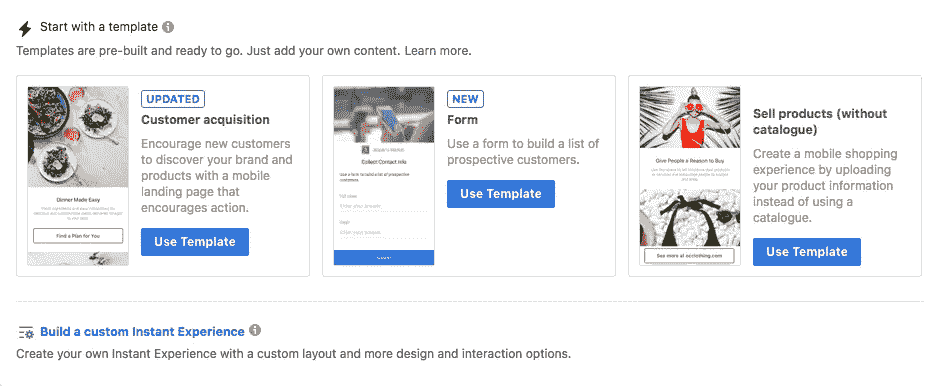

# 脸书终极指南(广告突破性更新)即时体验

> 原文：<https://medium.com/swlh/the-ultimate-guide-to-facebook-ads-ground-breaking-update-instant-experiences-3b2533beafd7>

如果你来这里是希望得到另一份即时文章指南，那你来错地方了。

本指南是关于脸书广告的一个突破性的补充。这是关于增加转化率，提高你的品牌知名度，成为一个全面的数字先锋。

即时体验。记住名称(并记住你在哪里学会如何使用它们)。

我们今天将深入学习，如果你再逗留 5-10 分钟，你将会学到很多非常有价值的东西，我真的迫不及待地想和你分享。

让我们先弄清楚一个(可能)就在你嘴边的问题…

# 什么是脸书即时体验？

在我深入自己的定义之前，脸书是这样描述即时体验的:

> 即时体验是一种全屏体验，当有人在移动设备上与您的广告进行交互后就会打开。创造即时体验，让你的品牌、产品和服务变得鲜活起来。

虽然这种描述解释了基本原理，但它并没有为营销人员和数字广告商带来最大的优势。毕竟任何有外链的广告都会为观众开启全屏体验。

也就是说，这是我自己的即时体验描述:

> 即时体验是将流量导向脸书平台上建立和托管的登陆页面的广告。“它们的加载速度比外部网站快 15 倍，完全可定制，看起来非常时尚，可以承载任何形式的内容(视频、照片、表格、目录)，并且完全是为移动用户设计的。”

现在，在我失去大约 33%的读者之前(因为他们懒得建立自己的脸书登陆页面),让我澄清一下，脸书已经建立了他们自己的可定制的即时体验模板，使他们非常容易从零开始建立(块插入),针对移动用户，最重要的是…

…一切都是完全可追踪的。是的，这意味着您可以使用您的 [*像素*](https://www.einsteinmarketer.com/must-have-facebook-pixel/) 来分析、优化和重新定位与您的即时体验互动的任何人！

# 为什么我对脸书即时体验如此兴奋？

到目前为止，你可能已经注意到这个指南有一种儿童在糖果店的风格，这是有原因的。

所有迹象都表明脸书即时体验是大赢家，到目前为止(没有冒险)，我们已经取得了巨大的成果。

让我解释一下。

移动设备现在是互联网使用最多的设备，占全球份额 (2018 年全年)的 52.2%，预计这一数字将会上升(到 2019 年底)。

在手机上使用互联网的便利性、可访问性和移动性(线索在标题中)已经将大部分市场从桌面上移走。

脸书即时体验是专门为这个市场设计的，使其成为广告商渴望已久的广告功能。

在这个阶段，你们中的一些人可能会指出你们的网站是移动优化的，所以让我们仔细看看即时体验的巨大优势。

# 装载速度

有很多(不同的)统计数据解释了加载速度的重要性。在这种场合，我打算把我们的信任寄托在 [*谷歌*](http://google.com/) 上:

> 随着页面加载时间从 1 秒增加到 5 秒，反弹的可能性增加了 90%

这意味着你可以花几个小时来创建、分析和优化你的广告，但是如果你的登陆页面很慢，大多数点击你的广告的人将永远不会真正到达你的网站。

一个即时体验广告否定了这个问题。页面加载速度提高了 15 倍，让即时体验变得非常…即时。

# 针对移动设备优化

这一点可能会引起一些争议。我知道大多数网站所有者都有一个被贴上“移动优化”标签的网站。

然而，这些网站并不是纯粹为手机而建的。事实上，我敢打赌，你们中 99.9%的人都在桌面上设计过自己的网站(事后想到了移动)。

这意味着，许多笨重，负载繁重的页面功能被转移到您的移动优化网站上，仍然存在。尽管你可能认为你的网站很漂亮，但它并不是专门为移动用户设计的。

你的设计、加载速度和按钮间距都是许多移动优化网站无法完美呈现的特征。所有这些都导致了糟糕的用户体验(UX)、高跳出率以及最终的挫败感。

另一个由即时体验解决的问题。

# 像素跟踪

脸书允许广告商用脸书像素追踪和分析他们的广告，这一事实使他们成为一个真正可行的选择。

即时体验是帆布广告的更新版本。你们中的许多人已经在脸书做了很多年的广告，但是仍然没有使用过画布广告。这是因为他们没有实现像素跟踪。

分析和优化的能力是普通营销人员与伟大营销人员的区别，有了即时体验，你也可以达到那个水平。

# 可定制的全屏和多种内容格式

与(许多人的)最初反应相反，即时体验是完全可定制的，为广告商提供全屏登陆页面(看起来不像是由 [*【脸书】*](http://facebook.com/einsteinmarketer) )并且可以保存照片、视频、文本、传送带、产品目录、引导表格…

…只要你说得出，你的即时体验就能做到。

即时体验的多样性和高质量与它们简单的构建功能相结合，使它们成为任何向移动用户显示广告的人的最佳选择。

# 什么时候可以使用即时体验？

即时体验只能显示给移动用户。所以，如果你只在桌面上运行广告，那么你应该完全忽略这篇文章中的所有内容(同时承认你错过了超过 50%的潜在市场)。

除了这一仅限移动设备的规则，新的移动广告功能只能在使用某些脸书广告活动目标时使用。它们是:

*   交通
*   品牌知名度
*   到达
*   约会
*   转换策略
*   视频视图
*   商店参观
*   应用安装

如果你对脸书的广告活动目标一无所知，一直盲目点击“提升帖子”按钮(基本上是扔掉你的钱)，或者仍在了解脸书的广告，你需要阅读[*2019 年脸书广告活动目标终极指南*](https://www.einsteinmarketer.com/facebook-ad-campaign-objectives/) 。

任何了解脸书广告的人都会明白，即时体验可以在营销漏斗的任何阶段实施(纯粹通过阅读广告目标)。

# 哪里可以找到即时体验？

在这一点上，我需要做一个跳跃，假设你有一个脸书业务经理账户(如果你没有， [*点击这里*](https://www.einsteinmarketer.com/facebook-business-manager-create-account/) )，你知道如何找到并建立一个脸书广告(创建一个活动)。

在“活动”或“广告系列”部分，您无需做任何特殊或不同的事情。像往常一样，选择最合适的目标(只要它在即时体验列表中)，瞄准合适的受众，设置您的位置，并输入您的预算和时间表。

准备好之后，向下移动到“广告”部分，您需要选择“创建广告”:

向下移动到“格式”部分(在“广告”下)，找到“添加即时体验”复选框:

选择此选项后，它将打开您的即时体验模板和选项门户。

在这一部分的顶部，您会注意到“创建新的”或“使用现有的”选项，这意味着您可以创建自己的模板并为不同的广告进行编辑(在未来)。

# 即时体验模板(和可定制选项)

在您的即时体验菜单中有三个模板选项。这些将取决于您的活动目标。如果您选择“品牌知名度”、“影响力”或“流量”，您将看到一个“表单”模板。在所有其他目标上，该选项被替换为“讲故事”。

我无法在此详细介绍所有 4 个模板，但请放心，它们非常简单明了:

*   “获取客户”是一种鼓励行动的形式
*   “出售产品”显示脸书商场的产品目录(如果有)
*   “表单”是一种销售线索生成表单
*   “讲故事”可以让你创造更大的品牌知名度，展示你的品牌故事

让我们看看即时体验模板的内部:

如您所见，模板就像填写空白字段和替换图像或视频一样简单。

模板的唯一缺点是缺乏通用性。即时体验的每个部分都是固定的(例如封面图像、文本、按钮)，这意味着您不能删除或移动它们。

因此，如果模板不符合您的要求，您将需要“构建定制的即时体验”。在此选择:

这将打开一个空白的“即时体验”，就像模板一样简单。

只需点击“+添加组件”即可开始:

这将打开一个包含即时体验组件选项的菜单，范围从“按钮”到“表单”:

尝试即时体验，直到你对它的设计满意为止。

***BTW*** :所有组件都可以通过拖拽上下移动，点击一个按钮就可以删除。

如果您对设计满意，请选择页面底部的“在手机上预览”选项。这将在手机上向您的个人脸书帐户发送通知，让您像潜在客户一样查看完整的即时体验。

我强烈建议你不要偷工减料。点击“完成”按钮很容易，但是在你的设计上线之前，只需要额外的一分钟来检查你的设计。

# 结论

现在你已经看到了即时体验的力量，我也向你展示了它们是多么容易建立，现在轮到你来建立一个了。

如果你已经有了一个成功的活动，我建议复制它，并在你自己的脸书托管登陆页面上添加一个即时体验。比较您的结果，并密切关注移动用户采取的行动。

即时体验将成为脸书广告的重要组成部分。当你浏览你的移动新闻源时，点击一些移动广告，看看外部登录页面需要多长时间才能加载，根据即时体验来衡量。你会注意到 UX 的不同。

就像市场营销中的任何新事物一样，走在曲线前面并首先实施突破性技术的品牌将受益最大。不要被落下！

你对即时体验有什么看法？你会使用它们吗？

## 这篇文章发表在[《创业](https://medium.com/swlh)》上，这是 Medium 最大的创业刊物，有+418，678 人关注。

## 在这里订阅接收[我们的头条新闻](http://growthsupply.com/the-startup-newsletter/)。

