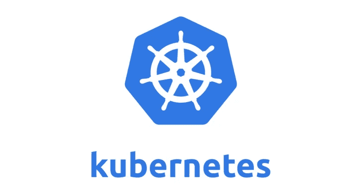

# On-Perm Kubernetes 的终极指南

> 原文：<https://medium.com/swlh/the-ultimate-guide-to-on-perm-kubernetes-84b564f0acc>



当我在 2018 年初第一次进入 Kubernetes 时，我想知道为什么有人会使用如此复杂(和昂贵)的服务，而有许多其他方式来托管应用程序，如 Vmware 产品和 Hyper-V。不久前，我被要求开发一个跨多个云和本地环境的高度可用的设置，这时候我突然想到:如果你想在本地数据中心环境中享受 Kubernetes 的好处， 有多种方法可以做到这一点，同时拥有高度可用的环境、类似云的自动化，最棒的是:从管理基础架构和硬件，一直到应用程序以及如何将流量路由到应用程序，对整个堆栈进行完全和绝对的控制。

有很多关于如何设置 Kubernetes 的指南，有些是针对 AWS 的，有些是针对 Azure 的，还有一些是针对本地部署的。然而，我看到的大多数内部指南要么已经过时，要么不准确，要么不适合生产环境。在本指南中，我将详细描述如何建立一个生产就绪的本地 Kubernetes 环境，该环境具有自动化和 Kubernetes 必须提供的所有功能。像往常一样，我接受关于如何使这个设置更好的评论和建议。这个指南的灵感来自于我在 inkubate 上看到的一个帖子。它涵盖了许多相同的步骤，但以更清晰的方式，针对 2019 年 7 月进行了更新，并修复了许多错误(由于重大更改，最初的版本没有设置 2019 年集群的正确步骤)。

在我们进入之前，让我们回答以下问题:

*   为什么要在本地数据中心或托管系统中设置 Kubernetes HA 集群？
*   我们希望通过这种设置实现什么目标？

首先，让我们看看为什么您会想要一个本地 Kubernetes 集群:

*   如果您的设施中已经有内部虚拟化系统，或者拥有一个数据中心，但不想(或还不想)迁移到云。
*   如果您想利用 docker、CI/CD、微服务或托管 Kubernetes 本地解决方案。
*   云贵。如果您希望拥有一个完全可管理的完整 Kubernetes 解决方案，但又不想花费大部分云所需的大量资金。
*   如果您正在为高可用性或灵活性部署混合解决方案
*   如果您想拥有一个全功能的 Kubernetes 沙盒或测试环境，而不必为云资源付费。
*   如果你正在学习 Kubernetes，并且想知道它在“引擎盖下”是如何工作的。

接下来，让我们定义我们希望通过此次部署实现的目标:

*   从基础架构和虚拟机到控制平面的一切都必须至少有 N+2 冗余。
*   部署必须在水平和垂直方向上可轻松、自动地扩展。
*   向群集中添加新节点的过程必须是无缝的，并且是一键自动化的。
*   应该利用现有的虚拟化环境，而不必进行复杂或破坏性的更改。
*   该解决方案应该考虑到业务连续性，并且必须能够在发生灾难时恢复。
*   部署必须符合当前的 Kubernetes 和 VMware 标准。
*   部署必须在云环境和本地环境中工作。
*   部署必须是联邦就绪的。

现在，让我们进入实际部署。这是部署概述。我们将分五步执行部署:

1.  配置和设置 Vmware 环境和自动化。
2.  使用自动化来构建 Kubernetes 集群。
3.  配置群集。
4.  发布配置任务。
5.  保护集群。

此次部署您将需要:

部署由 8 台服务器组成:

*   3 个 Kubernetes 主节点
*   3 个 Kubernetes 工作节点
*   一个代理负载均衡器节点
*   运行自动化和管理集群的客户机

最好创建一个密钥，将本指南中的 IP 与您自己的 IP 相匹配:

负载平衡器-192.168.2.51 /

主控 1- 192.168.2.52 /

主控 2- 192.168.2.53 /

主控 3–192 . 168 . 2 . 54/

工人 1 -192.168.2.55 /

工人 2–192 . 168 . 2 . 56/

工人 3–192 . 168 . 2 . 57/

这些机器都将运行 Ubuntu 18.04，不过我已经让它在 16.04 上也能运行(步骤相同)。虚拟硬件要求会有所不同，具体取决于您想要分配给群集的资源数量以及群集的工作负载。对于我的环境(将成为生产环境)，我给每个 worker 和 load balacner 节点分配了 3 GB 的 RAM、4 个 vCPUs 和大约 80GB 的 HDD。对于每个工作人员，我使用了 4–6 GB 的 RAM、4 个 4vCPUs 和一个 120–200 GB 的 HDD。请记住，对于大多数虚拟化平台，您可以根据需要调整磁盘大小，并增加/减少资源。

现在我们来看看虚拟机管理程序。我的部署在 Vmware Vsphere 管理的 ESX 企业集群上运行，该集群由 9 个节点、20 TB 存储、700 GB RAM、SSD 加速、图形协处理器和大约 120 个 CPU 组成。对于这个部署来说，这是不是有点过了？是的。显然，您不需要所有这些来运行这个部署。如果你刚刚起步，我建议你使用高端电脑、游戏电脑或者小型 ESX 集群。基本上，在任何可以运行 Vmware Vpshere server 的地方，您都可以运行此部署。

注意:自动化部分需要 VSphere server。如果您只运行 ESX 或其他虚拟机管理程序，部署仍然可以工作，但您需要手动设置每个节点或使用手动虚拟机克隆过程。最后，我想让自动化部署流程跨平台运行，但现在，我们将使用 VSphere server。

现在，好戏开始了。让我们登录 VSphere UI，开始部署群集。本指南假定您已经有一个正确配置的 VMware VSphere 群集，可以进行虚拟机部署。如果没有，可以看看我即将发布的关于如何设置的帖子。

## **客户端机器—安装和配置**

首先，你需要创建一个标准的 Ubuntu 18.04 服务器。我们将使用这台机器来设置自动化和 kubectl。这台机器可以有最低规格，但我建议至少 1 GB 的内存，2 个 CPU 和 80 GB 的磁盘。

在设置机器时，唯一的先决条件是它需要访问 Kubernetes 节点所在的网络。否则，可以使用默认安装选项(主机名、用户名等)。对于软件包，此时只需要标准的系统实用程序和 sshd。

假设您知道如何部署 Ubuntu 机器。如果没有，请看这里的。

## 安装 Kubeadm 工具

接下来，我们需要安装证书生成器、管理 Kubernetes 的 kubectl 和设置其他虚拟机的 Terraform。

首先，让我们安装云 Flare SSL:

```
wget https://pkg.cfssl.org/R1.2/cfssl_linux-amd64wget [https://pkg.cfssl.org/R1.2/cfssljson_linux-amd64](https://pkg.cfssl.org/R1.2/cfssljson_linux-amd64)# Add the executable permission to the package
  **chmod** +**x** cfssl*# Move everything to /usr/local/binsudo mv cfssl_linux-amd64 /usr/local/bin/cfsslsudo mv cfssljson_linux-amd64 /usr/local/bin/cfssljson
```

一旦一切都完成了，让我们验证一下 cfssl 版本:

```
cfssl version
```

如果一切都正确完成，那么在 cfssl 返回的字符串中应该有一个版本输出。

接下来，让我们安装 kubectl:

1-下载二进制文件:

```
wget [https://storage.googleapis.com/kubernetes-](https://storage.googleapis.com/kubernetes-)**release**/**release**/v1.12.1/**bin**/linux/amd64/kubectl
```

2-使其可执行:

```
**chmod** +**x** kubectl
```

3-将二进制文件移动到/usr/local/bin:

```
sudo mv kubectl /usr/local/bin
```

4-验证 kubectl 的版本:(注意:这将在此时抛出一个错误)

```
kubectl version
```

## 安装自动化工具和设置模板

接下来，我们将在客户机上安装自动化工具，并构建 Terraform 将使用的模板虚拟机。我们将使用 HashiCorp Terraform 来克隆现有的虚拟机模板，以创建 Kubernetes 集群。

## 模板虚拟机设置

首先，您需要设置一个新的 Ubuntu 18.04 VM，它有 4 GB 内存、120 GB 硬盘和 4 个 vCPUs。如果您愿意，可以稍后在部署配置中更改这些规范。此时，虚拟机上应该只有标准的系统实用程序和 sshd。

模板的名称应该是 Ubuntu-18.04-terraform-template

注意:从头开始创建虚拟机并运行全新安装是一个好主意。不要重用客户端虚拟机。

此时，您还可以在模板虚拟机上安装您需要的任何管理工具(snmpd、监控代理等)。**确保这些不会干扰 Kubelet 或 etcd 服务。**

重要提示:您将需要在所有虚拟机上安装 VMware 工具，因此让我们将软件包部署到模板:

1-将 [VMware tools](https://my.vmware.com/web/vmware/details?productId=742&downloadGroup=VMTOOLS1035) 下载到您的模板虚拟机上(如果您还没有 VMware 帐户，则必须创建一个)。为了更容易，您可以从您的机器上将包 SCP 到模板 VM。

2-解压存档文件。

```
tar xvzf VMware-Tools-core-whatever version.tar.gz
```

5-挂载 VMware tools ISO。

```
sudo mount -o loop /tmp/linux.iso /mnt
```

6-提取 VMware tools 安装程序。

```
tar xvzf /mnt/VMwareTools-whatever version.tar.gz -C /tmp
```

7-卸载 VMware tools ISO。

```
sudo umount /mnt
```

8-删除 open-vm-tools 包。我们将用 Vmware tools 的完整安装来替换它。

```
sudo apt-get remove --purge open-vm-tools
```

9-安装 VMware 工具(保留所有选项的默认设置)。

```
cd /tmp/vmware-tools-distrib
sudo ./vmware-install.pl
```

10-重新启动机器。

```
sudo reboot
```

重新启动后，我们可以清理虚拟机:

1-删除临时网络配置。

```
sudo rm /etc/netplan/50-cloud-init.yaml# Note: the config file name may sometimes be different. 
```

2-防止云配置保留主机名。

```
sudo nano /etc/cloud/cloud.cfg
...
preserve_hostname: true
...
```

3-关闭虚拟机。

```
sudo shutdown now
```

现在，您应该有一个完全配置好 VM，可以转换成模板了。

**注意:确保将 VM 适配器的网络配置设置为可以访问其余 Kubernetes 节点的网络。**

## 安装自动化工具

接下来，让我们回到客户机并设置 Terraform:

1-从 HashiCorp repo 下载 Terraform。

```
wget https://[releases.hashicorp.com/terraform](http://releases.hashicorp.com/terraform)/0.11.14/terraform_0.11.14_linux_amd64.zip
```

2-解压存档文件。

```
unzip -e terraform_0.11.14_linux_amd64.zip
```

3-将二进制文件复制到您的路径中。

```
sudo cp terraform /usr/bin
```

注意:Terraform 是多平台的。理论上，你应该也能从 Mac 或 Windows 机器上做到这一点。

我们将使用由 sguyennet 开发的脚本来克隆虚拟机。

注意:我绝对讨厌 vim。本教程中的编辑由 via nano 完成。

## 让我们来设置脚本:

1-克隆脚本存储库:

```
git **clone** https:*//*[*github.com/sguyennet/terraform-vsphere-standalone.git*](http://github.com/sguyennet/terraform-vsphere-standalone.git)
```

2-地形初始化:

```
cd terraform-vsphere-standaloneterraform init
```

3-配置 HAProxy 机器的部署:

```
nano terraform.tfvars
```

在这里，您需要设置以下内容:

*   Vsphere 服务器 URL、用户详细信息、数据中心等(第 1 块)
*   如果您有自签名的 Vsphere 证书，请将未验证的 SSL 设置为 true。
*   在第 2 块(虚拟机参数)，您需要填写虚拟机的详细信息。此时，您也可以自定义虚拟硬件。(关于规格建议，请参见上文)。
*   您将需要 7 个不同的虚拟机名称和 IP。选择您希望您的 HAProxy 机器现在拥有的 IP 和名称。
*   除非您有一个群集中所有虚拟机都可以看到的内部域名，否则将域留空。
*   输入您在上一步中为模板虚拟机指定的名称(默认为 Ubuntu-18.04-terraform-template)
*   除非您知道自己在做什么，否则请将链接克隆留空。
*   我建议对集群节点使用顺序 IP 来简化工作。整个集群总共需要 8 个。请记住，IPs 应该位于您的客户机可以到达的网络上(如果您希望从外部访问您的 Kubernetes 服务，您的 LAN 也可以到达)。
*   完成编辑后保存文件。

5.在文件夹中执行 ls 操作，确保没有看到 terraform.tfstate 或 tfstate.backup 文件。如果有，删除它。

4-部署虚拟机。这将是你的 HAProxy 节点。

```
terraform apply
```

这将启动您的 HAProxy 机器的部署。注意:如果你搞砸了，你可以随时做**地形摧毁。**

## 创建更多虚拟机

我们现在可以创建所有其他虚拟机。请记住，对于本指南，我们将需要一个负载平衡器、三名管理员和三名工作人员。

回到您的 tfvars 文件:

```
nano terraform.tfvars
```

为每次运行更改机器虚拟硬件规格、主机名和 IP。您需要为需要创建的每个虚拟机重复此步骤。

对于每个步骤，编辑 tfvars 文件，并

```
terraform apply
```

**重要提示:每次运行后删除 terraform.tfstate 和 terraform.tfstate.backup 文件。否则，每个应用操作都将替换前一个操作。**

(我打算以后纠正这一点)。

记住，你只能在每次运行后使用地形摧毁。当您删除 tfstate 文件时，您将擦除 Terraform 的内存，并且将无法自动恢复。

一旦您完成了所有的运行操作，您现在应该有一个空白的节点系列，可以安装 Kubernetes 组件了。

(您也可以保留该模板，并使用 Terraform 或其他工具将其用于其他部署。)

最好测试对每个节点的访问，以确保它们正常运行并且可以访问。

## 安装 HAProxy

现在，让我们在 LB 节点上设置 HAProxy。

1- SSH 到您的 HAProxy 节点。

2-更新虚拟机:

```
sudo apt-get updatesudo apt-get upgrade
```

3-安装 HAProxy:

```
sudo apt-get install haproxy
```

4-配置 HAProxy 在三个 Kubernetes 主节点之间负载平衡流量:

```
nano /etc/haproxy/haproxy.cfg
global
        log /dev/log    local0
        log /dev/log    local1 notice
        chroot /var/lib/haproxy
        stats socket /run/haproxy/admin.sock mode 660 level admin expose-fd listeners
        stats timeout 30s
        user haproxy
        group haproxy
        daemon# Default SSL material locations
        ca-base /etc/ssl/certs
        crt-base /etc/ssl/private# Default ciphers to use on SSL-enabled listening sockets.
        # For more information, see ciphers(1SSL). This list is from:
        #  [https://hynek.me/articles/hardening-your-web-servers-ssl-ciphers/](https://hynek.me/articles/hardening-your-web-servers-ssl-ciphers/)
        # An alternative list with additional directives can be obtained from
        #  [https://mozilla.github.io/server-side-tls/ssl-config-generator/?server=haproxy](https://mozilla.github.io/server-side-tls/ssl-config-generator/?server=haproxy)
        ssl-default-bind-ciphers ECDH+AESGCM:DH+AESGCM:ECDH+AES256:DH+AES256:ECDH+AES128:DH+AES:RSA+AESGCM:RSA+AES:!aNULL:!MD5:!DSS
        ssl-default-bind-options no-sslv3defaults
        log     global
        mode    http
        option  httplog
        option  dontlognull
        timeout connect 5000
        timeout client  50000
        timeout server  50000
        errorfile 400 /etc/haproxy/errors/400.http
        errorfile 403 /etc/haproxy/errors/403.http
        errorfile 408 /etc/haproxy/errors/408.http
        errorfile 500 /etc/haproxy/errors/500.http
        errorfile 502 /etc/haproxy/errors/502.http
        errorfile 503 /etc/haproxy/errors/503.http
        errorfile 504 /etc/haproxy/errors/504.httpfrontend kubernetes
bind 192.168.2.51:6443
option tcplog
mode tcp
default_backend kubernetes-master-nodesbackend kubernetes-master-nodes
mode tcp
balance roundrobin
option tcp-check
server k8s-master-0 192.168.2.52:6443 check fall 3 rise 2
server k8s-master-1 192.168.2.53:6443 check fall 3 rise 2
server k8s-master-2 192.168.2.54:6443 check fall 3 rise 2
```

根据 HAProxy 版本的不同，您的配置可能会有所不同。这里唯一需要改变的是 IP。将绑定 IP 更改为 HAProxy 节点的本地 IP。更改其本地 IP 的主 IP 0–2。

对于本指南，我对 HAProxy 机器使用 192.168.2.51，对主节点使用 52–54。

5-重新启动 HAProxy:

```
sudo service haproxy restart
```

检查 HAProxy 是否已成功启动:

```
sudo service haproxy status
```

## 为 Kubeadm 生成主节点证书

接下来，我们需要返回客户端虚拟机，通过 CloudFlare SSL 工具生成 TLS 证书。

1-创建证书颁发机构配置文件:

```
nano ca-config.json
{
  "signing": {
    "default": {
      "expiry": "8760h"
    },
    "profiles": {
      "kubernetes": {
        "usages": ["signing", "key encipherment", "server auth", "client auth"],
        "expiry": "8760h"
      }
    }
  }
}
```

2-创建证书颁发机构签名请求配置文件:

```
nano ca-csr.json
{
  "CN": "Kubernetes",
  "key": {
    "algo": "rsa",
    "size": 2048
  },
  "names": [
  {
    "C": "IE",
    "L": "Acme",
    "O": "Kubernetes",
    "OU": "Anvil",
    "ST": "Acme Co."
  }
 ]
}
```

将配置文件中的详细信息更改为您自己的信息。

3-生成认证机构证书和私钥:

```
cfssl gencert -initca ca-csr.json | cfssljson -bare ca
```

4-验证是否生成了 ca-key.pem 和 ca.pem:

```
ls -la
```

接下来，我们生成证书和私钥。

1-创建证书签名请求配置文件:

```
nano kubernetes-csr.json
{
  "CN": "kubernetes",
  "key": {
    "algo": "rsa",
    "size": 2048
  },
  "names": [
  {
    "C": "IE",
    "L": "Cork",
    "O": "Kubernetes",
    "OU": "Kubernetes",
    "ST": "Cork Co."
  }
 ]
}
```

2-生成证书和私钥:

```
cfssl gencert \
-ca=ca.pem \
-ca-key=ca-key.pem \
-config=ca-config.json \
-hostname=192.168.2.51,192.168.2.52,192.168.2.53,192.168.2.54,127.0.0.1,kubernetes.default \
-profile=kubernetes kubernetes-csr.json | \
cfssljson -bare kubernetes
```

**注意:您需要将 hostname= IPs 改为您自己的名称。**

3-验证是否生成了 kubernetes-key.pem 和 kubernetes.pem 文件。

```
ls -la
```

4-将证书复制到集群中的每个节点:

```
scp ca.pem kubernetes.pem kubernetes-key.pem pavel@192.168.2.51:~
scp ca.pem kubernetes.pem kubernetes-key.pem pavel@192.168.2.52:~
scp ca.pem kubernetes.pem kubernetes-key.pem pavel@192.168.2.53:~
scp ca.pem kubernetes.pem kubernetes-key.pem pavel@192.168.2.54:~
scp ca.pem kubernetes.pem kubernetes-key.pem pavel@192.168.2.55:~
scp ca.pem kubernetes.pem kubernetes-key.pem pavel@192.168.2.56:~
scp ca.pem kubernetes.pem kubernetes-key.pem pavel@192.168.2.57:~
```

注意:将用户名和 IP 地址改为您自己的。

# 安装 Docker

1-第一台机器的 SSH:

```
ssh pavel@192.168.2.51
```

2-提升到根目录:

```
sudo su
```

3-添加 Docker 存储库密钥:

```
curl -fsSL https:*//*[*download.docker.com/linux/ubuntu/gpg*](http://download.docker.com/linux/ubuntu/gpg) *| apt-key add -*
```

4-添加 Docker 存储库:

```
*add-apt-repository \*
"deb [https://download.docker.com/linux/](https://download.docker.com/linux/)$(. /etc/os-release; echo "$ID") \
$(lsb_release -cs) \
stable"
```

5-更新包列表:

```
*apt update*
```

6-安装对接器:

```
apt **install** -y docker-ce
```

# 安装 Kubernetes 组件:

1-添加 Google 存储库密钥:

```
curl -s https:*//*[*packages.cloud.google.com/apt/doc/apt-key.gpg*](http://packages.cloud.google.com/apt/doc/apt-key.gpg) *| apt-key add -*
```

2-添加 Google 存储库:

```
*nano /etc/apt/sources.list.d/kubernetes.list*
**deb** [http://apt.kubernetes.io](http://apt.kubernetes.io/) kubernetes-xenial main
```

3-更新包列表:

```
*apt update*
```

4-安装 kubelet、kubeadm 和 kubectl:

```
*apt install kubelet kubeadm kubectl*
```

5-禁用交换。

```
*swapoff -a**sed -i '/ swap / s/^/#/' /etc/fstab*
```

重要提示:启动时必须禁用交换。否则，群集将在重新启动时中断。

6.禁止在启动时交换:

```
nano /etc/fstab# Comment out the second line mentioning swap
# Save the file
```

**重要提示:需要对集群中的每个 Kubernetes 节点重复这个过程(仅限所有主节点和工作节点)。**

**在主节点上安装和配置 Etcd 服务**

接下来，我们将在每个主节点上安装和配置 Etcd 键值存储服务。

1-第一个主节点的 SSH:

```
ssh pavel@192.168.2.52
```

2-为 Etcd 配置创建一个目录:

```
sudo mkdir /etc/etcd /var/lib/etcd
```

3-将证书移动到配置目录:(您需要以用于将证书复制到机器的用户身份执行此操作，而不是以 root 用户身份，因为它们位于用户的主目录中)。

```
sudo mv ~/ca.pem ~/kubernetes.pem ~/kubernetes-key.pem /etc/etcd
```

4-下载 etcd 软件包:

```
wget https://[github.com/coreos](http://github.com/coreos)/etcd/releases/download/v3.3.9/etcd-v3.3.9-linux-amd64.tar.gz
```

5-提取 etcd 档案:

```
tar xvzf etcd-v3.3.9-linux-amd64.tar.gz
```

6-将 etcd 二进制文件移动到/usr/local/bin:

```
sudo mv etcd-v3.3.9-linux-amd64/etcd* /usr/local/bin/
```

7-创建一个 etcd 系统单元文件:

```
sudo nano /etc/systemd/system/etcd.service
[Unit]
Description=etcd
Documentation=https://[github.com/coreos](http://github.com/coreos)[Service]
ExecStart=/usr/local/bin/etcd \
  --name 192.168.2.52 \
  --cert-file=/etc/etcd/kubernetes.pem \
  --key-file=/etc/etcd/kubernetes-key.pem \
  --peer-cert-file=/etc/etcd/kubernetes.pem \
  --peer-key-file=/etc/etcd/kubernetes-key.pem \
  --trusted-ca-file=/etc/etcd/ca.pem \
  --peer-trusted-ca-file=/etc/etcd/ca.pem \
  --peer-client-cert-auth \
  --client-cert-auth \
  --initial-advertise-peer-urls https://192.168.2.52:2380 \
  --listen-peer-urls https://192.168.2.52:2380 \
  --listen-client-urls https://192.168.2.52:2379,http://127.0.0.1:2379 \
  --advertise-client-urls https://192.168.2.52:2379 \
  --initial-cluster-token etcd-cluster-0 \
  --initial-cluster 192.168.2.52=https://192.168.2.52:2380,192.168.2.53=https://192.168.2.53:2380,192.168.2.45=https://192.168.2.54:2380 \
  --initial-cluster-state new \
  --data-dir=/var/lib/etcd
Restart=on-failure
RestartSec=5[Install]
WantedBy=multi-user.target
```

把 IP 换成自己的。—名称将是第一个主节点的本地 IP。广告和广播 URL 也是如此。初始群集 IP 是主节点的 IP。

8-重新启动服务:

```
sudo etcd restart
```

9-使 etcd 在引导时启动:

```
sudo systemctl enable etcd
```

10-检查 etcd 是否已成功启动:

```
sudo service etcd status
```

注意:如果您在启动 etcd 时遇到问题，请查看机器系统日志。一个常见的问题是配置文件中的打字错误或错误的 IP 或错误的语法。

**仅对另外两个主节点重复此过程。**

**记得在配置文件中更新每个节点的 IP。**

## 初始化主集群

现在是初始化三个主节点的时候了。

1-第一个主节点的 SSH:

```
ssh pavel@192.168.2.52
```

2-为 kubeadm 创建配置文件:

```
nano config.yaml
apiVersion: kubeadm.k8s.io/v1beta2
kind: ClusterConfiguration
kubernetesVersion: stable
apiServerCertSANs:
- 192.168.2.51
controlPlaneEndpoint: "192.168.2.51:6443"
etcd:
  external:
    endpoints:
    - [https://192.168.2.52:2379](https://10.85.77.52:2379)
    - [https://192.168.2.53:2379](https://10.85.77.53:2379)
    - [https://192.168.2.54:2379](https://10.85.77.54:2379)
    caFile: /etc/etcd/ca.pem
    certFile: /etc/etcd/kubernetes.pem
    keyFile: /etc/etcd/kubernetes-key.pem
networking:
  podSubnet: 10.30.0.0/24
apiServerExtraArgs:
  apiserver-count: "3"
```

注意:在撰写本文时，API version:kubeadm.k8s.io/v1beta2 是一个有效的 API 版本。

注意:用自己的 IP 替换。控制平面端点和证书都是 HAProxy 机器 IP。端点是主节点 IP。我使用 10.30.0.0/24 的 pod 网络。你愿意的话可以把这个 IP 换成你自己的。

3-将机器初始化为主节点:

```
sudo kubeadm init --config=config.yaml
```

4-将证书复制到另外两个主节点:

```
sudo scp -r /etc/kubernetes/pki pavel@192.168.2.52:~
sudo scp -r /etc/kubernetes/pki pavel@192.168.2.53:~
```

5-在另外两个主节点上，创建 config.yaml 文件(不要做任何更改，使其与第一个主节点相同)。

然后运行:

```
sudo kubeadm init --config=config.yaml
```

在另外两个主节点上。

保存初始化后显示的 join 命令。

## 正在初始化工作节点

1- SSH 到第一个工作节点:

```
ssh pavel@192.168.2.55
```

2-执行您在上一步中保存的 join 命令:

```
sudo kubeadm join 192.168.2.51:6443 --token [your_token] --discovery-token-ca-cert-hash sha256:[your_token_ca_cert_hash]
```

将 IP 更改为您自己的 HAProxy 节点。

**对所有剩余的工作节点重复此步骤。**

## 验证集群节点

验证所有节点都已成功加入群集:

1-第一个主节点的 SSH:

```
ssh pavel@192.168.2.52
```

2-获取节点列表:

```
sudo kubectl --kubeconfig /etc/kubernetes/admin.conf get nodes
NAME STATUS ROLES AGE VERSION
k8s-kubeadm-master-0 NotReady master 1h v1.12.1
k8s-kubeadm-master-1 NotReady master 1h v1.12.1
k8s-kubeadm-master-2 NotReady master 1h v1.12.1
k8s-kubeadm-worker-0 NotReady  2m v1.12.1
k8s-kubeadm-worker-1 NotReady  1m v1.12.1
k8s-kubeadm-worker-2 NotReady  1m v1.12.1
```

注意:节点显示为未就绪，因为尚未配置网络。

## 在客户机上配置 Kubectl

现在我们需要在. 50 客户机上配置 kubectl，这样我们就可以管理 Kubernetes 集群。注意:这可以在任何能够运行 kubectl 的机器上完成。

1- SSH 到其中一个主节点

```
ssh pavel@192.168.2.52
```

2-向 admin.conf 文件添加权限。

```
sudo chmod +r /etc/kubernetes/admin.conf
```

3-将配置文件复制到客户端计算机，并改回权限:

```
cd /etc/kubernetes
scp admin.conf pavel@192.168.2.50:/ .
sudo chmod 600 /etc/kubernetes/admin.conf
```

4-返回客户机并创建 kubectl 配置目录:

```
mkdir ~/.kube
```

5-将配置文件移动到配置目录:

```
mv admin.conf ~/.kube/config
```

6-修改配置文件的权限:

```
chmod 600 ~/.kube/config
```

7-检查从客户端机器到 Kubernetes 集群 API 的连接:

```
kubectl **get** nodes
```

您应该会得到集群中状态为 not ready 的节点列表。

## 设置网络

Weavenet 将用作本指南的覆盖网络。如果您计划使用 F5 设备作为入口，建议使用法兰绒。

1-从客户端机器，部署覆盖网络盒:

```
kubectl apply -f https://[git.io/weave](http://git.io/weave)-kube-1.6
```

2-检查吊舱是否正确展开:

```
kubectl get pods -n kube-system
```

3-检查节点是否处于就绪状态:

```
kubectl get nodes
NAME STATUS ROLES AGE VERSION
k8s-kubeadm-master-0 Ready master 18h v1.12.1
k8s-kubeadm-master-1 Ready master 18h v1.12.1
k8s-kubeadm-master-2 Ready master 18h v1.12.1
k8s-kubeadm-worker-0 Ready  16h v1.12.1
k8s-kubeadm-worker-1 Ready  16h v1.12.1
k8s-kubeadm-worker-2 Ready  16h v1.12.1
```

注意:所有节点变为就绪状态可能需要几分钟时间。

您现在应该拥有一个功能完整的 Kubernetes 集群。

**安装附件**

Kubernetes 有几个有用的插件。其中之一是仪表板。

**Kubernetes 仪表盘**

1-创建仪表板:

```
kubectl create -f https://raw.githubusercontent.com/kubernetes/dashboard/v1.10.1/src/deploy/alternative/kubernetes-dashboard.yaml
```

2-删除仪表板服务。我们将使用另一种设置:

```
kubectl delete service kubernetes-dashboard -n=kube-system
```

3-暴露仪表板:

```
kubectl expose deployment kubernetes-dashboard -n=kube-system -type=LoadBalancer -name=kubernetes-dashboard -external-ip=192.168.2.52 -port=8443
```

这将在 [http://192.168.2.52:8443](http://192.168.2.52:8443) 上显示 Kubernetes 仪表盘

把 IP 换成自己的。

您还可以使用其他方法来运行仪表板:[https://github.com/kubernetes/dashboard/wiki/Installation](https://github.com/kubernetes/dashboard/wiki/Installation)

你现在应该有一个工作的 Kubernetes 仪表板。

现在，让我们登录。在登录页面上，选择令牌。

在客户端机器上:

4 -获取仪表板机密列表:

```
kubectl get secrets -n=kube-system | grep dashboard
```

5-描述名为 kubernetes-dashboard-token-xxxxx 的秘密

```
kubectl describe secret kubernetes-dashboard-token-xxxxx -n=kube-system
```

6-将密码复制并粘贴到 Kubernetes dasboard 登录屏幕上，然后单击登录。现在，您应该能够访问仪表板了。

仅此而已。现在，您应该拥有一个完整且功能齐全的本地 Kubernetes 集群。

## 什么叫没用？

有时，您可能会在集群设置过程中遇到一些问题。别担心，我已经把最常见问题的解决方案贴在下面了。

*   原木是你的朋友。如果服务没有启动或者发生了奇怪的事情，请检查日志。

```
cat /var/log/syslog
```

是一个好的开始。

*   有一个 IP 密钥。本指南中的许多示例文件仅仅是示例。检查两遍，并按照第一部分所述，制作一个表格，将我的 IP 与你的 IP 进行比较。
*   交换是否被禁用？etc 不喜欢 swap。确保按照步骤禁用它，并在重新启动时保持禁用状态。
*   从这个问题开始向后看。哪个组件受到影响？为什么会受影响？有服务需要的配置文件吗？等等。
*   提问。我重视评论和问题，我喜欢团队发言和不和谐。问我一些问题(但是先试着自己解决)。
*   大概是 vim 吧。不要用 vim。用纳米。
*   请查看我关于排除 Kubernetes 故障的帖子:

[](/@lyokowarrior14/troubleshooting-kubernetes-the-beginners-guide-2440ec400155) [## Kubernetes 故障排除:初学者指南

### 如果您过去曾与 Kubernetes 合作过，那么您可能会遇到一些问题…

medium.com](/@lyokowarrior14/troubleshooting-kubernetes-the-beginners-guide-2440ec400155) 

感谢阅读。如果您有疑问或发现问题，请发表评论。

~帕维尔