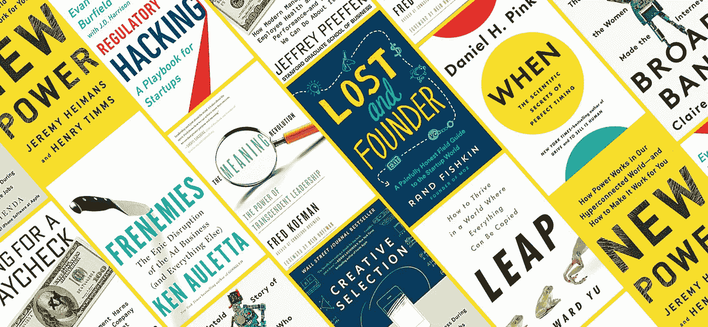

# 如何毫不费力地一年读完 25 本书

> 原文：<https://medium.com/swlh/the-ultimate-life-hack-to-read-25-books-a-year-effortlessly-d489a325b6d4>

## 更好地记忆它们

我总是渴望知识，所以阅读似乎总是对我有吸引力。老实说，在我们当今商业世界的激烈程度下，你会觉得你不能不处于一种不断学习的模式。但这是我第一次超过 10 本书(甚至更多)。

如你所知，我有两个年幼的孩子(一个 4 岁，一个 2 岁)，我正在创建我的第三个创业公司*——*[*【阿纳西*](http://anaxi.com) *，我们希望用一个新的项目协作平台来解决软件项目管理问题；不要犹豫，去看看吧；)*。相信我，第三次创业并不比第一次容易！或者如果你认为是的话，小心——你可能是在欺骗自己，碰壁……你只是知道应该避免哪些错误。总之，我没有太多的时间，一年到头都很累！我相信你们很多人都有同感。

所以我没有精力和时间去读 25 本书。对我的头脑来说，这种例行公事需要毫不费力，但仍允许我满足对新知识的渴望。

# 那么你怎么能不花太多力气一年看完 25 本书呢？

第一，我说的阅读，可以是真书，可以是电子书，也可以是有声读物。任何类型。这里的关键是有声读物。

2018 年 3 月开始听有声读物。这完全改变了我现在接触书籍的方式。

我每天花大约一个小时通勤，开车送孩子去学校/托儿所(耶，两个不同的地方)。当我听的时候，我只是听有声读物(1.25 或 1.5 的速度，取决于旁白的速度)。当孩子们在车里的时候，我不喜欢，因为他们更喜欢音乐！但是，假设你可以每天花 45 分钟听有声读物。平均速度约为 1.33，相当于你每周听 5 个小时的有声读物。商业书籍的长度从 4 小时到 10 小时不等。但我敢说 6.5 小时后你就能搞定一个了。所以我平均每两周听一本书，因为有时你会停顿，这会让你思考，你会倒带，因为你错过了一部分……(我们是人，对吗？).

# 有声读物，嗯…但是你没有得到所有的信息，对吗？

现在有些人说，“是的，但是你不能通过这种方式在一本书里获得所有的信息——你会错过很多东西。”我会说你得到了 80%的信息，如果你足够专注，100%的重要信息。这才是重点！你可以很容易地在手机上(或者幸运的话在苹果手表上)一键倒带 30 秒，重新听这个重要的部分。

但是有一个技巧可以让你比真正阅读实体书(或电子书)的人更好地记住这些书。如果我真的喜欢一本书，我会在几个月后阅读我在谷歌上找到的摘要，提醒自己所有的要点。这使我能够很好地记住所有这些书的所有要点。然后，我会记住围绕这些要点的不同故事。我发现我用这种方法比读完真正的书，然后把它放在书架上，不再回来看更好地记住了书。

当然，你可以读一本真正的书，然后每隔 X 个月回来看看或者做一些总结，这是最好的。但这需要努力和精神能量，我给我的余生都不能省下太多。

# 那么为什么不在 2019 年尝试一下呢？

最近，其他一些反对者问我:

***“但是你被允许在开车或者骑车的时候听有声读物吗？”*** 当然，你听广播或音乐，不？所有这些都是为了说，试一试，让我知道它是否对你也有效。

***“是的，但是我不是通过听来学习的，我需要阅读。”嗯，我以为我也是这样。直到你尝试，你才知道。你知道如何和别人进行口头对话，所以你可以倾听。***

“但是我只有 20 分钟的时间。” 太完美了！我经常遇到这种情况。当你不得不继续阅读一本有声读物时，你需要花一点时间去回忆你在哪里。这个小小的努力实际上帮助你更好地记忆这本书。

对我来说，这种做法非常有效的信号是当我阅读电子书时(我仍然这样做)，我总是希望有声书可用:)

# 音频摘要呢(Blinkist，Instaread…)？

编辑:我添加了这一段，因为我已经被问了好几次了。

是什么让你想起一本书？就我而言——我认为这适用于所有人——是故事阐明了这些书的基本理论。如果你没有得到故事，你将很难记住理论，你不会得到它们所有的微妙之处。这些故事有助于你更好地记忆。

我尝试了那些音频摘要，但就我而言，我最终忘记了所有从它们那里获得的新见解。但是有声读物却不是这样。当你几个月后读了一个总结，你就记住了有声读物的所有故事。

# 在你走之前…

你觉得这篇文章有趣吗？请按住👏说“谢谢”并帮助别人找到它！
如果您对关于**我们在**[**Airbyte**](http://airbyte.io)**用我们所有的知识**打造世界级组织的旅程的文章感兴趣，请订阅我们的时事通讯！

在 [Twitter](http://twitter.com/JeanLafleur) 上关注我，保持联系。谢谢大家！！