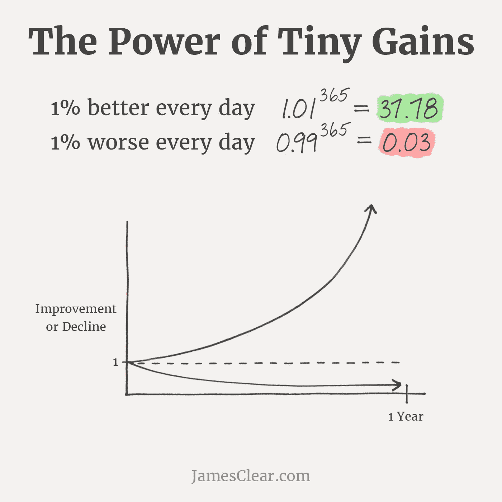
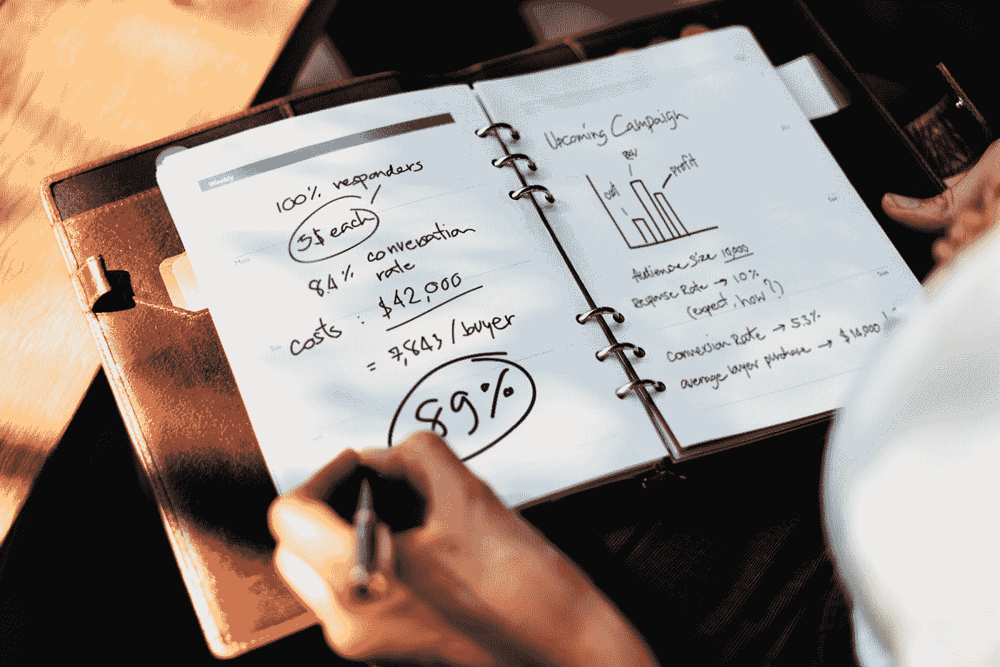

# 生产力黑客的终极对决

> 原文：<https://medium.com/swlh/the-ultimate-showdown-of-productivity-hacks-82b64ee8c42f>

有无数的方法来处理工作、生产力和所有相关的事情。几十个诀窍、技巧和窍门——它们都被作为解决你所有成功问题的灵丹妙药而广为流传。

但事实并非如此。它们不是神奇的解决方案。

他们是**的工具。**

Photo by [Cesar Carlevarino Aragon](https://unsplash.com/@carlevarino?utm_source=medium&utm_medium=referral) on [Unsplash](https://unsplash.com?utm_source=medium&utm_medium=referral)

为了找出哪些工具适合你的个性、习惯和工作范围，你必须尝试一下，看看它们是否适合你的系统。

在找到适合我的方法之前，我已经尝试了很多方法。

今天，我邀请你也这样做。

**附言**

没有绒毛沿着*睡得好*和*保持水分*线。我知道你厌倦了那种东西。给自己倒杯热饮，让我们来点实际的。

为了帮助你浏览这篇文章，我将所有的技巧分为 4 大类。

*   时间管理
*   基本生产力(做事)
*   有效性和效率(以**正确**的方式做**正确**的事情)
*   动机和创造力(让事情充满乐趣和活力)

# 第 1 部分:时间管理

> 我们每天都有同样的 24 小时。重要的是我们如何对待他们。

Photo by [Lukas Blazek](https://unsplash.com/@goumbik?utm_source=medium&utm_medium=referral) on [Unsplash](https://unsplash.com?utm_source=medium&utm_medium=referral)

适当的时间管理是最佳绩效和持续增长的重要组成部分。不管你有多有创造力或积极性，如果你的时间被打乱了，其他事情也会被打乱。

Photo by [Priscilla Du Preez](https://unsplash.com/@priscilladupreez?utm_source=medium&utm_medium=referral) on [Unsplash](https://unsplash.com?utm_source=medium&utm_medium=referral)

## 两分钟规则

> 如果一件事能在 2 分钟内完成，现在就做。

两分钟规则是由大卫·艾伦在他的畅销书*中提出的。*

想法:不需要很多计划或工作的次要任务应该立即完成，以防止“大脑混乱”。此外，2 分钟规则可以帮助你避免回到之前的任务上(因此要花两次时间在上面)——一次做所有相关的事情。

例如:你收到了一封你在生活中并不真正想要的邮件。退订需要 10 秒钟。现在就做吧——以后你再也不用花一秒钟打开它们(并感到烦恼)。

有用吗:毫无疑问，这是一个绝对的生活改变者。

Photo by [Jamie Street](https://unsplash.com/@jamie452?utm_source=medium&utm_medium=referral) on [Unsplash](https://unsplash.com?utm_source=medium&utm_medium=referral)

## 消除通知(以及其他干扰)

加州大学信息学系教授 Gloria Mark 在接受 [Fast Company](https://www.fastcompany.com/944128/worker-interrupted-cost-task-switching) 采访时提到:

> 在被打断或分心后，平均需要 23 分 15 秒才能回到任务中。

这不是一个胡乱的猜测:纯粹的数据来自她早期的研究。

换句话说，当你正在做某件事，然后决定检查你的中等状态 3 秒钟——你会损失 23 分 18 秒，真的。值得吗？

想法:排除尽可能多的干扰，因为每个干扰都会占用你 23 分钟的时间。

*   关闭智能手机上的所有通知
*   取消订阅&取消关注尽可能多的人、网页和网站(只留下那些你真心想留在你生活中的人)
*   停止一心多用——这只是一连串的干扰
*   每天只检查一次或两次你的邮件/统计/关注者，在预先设定的时间(例如，早上 7 点和下午 6 点)
*   当在做一些**真正**重要的事情时，关掉你的手机

**管用吗:**管用，哦，管用。

Photo by [Jack Hamilton](https://unsplash.com/@jacc?utm_source=medium&utm_medium=referral) on [Unsplash](https://unsplash.com?utm_source=medium&utm_medium=referral)

## 吃那只青蛙！

> 早上第一件事就是吃一只活青蛙，接下来的一天就不会有更糟糕的事情发生了。——马克·吐温

布莱恩·特雷西，生产力专家和《吃青蛙》一书的作者！，将上述思想应用于任务管理。你的“青蛙”是每天最不愉快、最紧急或最重要的任务。如果你不照顾好它，它会让你的生活变得很糟糕。

想法:我们的意志力在任何一天都是有限的资源，所以早上是完成不愉快但重要的事情的最佳时间——否则你以后会拖延。通过摆脱它，你也会充满动力和动力去做伟大的事情。

**有效吗:**不一定。这可能是一种解放，但在其他一些日子里，这只是在排水。就个人而言，我更喜欢首先关注有价值的东西:从长远来看对我的生活影响最大的任务。

Photo by [David Clode](https://unsplash.com/@davidclode?utm_source=medium&utm_medium=referral) on [Unsplash](https://unsplash.com?utm_source=medium&utm_medium=referral)

## 砍了那头大象！

> 你如何吃掉一头大象？把它切成碎片！

想法:大项目令人生畏，所以我们倾向于拖延。通过将大项目或任务分割成一堆小项目，更容易开始工作。

有用吗:是的。碎片越小，效果越好。不要担心你能让它们变得多小。

**例子:**我没有给这篇文章设定“写一篇关于我所知道的所有与工作相关的黑客的评论”这样的任务，我的任务清单更像这样。

*   列出我尝试过的提高效率的技巧和原则
*   将黑客分成几个部分
*   想出一个标题
*   写一写 hack 1
*   写关于黑客 2

诸如此类。

Photo by [rawpixel](https://unsplash.com/@rawpixel?utm_source=medium&utm_medium=referral) on [Unsplash](https://unsplash.com?utm_source=medium&utm_medium=referral)

## 帕金森定律

> 工作扩大以填补完成工作的时间。—西里尔·帕金森

大多数人不会提前完成工作。如果你估计一篇文章要一周才能写完，那就要一周。

如果你给自己一整天的时间来完成一项任务，那么几乎不可能更快完成。幸运的是，这个原则也适用于其他情况。

想法:为你愿意为某项任务奉献的时间设定极限。即使匆忙是痛苦的，你很可能会很快完成任务。

**管用吗:**疼得要命。但这很有效。

**例子:**一个客户给我发来一篇文章，截稿日期是下周。如果不找别的项目，这篇文章要花我一个星期。如果我把一周中的其他日子都塞满了其他紧急项目，只留下这一天来写文章——我将别无选择，只能在今天完成它。

Photo by [Vince Lee](https://unsplash.com/@vklee?utm_source=medium&utm_medium=referral) on [Unsplash](https://unsplash.com?utm_source=medium&utm_medium=referral)

## **番茄工作法**

这是弗朗西斯科·西里洛在 20 世纪 80 年代末提出的，是有史以来最流行的时间管理方法之一。西里洛用一个番茄形状的厨房定时器( **pomodoro** 在意大利语中是番茄的意思)将他的工作分成更小的 25 分钟间隔，中间有短暂的休息。

每个间隔被称为一个番茄。

**想法:**通过短时间的冲刺工作，有可能在一定程度上提高对手头任务的专注度。

此外，开始一个 25 分钟的小工作冲刺比考虑未来一整天要容易得多。

**有效吗:**对某些人有效。几年前，我玩番茄有相当多的乐趣，但我最终注意到，没有我的响铃计时器的不断干扰，我可以完成更多的事情。

# 第 2 部分:生产力(做事)

> 除非你去做，否则梦想不会实现。

Photo by [rawpixel](https://unsplash.com/@rawpixel?utm_source=medium&utm_medium=referral) on [Unsplash](https://unsplash.com?utm_source=medium&utm_medium=referral)

完成你的工作是任何一种进步的基本部分——成长的核心。没有适当的行动，梦想是死的。

Photo by [rawpixel](https://unsplash.com/@rawpixel?utm_source=medium&utm_medium=referral) on [Unsplash](https://unsplash.com?utm_source=medium&utm_medium=referral)

## 做比好更好

还有，

> 完成比完美更好，因为完美永远不会完成。

在追求完美的过程中很容易迷失。

*   这篇文章不够好，需要多下功夫
*   我的个人资料照片太丑了，得和专业摄影师合作
*   不知道该在我的简历上写些什么，得读几本这方面的书

如果你的文章清晰、简洁、有用，那就没问题。出版并继续前进。

如果我能看到你的脸，你的照片就没问题。上传并继续前进。

如果我对你有一个模糊的概念，你的简历是可以的。保存并继续前进。

你可以在以后改进这些东西。

这并不意味着你应该满足于低质量或平庸:瞄准一个有效的最小值，实施，然后改进。

**想法:**做你该做的事，然后把它忘掉。你总是可以在以后改进结果，但你必须先得到结果。

**管用吗:**这是我 2018 年内化的最好的原则之一。

Photo by [rawpixel](https://unsplash.com/@rawpixel?utm_source=medium&utm_medium=referral) on [Unsplash](https://unsplash.com?utm_source=medium&utm_medium=referral)

## 沉没成本谬误&不归点

> 如果你在一个项目或任务上投入了大量的时间、金钱或情感，你更有可能去追求它。

在经济学中，沉没成本是一定数量的资源，这些资源已经被使用并且无法收回。沉没成本成为有效激励因素的点有时被称为**不可逆转点**。

例如，假设你花 20 美元买了一张不可退款的体育赛事门票。在活动的预定日期，你突然觉得你并不想去——所以你不想去。二十块？没什么大不了的。

如果门票花了你 200 美元，你更有可能去参加这个活动(即使你不再对它感兴趣)。

门票价格突然变得很重要，你**会**去参加活动，只是为了避免无缘无故失去这笔钱——这是你的不归路，你的沉没成本(财务、情感等)。)要求导致行动。

**想法:**如果你想做成某件事，就投资这件事。想成为作家？买一个写作课程(很贵的)，学习几个小时，练习几天。你花的时间、金钱和情感越多，你就越能感受到自己在这件事上的投入。

**重要提示:**投资金额决定了行动的可能性，而不是行动的成功。一门昂贵的课程增加了你通过这门课程的机会，但并不保证你会成为一名伟大的作家。

**有效吗:**绝对有效，但每个人对沉没成本(不同的不可回收点)的敏感度不同。有些人即使投资了几千美元也不会行动，有些人会在第一个一百美元后兴奋地跑起来。

Photo by [Mike Alonzo](https://unsplash.com/@mikezo?utm_source=medium&utm_medium=referral) on [Unsplash](https://unsplash.com?utm_source=medium&utm_medium=referral)

## 不要弄断链条

> 你连续做一件事的天数越多，你就越有可能继续做这件事，以免打破这个链条。

据我所知，是喜剧演员杰瑞·宋飞给这种技术起了个名字。基本上，我认为这是沉没成本谬误的一种形式——但是，嘿，它很简洁。

**想法:**当你想坚持做某件事(或者戒掉某件事——比如不吸烟)，在日历上用一个大大的红色 X 标记你做这件事的每一天。大约 5 天后，你会在日历上看到越来越多的红十字链，这会激励你继续增加。

**管用吗:**对我来说不管用，但是我很少在动力上有问题。我认识一些人，对他们来说，这项技术是一个真正的救星。

Photo by [Mike Lewis HeadSmart Media](https://unsplash.com/@mikeanywhere?utm_source=medium&utm_medium=referral) on [Unsplash](https://unsplash.com?utm_source=medium&utm_medium=referral)

## **消除需要流动的地方的障碍**

> 你怀疑的越少，你的选择越少，你完成的就越多。

想象一下，你早上起床，突然想起你答应过自己今天要出去跑步。

你记得你的跑鞋在阁楼里(别问我，我不知道为什么)。你不知道你的水瓶在哪里。而且你的 AirPods 也没电了。这么多不跑的理由，啊！

但是你答应过自己，所以…

跑还是不跑？这就是问题所在！

通常情况下，这会导致不跑步。反抗力量太强大了。

**思路:**事先消除阻力，增加某个行动的可能性。在你想出去跑步的前一天找到你的跑鞋、水瓶和跑步装备*。给耳机充电。做一切你认为可以作为不行动的借口的事情。*

**有效吗:**对我来说没什么区别，但我承认如果我在重要任务的前一天消除了可能的障碍，我会感觉更有活力。

Photo by [Pau Casals](https://unsplash.com/@paucasals?utm_source=medium&utm_medium=referral) on [Unsplash](https://unsplash.com?utm_source=medium&utm_medium=referral)

## **在需要阻力的地方添加障碍物**

> 人是懒惰的:有时一点点阻力就足以阻止一个行动。

你有没有注意到，打开你最喜欢的社交媒体应用程序是多么容易和无摩擦？我的意思是，对于我们中的许多人来说，这是肌肉记忆，我们每次解锁手机时都会自动打开它。

解决办法很简单:增加一些阻力。

**思路:**如果你想远离某个动作，那就尽量让它不方便。

*   删除不需要的或消磨时间的应用程序。在手机上使用这些服务的网页版本，或者再次下载应用程序会遇到很多阻力。
*   如果你想少吃糖，就不要在家里放糖。去当地的商店买东西比去厨房狼吞虎咽地吃甜甜蜜蜜的白面包阻力要大得多。

有用吗:是的，太神奇了。我喜欢这种技术。顺便说一句，我相信这是尤利西斯契约的一种形式——一个你在未来约束自己的决定。就像尤利西斯在听到塞壬歌唱后把自己绑在桅杆上不让自己跳海一样。谈抵抗！

Photo by [Jon Tyson](https://unsplash.com/@jontyson?utm_source=medium&utm_medium=referral) on [Unsplash](https://unsplash.com?utm_source=medium&utm_medium=referral)

## 设定人性化的任务——一步一步来

> 不要让你的大脑怀疑你在想什么。

这个技巧是创建有效的待办事项列表的关键部分。

用你将任务委托给别人的方式来写你的任务:以简单、可理解、精确和直截了当的方式。

你会对你的员工说“报告”而不是“写一月销售*该*产品的月收入报告”吗？

想法:把你的大脑当成一个不太聪明的雇员，必须得到下一步该做什么的具体指示。此外，只将给定项目的下一个关键步骤设定为任务。不要将整个项目设定为单一任务。

例如，这里有一个**写得很糟糕的任务:**

*   苹果派

这很糟糕，因为(1)这真的是一个项目，(2)它一点也不清晰和具体。以下是你如何改进它，增加完成的机会。

**OK 任务:**

*   为明天和杰克的聚会烤苹果派

好多了，但是仍然缺乏细节——并且可以分解成更小的任务。记住，你的大脑不是一个非常聪明的员工:给他具体的指示和较小的任务！

**优秀任务:**

*   购买苹果派的配料(*配料清单*)
*   查看此视频(*链接到视频*)获取说明
*   为明天和杰克的聚会烤苹果派

现在我们有进展了。我们开始工作吧！

有用吗:是的。我喜欢它，并且一直在使用它。

Photo by [Hugh Han](https://unsplash.com/@hughhan?utm_source=medium&utm_medium=referral) on [Unsplash](https://unsplash.com?utm_source=medium&utm_medium=referral)

## 充分利用一天中的“死亡”时间

> 我“不能工作”通常是“我不想工作”的一种说法。

这是给所有通勤者的。

不要认为你的通勤时间是“死的”和无效的:你总是可以在上下班的路上做一些精彩的事情，尤其是如果你使用公共交通工具的话。

想法:通过为你的通勤时间计划具体的任务，你可以很容易地凭空得到一大堆有效率的时间。以下是一些需要考虑的事项:

*   读一本书或听一本有声读物
*   集体讨论并记下想法
*   为文章写草稿
*   观看视频课程

有用吗:是的。有一段时间，我每天花 3-4 个小时来回通勤。足够以一种相当放松的方式写 1-2 篇文章。

Photo by [Kelly Sikkema](https://unsplash.com/@kellysikkema?utm_source=medium&utm_medium=referral) on [Unsplash](https://unsplash.com?utm_source=medium&utm_medium=referral)

## 把一切都写下来:你的记忆力并不完美

不管任务有多小，都要把它保存在某个地方。它可以是你的电话，一张纸，一个你用来做计划的特别的笔记本。

想法:我们的大脑会忘记一天中我们被轰炸的大部分东西，所以很容易忘记一件最终会产生重大影响的小事。

有用吗:是的。没什么好补充的，很管用。

Photo by [Malte Wingen](https://unsplash.com/@maltewingen?utm_source=medium&utm_medium=referral) on [Unsplash](https://unsplash.com?utm_source=medium&utm_medium=referral)

## 尝试音乐

对有些人来说，音乐很容易让人分心。其他一些人(我也是其中之一)能够在背景中播放某些东西时达到更高的专注度。

通常，我们谈论的是没有歌词的平静的音轨，通常是在环境音乐/放松音乐/电子音乐类型中。

但是你必须找到最适合你的方法。

尝试这些来发现音乐如何影响你的生产力:

*   完全沉默
*   白噪声
*   没有歌词的电子曲调

# 第 3 部分:有效性和效率

> 效率是把事情做对，有效性是做正确的事情。
> 
> —彼得·德鲁克

在理想的情况下，我们会以正确的方式做正确的事情。

Photo by [Ross Findon](https://unsplash.com/@rossf?utm_source=medium&utm_medium=referral) on [Unsplash](https://unsplash.com?utm_source=medium&utm_medium=referral)

正如蒂姆·菲利斯所说，“忙碌是懒惰的一种形式”。从长远来看，你做的工作量(生产力)是次要的。真正**重要的是你优先考虑什么样的工作——以及你做这件事的效率。**

Photo by [Vinícius Henrique](https://unsplash.com/@x_vinicius?utm_source=medium&utm_medium=referral) on [Unsplash](https://unsplash.com?utm_source=medium&utm_medium=referral)

## 黄金时间

每天，你醒来时(理想情况下)都充满了“灵魂燃料”、意志力和动力。你的激情、你的能量、你的动力会在一夜之间恢复，现在你已经准备好主宰你的生活了。

你会怎么做？

第一种方法是**吃掉那只青蛙**，完成你最不愉快、最紧急或短期内最重要的任务。

但是 10 年后这还重要吗？会对你的生活产生真正的影响吗？

想法:在你一天的前 2-3 个小时里，完成那些从长远来看可能会改变生活的任务。为你的小说写一章。编写你的应用程序 MVP 代码。坚持不懈地锻炼。抓住你的大梦想。

有用吗:对我来说，它通常比青蛙黑客好用得多。

Photo by [Hasan Almasi](https://unsplash.com/@hasanalmasi?utm_source=medium&utm_medium=referral) on [Unsplash](https://unsplash.com?utm_source=medium&utm_medium=referral)

## 没有零天+成功水平

当谈到大而大胆的长期目标和任务时，**“部分完成”总比“什么都没做”好。迈出小步总比什么都不做好，尤其是如果你日复一日地这样做的话。每天只提高 1%就会在一年内产生巨大的变化，这就是微小进步的力量:**

By [James Clear](https://jamesclear.com/marginal-gains), author of Atomic Habit

我注意到，当我为我的每一项主要任务设定不同的成功水平时，我更好地遵循了“零零日”原则——基本上，这是一种生活游戏化的形式。

它是这样工作的。

例如:假设你今天最大的任务是“完成我的小说第三章的 1000 字草稿”然后生活变得忙碌起来，一天一天地过去——老实说，你知道当你辛苦工作一天回到家时，你不可能写出那 1000 个字。你情绪低落。

替代方法很简单:为这些任务设定不同的成功等级——并承诺至少达到最基本的成功等级。

不要只设想 1000 个单词的最终目标，试着把它分成如下几个层次:

*   超额完成者(110%) — 1100 字
*   支配者(100%) — 1000 字
*   斗士(80%) — 900 字
*   战士(60%) — 600 字
*   弟子(40%) — 400 字
*   新手(20%) — 200 字
*   梦想家(10%) — 100 字

不管进步有多小，都要努力去实现它。至少 1%。

**有效吗:**有效！长期来看，持续的小收益会带来巨大的成果。

Photo by [rawpixel](https://unsplash.com/@rawpixel?utm_source=medium&utm_medium=referral) on [Unsplash](https://unsplash.com?utm_source=medium&utm_medium=referral)

## 定期测量、报告和审查

被衡量的事物会进步。那些被测量和报告的指数级提高。——*卡尔·皮尔逊*

如果你想改善你生活的某个方面，不管是关于你的粉丝数量还是你在某项活动上花费的时间，跟踪这些数字是旅程中至关重要的一部分。测量它们。

然后，尝试实施一项可能改善这些数字的行动或改变。做一段时间。然后**报告效果，**就算是给自己的。

冲洗和重复，然后一次又一次。**每天、每周、每月回顾你的进步**来记录你进步的全貌。

如果我必须推荐一个对你的生活影响最大的方法，我会说这就是。太神奇了。

Photo by [Tomas Yates](https://unsplash.com/@tomas_yates?utm_source=medium&utm_medium=referral) on [Unsplash](https://unsplash.com?utm_source=medium&utm_medium=referral)

## **清除杂物，为重要的事情腾出精力**

想法:专注于重要事情的最简单方法是摆脱不重要的事情。你的注意力、意志力、情感和能量——所有这些都是有限的。把它们投资在对你真正重要的事情上。

杂乱有多种形式:

*   有毒的人
*   无聊或低质量的订阅
*   您从不使用(或使用频率过高)的通知和应用程序
*   你不想参加的活动
*   你不使用或不需要的实物

尽你所能从你的生活中消除以上这些，结果会让你大吃一惊。说实话。

**有效吗:**有效。扔掉东西感觉棒极了。

# 第四部分:动机和创造力

> 玩就好。玩得开心。享受比赛。
> 
> —迈克尔·乔丹

Photo by [David Calderón](https://unsplash.com/@david_calderon?utm_source=medium&utm_medium=referral) on [Unsplash](https://unsplash.com?utm_source=medium&utm_medium=referral)

**动机、动力、兴奋、创造力。这些都是让我们的工作尽可能有趣的因素。如果没有乐趣、挑战和刺激，很可能你很快就会筋疲力尽——比你达到极限还要快。**

这是让火继续燃烧的方法。

Photo by [Manny Pantoja](https://unsplash.com/@mann_pantoja?utm_source=medium&utm_medium=referral) on [Unsplash](https://unsplash.com?utm_source=medium&utm_medium=referral)

## **改变你的环境**

例行公事是真正的精神杀手。

这很无聊，令人筋疲力尽，有时几乎让人心碎。

有退路吗？

去别的地方工作吧！

这种黑客技术的一种变体被称为[工作站爆米花](https://impossiblehq.com/workstation-popcorn/)，其中你有意创建任务组，并在不同的位置完成每个任务——例如，你在咖啡店 1 的博客任务，你在咖啡店 2 的编码，你在图书馆的研究，等等。

想法:如果你不时地改变你工作的地方，你可能会感受到一股新鲜的想法、意想不到的联系和充满活力的情绪。如果你在家工作，去咖啡店，当地公园，或者一个共同工作的平台。身体运动的感觉有时会极大地提高你的工作效率。

**有效吗:**对我来说，只有当我真的筋疲力尽的时候才有效。在平常的日子里，一个陌生的环境更像是一系列新的干扰。就个人而言，我不建议太深入这个技巧，但你必须尝试几次，看看它是否对你有用。

Photo by [Carl Cerstrand](https://unsplash.com/@cerstrand?utm_source=medium&utm_medium=referral) on [Unsplash](https://unsplash.com?utm_source=medium&utm_medium=referral)

## 做让你害怕的事情(但不要太害怕)

当一种工作变得司空见惯时，快速完成它的动力就消失了。另一方面，如果一个目标太有挑战性，风险太高，那么肯定会急于行动。

**想法:**总是挑战自己的极限，但要以健康的方式。除了促进增长，这也是让你的工作保持兴奋和回报的可靠方法。

**有用吗:**有用，但平衡在这里至关重要。找到你恐惧的“黄金地带”——既害怕又兴奋，但不是以一种瘫痪的方式。

Photo by [rawpixel](https://unsplash.com/@rawpixel?utm_source=medium&utm_medium=referral) on [Unsplash](https://unsplash.com?utm_source=medium&utm_medium=referral)

## 花时间做你喜欢的事情和活动

如果你不从工作中恢复过来，你就不能发挥出你的最佳水平。

想法:从精疲力尽的工作中恢复过来的最有效的方法就是花足够的时间去做那些让你感到鼓舞和惊喜的事情。对恢复时间做的事情要挑剔。

花在脸书上的时间通常是死亡时间。花时间在你喜欢的爱好或让你兴奋的活动上——这是黄金时间。

对我来说，它真的很神奇。我注意到，如果我每天看漫画和冥想，我会更加努力工作并想出更多创造性的想法。

Photo by [rawpixel](https://unsplash.com/@rawpixel?utm_source=medium&utm_medium=referral) on [Unsplash](https://unsplash.com?utm_source=medium&utm_medium=referral)

## 永远不要忘记你为什么开始

当坚持下去变得太难的时候，当你疲惫不堪，对自己失望的时候——深呼吸，停下来，问自己:*我到底为什么要开始这个？*

为什么我想成为一名作家/艺术家/程序员/企业家？

为什么我在成千上万的选择中选择了这条路？

我要去哪里？

**想法:**如果你给自己的答案仍然正确，经过这么多时间和努力，它可能会唤起很多情绪，认为*可能会成为继续前进的额外能量的来源。*

**有用吗:**大多数时候，真的有用，但是你要对自己真的很诚实，很脆弱。

# 最后的想法

几个，跑什么！你找到下一个最喜欢的生产力助推器了吗？

酷！

不过，提醒一下。

上面的技术、诀窍和技巧并不是解决你生产力问题的神奇方法。

你不能只拿走其中一个，就指望它会永远改变你的生活。

这些东西一起工作，就像一堆微小的细节，只有以有效的方式连接起来，才能使引擎工作。

你知道细节。现在去造你的引擎吧。

祝你好运！

## 这篇文章发表在 [The Startup](https://medium.com/swlh) 上，这是 Medium 最大的创业刊物，拥有+414，678 读者。

## 在这里订阅接收[我们的头条新闻](http://growthsupply.com/the-startup-newsletter/)。

