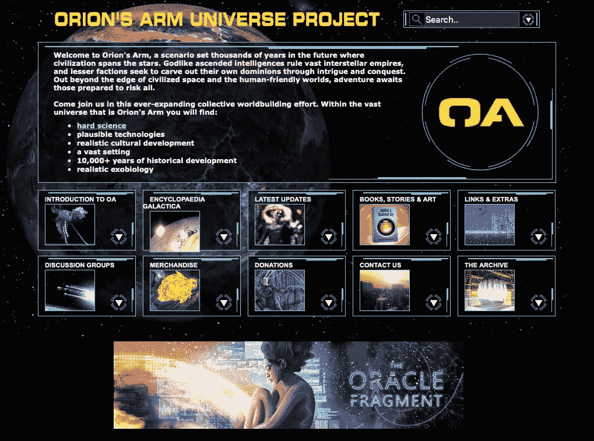

# (不)像是建设世界的爱好

> 原文：<https://medium.com/swlh/the-un-likely-hobby-of-world-building-ee4621ab78b8>

Photo by [Andrew Buchanan](https://unsplash.com/@photoart2018?utm_source=unsplash&utm_medium=referral&utm_content=creditCopyText) on [Unsplash](https://unsplash.com/search/photos/fantasy-map?utm_source=unsplash&utm_medium=referral&utm_content=creditCopyText)

> 越来越多，讲故事已经成为世界建设的艺术，因为艺术家创造了引人注目的环境，无法在单一作品甚至单一媒体中充分探索或用尽。世界比电影更大，比特许经营更大——因为粉丝的猜测和阐述也以各种方式扩展了世界。——亨利·詹金斯，**(2006)，第 114 页**

**至少根据《牛津英语词典》的记载，建造世界这个词的起源可以追溯到 19 世纪。事实上，如果我们相信牛津英语词典的话，创造世界这个词可以追溯到 19 世纪 30 年代。**

****************

**H.P. Lovecraft, A.S. Eddington, J. R. R. Tolkien, and Robert E. Howard.**

**然而，目前对建造世界的理解属于二十世纪，科学家 A.S .爱丁顿在*时空和引力:广义相对论大纲* (1920)中提出，建造世界是对宇宙及其规律的一种推测，这恰好是将广义相对论和其他科学进步中相当困难的概念概念化的一种完美方式。其他人，尤其是艺术家和业余爱好者，通过他们的创造性作品，抓住建造世界的想法，探索次要世界、宇宙，甚至是我们自己世界的再现。一些重量级人物包括像 J.R.R .托尔金这样的人，但他们也包括像 H.P .洛夫克拉夫特和罗伯特·E·霍华德这样死后享有盛名的人。**

**这些二次元世界给了数百万粉丝数万小时的娱乐，但娱乐只是开始。粉丝们还被卷入了深夜争论，争论某些克林贡语的重要性，或者蓝色在特定场景中的重要性。粉丝们甚至敢于继续他们最喜欢的特许经营，探索他们最喜欢的世界/宇宙，并用令人满意的世界建设和/或粉丝小说来填补空白，这让最初的创作者非常懊恼。**

****

**Screenshot Taken of Orion’s Arm Universe Project**

**(从技术上讲)这不是一篇关于世界建筑起源的文章。相反，我想把建设世界作为一种严肃的爱好来考察，一种在许多爱好中吸收了无与伦比的长时间和创造力的竞争者——尽管我在这里的断言可能是错误的。反正我跑题了。我也想探索一下*为什么要*建设世界。是什么让它成为全球数以千计(如果不是数百万的话)人所共享的如此耗时且完全着迷的爱好呢？此外，在我们日常生活中无意义的工作和需要建立比我们在现实世界中创造的东西感觉更有形的东西之间有联系吗？**

**二十年来，建造世界一直是我的一个爱好，跨越了我的青年时代、大学时代，甚至是我作为一名年轻专业人士的岁月。我并不孤单。如果你探索网络上的世界构建社区，你会发现从青少年到年轻的专业人士到经验丰富的退休人员，所有人都在探索占据了他们想象力的世界或宇宙。他们在博客、博客、维基甚至脸书上分享他们的工作。正是这种普遍的吸引力使得建造世界成为如此引人入胜的爱好。此外，这种爱好通常倾向于成员之间的友好对话，这意味着进入和合作的障碍很少。这可能会产生漂亮的结果，这让学者和局外人困惑了几十年。对于那些由外向内看的人来说，他们看到了大量被浪费的潜力，或者仅仅是资本主义机器的一部分，把产品变成了没有报酬的消费者。**

> ****Prosumer:** 在他或她所购买的产品的设计中扮演积极角色的消费者，或者购买产品的组成部分以制造或管理他或她自己的商品和服务的消费者。— **牛津英语词典****

**世界建设和粉丝文化确实受到了男性毒性和局外人误解等因素的损害，但它们也为相当多样化的一群人提供了一个地方，让他们可以一起推测自己粉丝最喜欢的世界，甚至自己的世界。例如，*星际边疆*社区对年轻的我相当热情和欢迎，允许我成为社区努力复兴特定桌面 RPG 宇宙的一部分，并通过合作建设世界的努力扩展它。我在世界建设和粉丝文化中最美好的记忆之一，这两者经常携手并进，碰巧参加了与 *Wookiepedia* 的高级成员关于*星球大战*扩展宇宙的细节的投机性辩论——也就是在迪士尼决定系统地划分欧盟和他们新购买的扩展宇宙的任务之前。对影迷和世界建设最大的犯罪之一是迪斯尼一致决定扼杀花了几十年和数万小时创作的作品。换句话说，迪斯尼扼杀了粉丝们对他们喜爱的宇宙的所有权。我认为这是最重要的一点:粉丝在一个世界或宇宙中创造意义，因此，他们拥有这个世界或宇宙，就好像这是他们自己的创造。所有权很重要，尤其是在这个所有权已经变得越来越没有意义的时代。**

****

***Star Frontiers Tabletop Role-Playing Game***

**虽然建造世界的爱好确实要归功于那些站在我们所有人前面的巨人，他们开发并推测次要的世界和宇宙，但这种爱好确实要归功于 weridos、geeks、nerds，以及那些熬夜开发大量 wikis 或建造世界项目的人。此外，正如我们所知，世界建设不是一个自发的事件，不是凭空出现的。相反，世界建设有着悠久而丰富的历史，可以追溯到低俗小说和漫画书的黄金时代，我们都知道和喜爱的电视节目和电影特许经营权，以及我们玩、消费和珍惜的数字产品。**

**对我和那些有这种共同爱好的人来说，创造世界可以让一个人探索想象力的最深处。对于我们这些生活在想象力经常被压制或嘲笑的世界中的人来说，这是完全有吸引力的。(如果你曾经参加过一次震撼心灵的会议——你知道那种会议——你会想退入想象中。)然而，幻想的飞行是为 weridos 准备的，并且，如果一个人沿着它的逻辑路径继续论证，想象力是令人恐惧的，因为它在国家、家庭、公司甚至社会的控制之外。如果我们加上全球许多政治环境的毒性，难怪人们会退回到他们的想象中，退回到他们最喜欢的世界或宇宙中，无论它们是否是专有的。**

> **扯淡的工作是这样一种工作，即使是做这份工作的人自己也认为不需要或不应该存在。如果这份工作，甚至整个行业都消失了，要么对任何人都没有影响，要么这个世界会变得稍微好一点。—大卫·格雷伯， [**《经济学家》** (2018)](https://www.economist.com/open-future/2018/06/29/bullshit-jobs-and-the-yoke-of-managerial-feudalism)**

**换句话说，我想说的是，创造世界，以及与之相关的各种粉丝文化，难道不是某种资本主义洗脑或调节，让人们变得更有效率，即使是在他们低迷的时候。相反，建设世界似乎是人类真实需求的副产品，这种需求就是创造、逃避和成为比我们自身更大的事物的一部分。尽管在外人看来这是危险的，甚至是浪费的，但事实上，两者都不是。世界建设是在一个意义和创造变得越来越不重要的世界里创造和寻找意义的一种尝试。我们当中有多少人能说我们今天做了一些有意义的事情？我们中有多少人能说我们用我们的头脑和双手创造了有形或看似有形的东西？如果你对上述问题的回答是“是”，你很可能是少数，而世界建设可能对你没有吸引力。对于那些对上述问题回答“不”的人，考虑一下世界建设。这可能是数百万人的爱好，而且还在增长。如果你不相信我，可以考虑在网上搜索一下“建设世界”。**