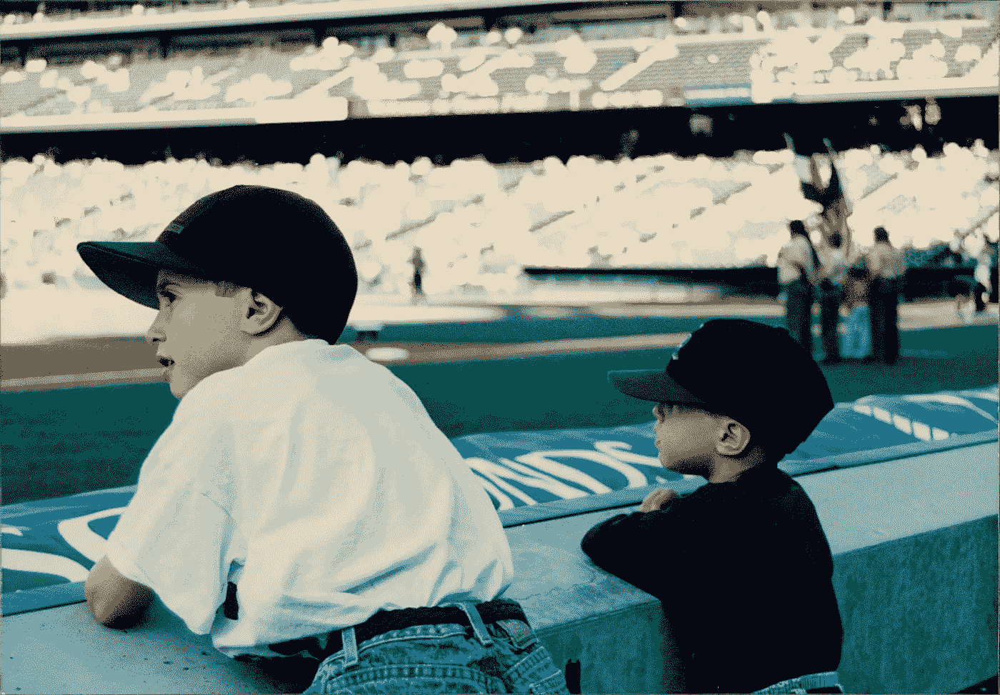

# 过去涌入现在的意外时刻

> 原文：<https://medium.com/swlh/the-unexpected-moment-when-the-past-floods-into-the-present-4aad6e43de4d>

## 理解怀旧，这是生活中更复杂的情感之一

Nostalgia! My brother and me in 1995, wearing our jeans at the right height.

去年 4 月的一个工作日下午，我在家工作，遇到了一次例行的午餐后低能量减速。在《艺术的战争》一书中，作家史蒂文·普雷斯菲尔德称阻止我们完成最重要工作的潜在力量为“抵抗”那天下午，我…