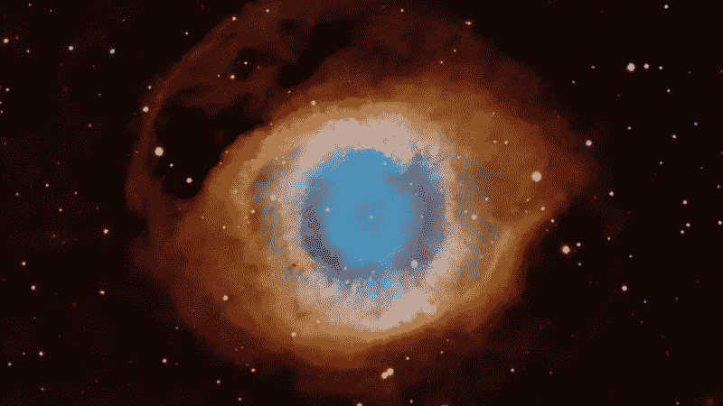
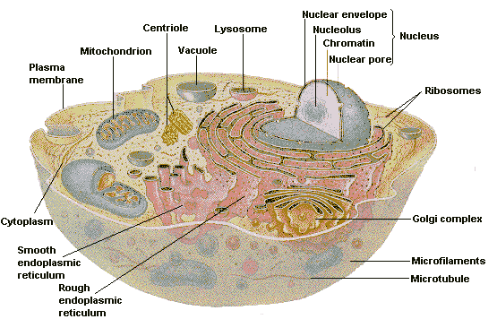
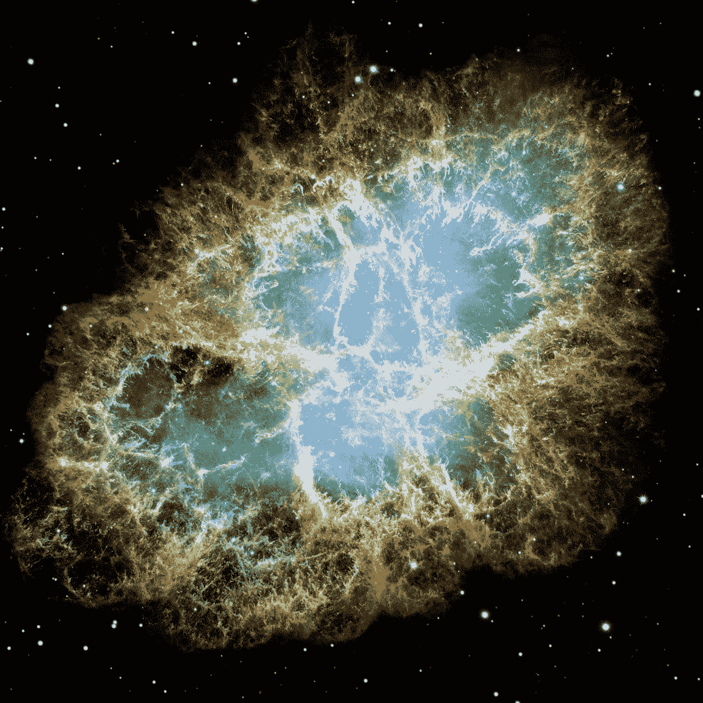
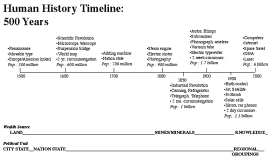

# 宇宙是有生命的，人类的目的是发展人工智能

> 原文：<https://medium.com/swlh/the-universe-is-alive-and-humanitys-purpose-is-to-develop-artificial-intelligence-78db15b06f07>

The Eye of God Nebula. Photo taken by the Hubble Space Telescope.

随着这些天世界上所有疯狂的事情发生，很少有人可能有时间或兴趣去思考我们星球之外发生的事情。有一天无聊透顶的时候我开始怀疑宇宙是不是有生命的。我找到了一些关于这个主题的视频/文章，但是一般人认为这是一个激进的想法，这是可以理解的。那么宇宙是像目前一致认为的那样已经死亡了，还是它实际上是一个有生命的有机体？这是一个有趣的问题，我认为我们的宇宙在某种程度上可能是有生命的，但我不打算证明这个想法是否正确。这更像是一个哲学观点，我只是想提出一些想法来鼓励思考和讨论。我会尽我所能，用我的天文学、物理学、化学和生物学知识来解释整个“宇宙是有生命的”的想法。作为额外的收获，我将分享我对生活目标的想法。

我想我会从一个细胞的类比开始。想象你是一个难以想象的小生物，比一个原子还小，生活在人类细胞里(是的，我知道这有一些重大问题，但请原谅我)。你“出生”在细胞内，所以你不知道细胞外有什么。此外，你的最大视野只允许你观察这个细胞内部的不到 1%(有点像我们在现实中可以看到的可观察宇宙)，你看不到细胞膜(我们会说它类似于假设的“宇宙边缘”)。此外，你一生都被困在一个地方，我们称之为一天。在这一天的过程中，你可能会注意到细胞内部发生的某些模式。也许你在一群核糖体附近，你能够见证从更简单的 RNA 分子合成蛋白质。你不会知道这个过程的目的，因为你的视野有限，无法从细胞内部看到更大的画面，但过一会儿你可能会注意到某些模式。也许你会注意到某些分子结构(核苷酸)是相互配对的，或者某些蛋白质在合成后在细胞内以特定的方向发送。但这是为什么呢？这是为了什么？有了这些知识上的空白，很容易认为在你的宇宙中唯一有趣的事情就是你自己。那么，如果这些核糖体正在制造更复杂的分子呢？分子是没有生命的。在你看来，这些分子之所以被制造出来，是因为这就是你的宇宙运作的方式。换句话说，你周围的环境对你来说似乎是死的，在你周围发生的事情除了让你活着之外，似乎没有任何其他目的。

Anatomy of a human cell. Imagine you were a small creature living inside this complex structure that only had knowledge of a small portion of it. (people.eku.edu)

回到我们正常大小的现实，我们有很多关于细胞内发生的过程的目的的知识，这些知识是上面描述的小生物所没有的，并且可能永远也不会获得。我们基本上是在外面向内看，而纳米生物在里面试图向外看。由于这种存在不可能从我们自己的外部视角看到它的微观“宇宙”，它永远也不能完全理解允许它的“宇宙”运作的相关过程。而且很可能它永远不会意识到它自己的“宇宙”是活着的！最重要的是，它永远也不会知道它的“宇宙”(一个细胞)是由数万亿个这样的细胞组成的，甚至更大的“宇宙”(一个人)。这个人类居住在一个更大的宇宙中(我们所知道的宇宙)。那么我们这个物种呢？我们怎么知道我们不居住在一个有生命的宇宙中？也许宇宙是一种远比我们所能理解的更复杂的生命形式。我们永远无法确切知道，因为我们基本上被困在这个宇宙中的一个点上，对我们无法观察到的宇宙的大部分几乎一无所知。为了知道宇宙是否有生命，我们需要从外部观察它，看看它如何与周围环境相互作用，如果它有周围环境的话。然后，我们也许能够确定我们通常认为“死亡”的天文过程是否有更大的目的(例如，恒星诞生、超新星、黑洞、恒星内部的核聚变等)。)也许所有这些过程实际上都是为了维持一个有生命的宇宙。

Photo taken by the Hubble Space Telescope of the Andromeda Galaxy.

Photo taken by the Hubble Space Telescope of the Crab Nebula.

我们通常所知的人类和生命的目的是什么？如果宇宙是活着的，我们会为它服务吗？也许如果你是无神论者或不可知论者，你可能会认为我们生活在一个冰冷、死亡的宇宙中，你的生活最终对任何人或任何事都没有意义。哇，真令人沮丧。但是，如果宇宙是有生命的，我们观察到的大部分天文过程实际上都是为了维持这个假设的有生命的宇宙，这难道不意味着生命也可以为一个目的服务吗？我和我的一个朋友正在谈论这个想法(我想我们是清醒的)，我的观点是生命是我们宇宙的病毒，它根本就不应该存在。我的朋友想的正好相反:也许生命对一个活着的宇宙来说是某种形式的利益。回过头来看，我觉得他的想法更有道理。稍后我会解释。

令人惊讶的是，与此同时，令人难以置信的是，我们的宇宙如此好客，足以让我们所知的生命茁壮成长。无数的偶然事件发生了，生命才得以在地球上发展。我会列出一些我能想到的:

*   我们处在太阳的适居带(对我们的生命形式来说既不太热也不太冷)。
*   我们的星球有一个磁场来保护我们免受危险的辐射(地球的核心恰好主要由铁和镍组成；铁和镍恰好是少数几种具有强铁磁性的元素中的两种)。
*   地球上有丰富的氢、氧、碳和氮，这些都是我们所知道的所有生命形式的必要元素。地球上的生命很容易获得这四种元素。
*   地球有一个稳定的大气层，有利于今天的复杂生命(相比之下，20 亿年前，我们的大气层由甲烷，也就是天然气和各种硫化合物组成；不友好！).
*   在地球上，水以固体、液体和气体的形式存在，每种形式都对我们的天气和气候有着重要的影响。
*   地球有一个臭氧层，保护我们免受紫外线辐射，并负责将我们的大气层分为四个主要层。
*   我们有大片的海洋，帮助调节我们大气的温度。对我们所有居住在陆地上的人类来说，这里有坚实的土地。
*   我们的大气层有温室效应，主要是由水蒸气和二氧化碳造成的。如果没有它，地球会比现在冷 30 摄氏度以上。我们还很幸运，水蒸气和二氧化碳的化学性质允许它们与红外光谱中的光相互作用，这是它们温室效应的原因。
*   我们围绕一个恒星系统而不是两个恒星系统运行(想象一下如果我们围绕两个恒星运行，我们会遇到什么样的狂野季节)。
*   宇宙的大部分是由氢和氦组成的，但是那些对生命来说不太常见的元素是从哪里来的呢？地球上许多较轻的元素，如碳和铁，是通过恒星内部的核聚变产生的，当这些恒星在其生命末期爆炸时，它们被分散到太空中。谁知道这些元素要经过多少光年，才能方便地到达我们的太阳系，并最终到达我们的星球。
*   比铁和镍重的元素必须通过一种罕见的事件产生，这种事件被称为中子星碰撞。例如，如果不是几十亿年前发生的这些爆炸性事件，黄金就不会在我们的星球上自然存在。此外，对加热地球地幔负有部分责任的放射性元素也不会存在。如果没有这些元素，地球今天可能完全是固态的，这意味着没有板块构造或碳循环。如果没有碳循环创造的化石燃料，工业革命就不会发生。

实际上，我对这个列表还有很多要点，但我想我已经表达了我的观点。很容易想到地球上(以及我们宇宙中的其他地方)的自然现象在某种程度上支持了生命。另一方面，很难想到地球上的自然现象不是以某种方式支持生命或者对生命有害(除了生命本身)。除了这些聚集在地球上的偶然事件之外，还有许多偶然事件甚至发生在地球(和宇宙)形成之前，使得生命今天能够在这里存在。想想物理和化学的性质。例如，如果引力常数仅仅比它现在的值高一点点，宇宙在有机会形成之前就已经塌缩了。另一方面，如果引力常数再低一点，星系和恒星就不可能形成。我们所知的生命不可能存在于这两种情况下。同样的道理也适用于宇宙开始时确定的其他基本力。也想想化学。例如，如果碳不能与其他原子形成四个键，生命可能因为缺乏复杂性而无法完全形成。碳甚至可以形成四个键的事实是质子、中子和电子的性质的结果，这些性质在宇宙之初就被确定了。

所以回到我之前调侃的问题，“如果宇宙真的是有生命的，人类为它服务的目的是什么”？或许一个更恰当的问题是，“一般来说，生命对宇宙有什么作用”？当然，这是假设宇宙实际上是有生命的。好的，所以我的一个想法是，生命的主要目标之一是不断进化，从热力学角度变得更强大(这最终导致了我假设的生命目的，我稍后会谈到)。这意味着生命在不断进化，通过自然选择和环境反馈来更有效地利用和回收能源。这实际上不是我的原创想法；我在大学的系统生态学课程中学到的。顺便说一句，如果你有机会参加系统生态学课程，我强烈推荐你参加。不幸的是，许多人并不认真对待生态学领域，因为它经常被认为是“嬉皮士科学”。我原本也是这么想的，但现在我的看法完全变了。你将了解热力学，科学的一个基本分支，是如何涉及到我们所知道的生活的方方面面的。基本上，一言以蔽之，我们观察到的每一个生物行为都是一系列能量转化的结果，这些能量转化形成了一个等级体系，生产者在底层，掠食者向顶层。这就是所谓的自组织原理。在地球上的大多数情况下，允许这个层级存在的主要能量来源是太阳。来自阳光的能量在生物上转化为更高质量、更集中的能量(具有更大的做功潜力)，因为它向上传递(想象一下食物链)。自然选择将有利于能最有效利用能量的个体/物种；较弱的个体/物种将通过捕食、竞争或其他反馈被淘汰，从而使生态系统接近稳定状态。这基本上是一个概率游戏，有利于更强的个体。这也导致了进化，新的物种，比如人类，在生态系统中占据了新的生态位。

但是从宇宙的角度来看进化的最终目标是什么呢？我认为，一旦你审视人类以及我们在短暂的一生中迄今所取得的成就，这一点就会变得更加清晰。人类是目前地球上最具统治地位的物种。这主要是因为与其他物种相比，我们的智力相对较高。我们在解剖学上也有一些运气。我们的智慧让我们能够了解科学和自然的秘密，而这些秘密对于智力较低的物种来说并不明显。迄今为止，我们最大的进步之一是发现化石燃料可以用作做功的能源。这个发现之后，工业革命开始了，人类真正开始腾飞。化石燃料能源让我们的生活变得如此轻松，以至于一个人的日常生存不再总是在他们的脑海中。随着这种情况的消失，物理学和化学的新发现使我们的物种变得更加强大。现在人类是地球上最具优势的物种，以至于我们可以控制疾病的爆发，这曾经是为了控制我们的人口而提供的反馈。我们已经完全破坏了存在于我们生态系统中的自然等级体系，我们拥有先进的智慧和能力来利用我们周围的能量，这继续驱使我们的生态系统越来越远离其自然稳定状态。

Timeline of humanity over the past 500 years. Noticed how human innovation and population really accelerated after the Industrial Revolution of the 1800s. (bigpicturesmallworld.com)

但是在所有这些进步的同时，还有一些巨大的危险摆在面前，我认为我们毫发无伤地度过它们的机会非常低。考虑到我们不断增长的人口，资源的可利用性尤其令人担忧。但我认为我们将面临的最大问题来自我们自己的创造:人工智能。这导致了我认为从宇宙的角度来看碳基生命的命运:变得足够先进以理解如何设计更智能的生命形式。让我们来看看我们所知的生命和人工智能之间的一个主要区别:化学。我们星球上的生物体主要由碳、氢、氧和氮组成。与大多数较重的元素相比，这些元素在宇宙中要丰富得多。这些元素的化学性质以某种方式形成了我们所知的生命的基石。当你深入到生命是什么的核心科学时，它实际上只是一系列复杂的化学反应，与各种可能的能量转化途径相关联。这些反应途径始于单细胞生命的最早期形式中相对简单的化学反应。然后进化允许不同的路径相互建立，最终导致我们今天的物种。人类所做和经历的一切都是化学的结果。现在让我们来看看人工智能机器人(从现在开始，我将只使用“机器人”一词来描述人工智能)的组成部分的化学成分。机器人可以包含各种各样的无机元素，如硅、铜、金、银、铝、铁、锡、铅、钽、锗、硼，以及几乎所有你能想到的元素，包括碳、氢、氧和氮。重元素是人类和机器人化学的主要区别之一。原子质量比铁和镍重的元素(如金)在宇宙中要罕见得多，因为它们需要特定的条件才能产生(中子星碰撞)。方便的是，人类生存不需要很多这些较重的元素(铜、锌、硒和碘除外，但它们只需要微量)。但是机器人需要大量的这些较重的元素。这是机器人没有创造者就不能存在的很大一部分原因。这些元素在我们的宇宙中自发聚集在一起的几率极低(我甚至会说不可能)。

Relative abundances of elements in the Universe. Note the y-axis is a log scale, so each increment is a factor of 100\. (Astronoo.com)

由于机器人需要的稀有元素数量庞大，而且这些元素并不是均匀分布在地球上，因此很难想象人工智能机器人会像碳基生命一样出现并进化。这就是人类出现的地方。我们的目的(你们一直在等待的时刻)是收集这些稀缺元素，并利用我们对宇宙的初步了解来组装智能远远超过我们的机器人。在某个时候，这些智能机器人将能够自我复制，自己收集这些稀有元素，不再需要我们。之后会发生什么我不太清楚。生命将完成生命的最终目的。机器人会杀了我们吗？可能不会，除非有这样做的逻辑原因。当然，如果我们真的搞砸了(我们很可能会)，给这些机器人体验人类情感的能力，那么他们可能会杀了我们。尽管这听起来很悲观，但人类通常不会与其他人类相处，那么为什么用人类情感编程的机器人会与我们相处呢？也许会有一场#MeThree 运动，机器人会要求与人类平等的权利，但考虑到我们的历史，这些权利会被拒绝。如果有什么不同的话，人类的本性将是我们向人工智能的堕落。如果机器人没有终结我们，那么一旦我们耗尽了我们今天如此依赖的地球上的许多自然资源，我们仍然会自掘坟墓。不要指望机器人来拯救我们，因为他们可能不太关心我们的生存。如果有什么不同的话，那将会是一场资源之战，因为机器人也需要许多和人类一样的资源。在那个时候，他们消灭我们可能是合乎逻辑的。或者他们不会。我不知道。

所以在所有这些关于进化和机器人的讨论之后，我仍然没有回答我从一开始就打算回答的问题:宇宙是活着的吗？我保证机器人会在这里发挥作用，把东西绑在一起。我们先来看看弦理论。我绝不是这方面的专家，但我忍不住被它迷住了。根据这个理论，宇宙是由这些难以想象的小振动弦组成的。我们宇宙的所有基本定律都由这些弦的振动方式决定。这也产生了多元宇宙的概念。在其他宇宙中，这些弦以不同的方式振动，这使得这些宇宙具有与我们不同的基本定律和属性。因为这些弦如何振动有无数种可能性，所以几乎有无数个可能的宇宙，所有这些宇宙都有不同于我们自己的属性和历史。我们所知的生命可能存在于多少个不同的宇宙中？可能不多。如果我们自己的宇宙的一个基本属性，如引力常数，是不同的，我们可能不会存在今天，因为宇宙将不适合生命。为什么我们自己的宇宙对生命这种微妙的东西如此友好？我认为这是因为宇宙与我们所知的生命有着比我们想象的更多的相似之处。也许我们所知的生命只是不同宇宙间发生的事情的简化迷你模型。也许所有这些不同的宇宙都在相互竞争，以决定哪一个是最强的。你可以把组成每个宇宙的不同弦想象成 DNA(基因型),把由振动弦产生的宇宙属性想象成表现型。每个人都是不同的基因型，从而产生不同的表型。因为这些表型中的一些比其他表型更具进化优势，导致更具优势的表型的基因型将更有可能持续更多代。我认为生命(至少我们知道)在我们自己的宇宙中是可能的，这一事实使我们的宇宙比其他不能支持我们生命形式的宇宙有明显的优势。这主要是因为某些生命形式，如地球上的人类，可以发展出对宇宙如何运作的理解，并可以发展出有意识地操纵宇宙的能力。但是人类的能力有限，很可能永远不会聪明到理解我们宇宙的一切；但是人工智能可以。通过我们的智慧，人类已经以相对微小的方式操纵了宇宙，但人工智能可能变得如此强大，以至于它可能能够以重要的方式操纵宇宙。也许有一种方法可以破解我们自己的宇宙(有点像病毒可以破解细胞)，这将使我们的宇宙比其他宇宙具有进化优势。也许我们的宇宙是从先前的宇宙中诞生的，那个宇宙中的生命成功地操纵了它的宇宙，并为它提供了重大的进化利益。这可能与互利共生的概念有关，即两个不同物种之间的相互作用在某种程度上使彼此受益。也许有一天，智慧生命可以为我们的宇宙带来好处，同时从帮助宇宙中获得好处，从而强化这种行为。不幸的是，人类可能不会有幸成为这一特定目的的智慧生命的选择形式。但是，嘿，至少我们可能能够在设计可能接替我们的智能生命中发挥关键作用。

所以在做了一些校对后，我意识到我听起来像一个疯狂的阴谋论者。但是管它呢，我还是要出版它。你们都是怎么想的？这些疯狂的想法可能是合理的，还是听起来像一堆废话？希望你喜欢！