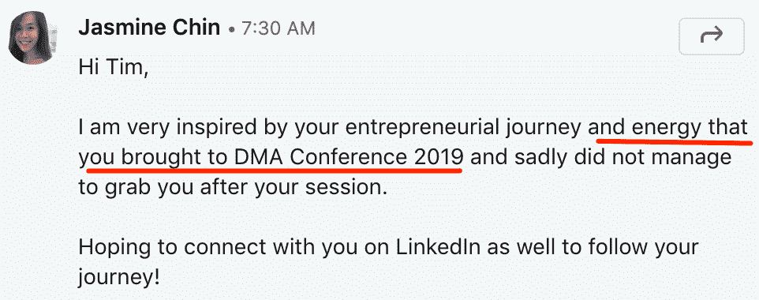
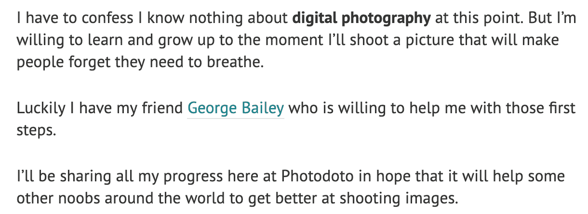
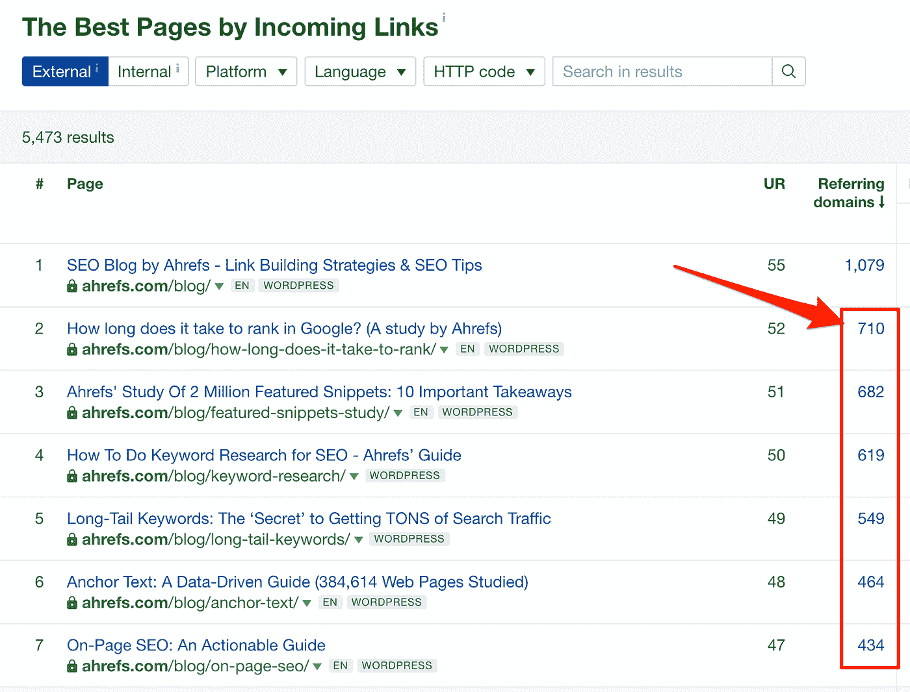
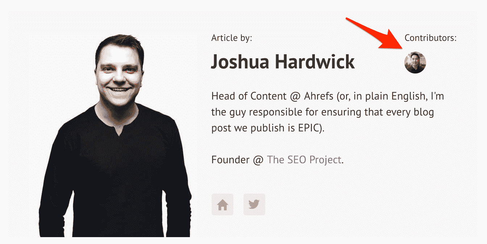
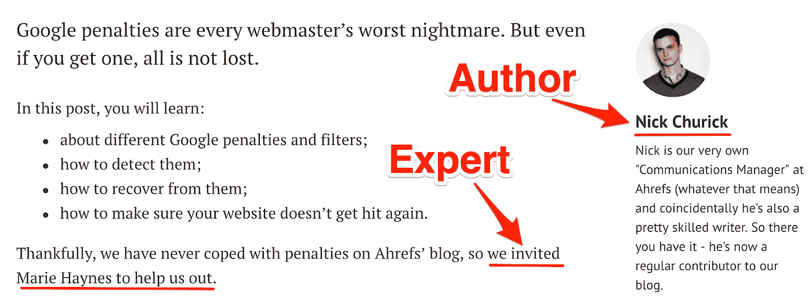
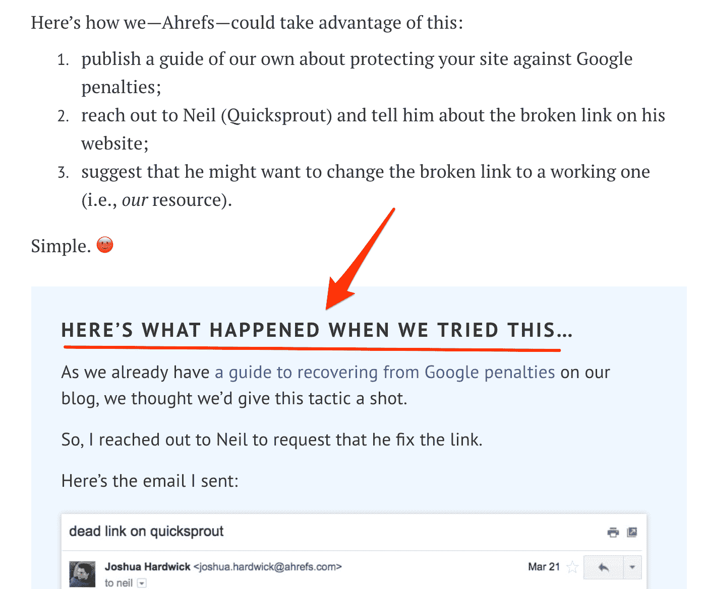
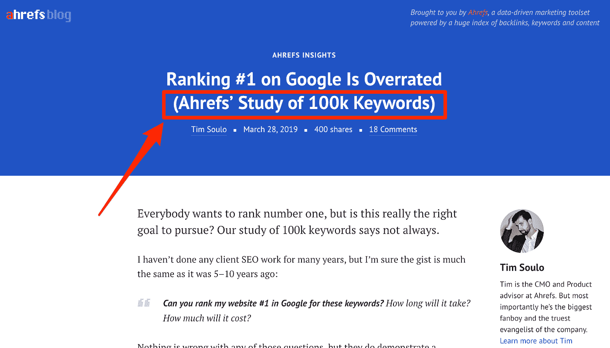

# 内容营销的潜规则

> 原文：<https://medium.com/swlh/the-unspoken-golden-rule-of-content-marketing-8f966e1f1aa0>

> “你对创作优秀内容的最佳建议是什么？”

问题问得很大声；急切地。

五百双期待的眼睛注视着我坐在墨尔本会议中心的舞台上，手里拿着麦克风。

我早就知道，我的“突破”往往发生在两种特定的情况下:淋浴时和难以入睡时。

我现在可以把这个列表扩大到包括像这样的时间——在巨大的压力下，尴尬的沉默迫在眉睫，没有时间思考。

在这种时候，我有时会惊讶地发现自己以前从未想到过的独到见解。

这绝对是其中的一次。

所以我很好地利用了麦克风。

> *“真是* ***最有资格的人*** *。过去几年，我们成功发展博客的关键在于，我们尽最大努力让每篇文章都由公司里最有资格谈论该话题的人撰写。”*

公平地说，这并不是对我那天所说的话的直接引用。

我想实际发生的事情是，我漫无边际地说了三分钟，试图用语言表达这个突然袭击我的概念。

但那天我没能表达的，显然是我对这个话题的极度兴奋弥补了。因为就在第二天，我收到了一堆 LinkedIn 的邀请，就像这样:

无论如何，在那次会议之后，我有足够的时间来思考“最有资格的人”这个概念。

所以我们开始吧！

# 内容营销最大的问题

让我们从最底层开始。

七年前，我负责一个名为[Photodoto.com](http://photodoto.com/author/timsoulo/)的摄影博客(这是一家更大公司的子项目)。

我对摄影一无所知，也没有热情，但我还是决定尝试一下。我甚至在 Photodoto.com 发表的第一篇文章中宣布了我旅程的开始:

长话短说，我很快意识到我对摄影毫无兴趣。不出所料，我最终没有学到任何关于它的东西——更不用说在博客上分享我的知识了。

另一方面，我非常热衷于数字营销和建立在线业务…所以尽管我对摄影不感兴趣，我还是找到了发展博客的方法。

秘密:我雇佣了一群自由摄影师，他们愿意为我们的博客写文章来赚取额外的收入。

再加上我在博客和文案写作方面的经验，他们的领域专业知识产生了一些很棒的文章，在社区内引起了关注，并为我们的博客带来了相当多的流量和名声。

事情开始慢慢好转，Photodoto 开始看起来像一个可行的在线业务，有一些真正的潜力。

但当我查看竞争对手的摄影博客时，我开始意识到我对摄影缺乏热情是这个行业最大的缺点。我不了解这个行业，也不了解这个市场——见鬼，我甚至不知道我雇佣的自由摄影师的文章做得好不好。

与此同时，我们的竞争对手在战壕深处；拍摄精彩照片、测试最新设备、参加会议……所有这些。

他们是思想领袖。我们没有。

鉴于我对这个话题缺乏热情，我不认为我们会成为一对。所以我永远离开了那个项目。

## 结论呢？

我没能把那个摄影博客变成一个世界性的成功*而不是*，因为我不知道任何有效的营销或文案技巧。

这个项目失败了，因为如果没有实际的领域专业知识，所有这些技巧都毫无意义。

回想起来，我做对的一件事是雇佣**真正的摄影师**为我们的摄影博客写内容，而不是文案。

这种情况发生在太多的网上交易中。他们将内容营销业务委托给“文案作者”:有写作经验、对心理学和销售触发器有丰富知识的人。

但与此同时，这些“内容营销摇滚明星”缺乏对他们所写的利基市场的了解…更不用说他们用内容推广的业务的更好的细节和细微差别了。

请记住以下几点:

> 如果没有行业专家的参与，文案一文不值。

我认识的最好的文案不会同意为你做任何工作，除非你允许他们和你公司的人联系，问各种各样的问题，帮助他们更好地了解你的业务。

然而在大多数情况下(至少从我的经验来看)，内容营销部门完全脱离了构建和运营业务的人。

但是让我们站在一个读者的立场来看这个问题。

# 我们更喜欢听权威人士的意见

我以墨尔本会议中心的一个场景开始这篇文章，有两个原因。第一:马上用一个很酷的故事吸引你。

第二:这个场景把我描绘成一个“权威”——一个被邀请在世界各地的会议上发言的人。这让我有足够的可信度在你完成这篇文章的十分钟内抓住你的注意力(至少，我希望如此！)

我关于 Photodoto 博客的故事也是如此。

除了分享写博客的重要一课，这个故事还告诉你，我已经在内容营销游戏中至少 7 年了。

你不会想把时间花在阅读昨天发表了第一篇文章的人的内容营销建议上，对吗？

当然，这在每个细分市场都有所不同。你是想读我写的一篇关于殖民火星的文章，还是想听听埃隆·马斯克或尼尔·德格拉斯·泰森的文章？

答案很清楚。当选择要消费的内容时，人们会倾向于由某个特定主题上最有资格的人创建的内容。

所以当我以 CMO 的身份加入 Ahrefs 并开始投资内容营销时，我已经知道我不需要任何“有经验的文案”来为我们的博客写作。

相反，我需要真正的 SEO/营销从业者来写，即使我不得不投资教他们文案技巧。

我照做了。我确信，这就是为什么我们博客上的文章会得到数百个不同网站的反向链接，而我们这个细分市场中的其他公司却很难让别人在推特上发布他们的文章——更不用说链接到它们了。

不过，有一个问题。

看一下上面的截图。你看到的前 4 篇文章(不包括我们博客的首页)都是我的功劳。

但是……你会问，难道 CMO 没有更好的事情可做吗？比如思考整体战略、管理团队、招聘员工、做重要决定等等

事情是这样的。

在 Ahrefs，我们了解内容营销的力量，我们希望在这方面击败我们的竞争对手。这意味着我们需要让公司里最有资格的人来制作我们的内容。

因此，尽管这些文章的作者是我自己，但实际上每篇文章背后都有一个完整的团队。

我不得不从我们的数据科学和开发团队中抽出时间来为我编写脚本和处理数字。我不得不请我们的博客编辑润色我的措辞，完善文章流程。我们的 [CEO 本人](https://twitter.com/botsbreeder)经常会阅读我们的博客内容并给我们一些批评，尤其是当我们谈论对我们公司具有战略重要性的话题时。

换句话说，如果你是一个企业主，想要建立一个“不干涉的内容营销团队”,这个团队不需要花费你自己的时间就能产生效果……你最终会被一个愿意投入自己的时间为公司创造内容的企业主彻底拆散。

# 那我该如何破解呢？

虽然让公司最有资格的人参与内容营销非常重要，但这绝对是说起来容易做起来难。

首先，这些人很有可能有太多的事情要做，无暇照顾你的内容团队。

另外，如果你的团队中没有领域专家或思想领袖，会发生什么？

不要担心，你仍然可以解决这个问题和惊人的内容营销。我可以说，这里有一些策略——或者说是黑客？—我们在自己的团队中练习。

# 1.合作

三个臭皮匠顶个诸葛亮。

正如我之前提到的，我们在 Ahrefs 博客上发表的每一篇文章都会得到同事的反馈。

我们已经意识到团队成员的贡献对最终结果至关重要，因此我们决定在文章作者框中反映这一点。

这是一个信用到期的例子:

# 2.成为奥普拉

想想奥普拉是如何建立她的事业的。

不能让你们公司有资格的人参与进来？在你的领域里寻找一些杰出的人。

我们经常在自己的博客上这样做:

到目前为止，我所看到的最突出的例子是 WaitButWhy 的蒂姆·厄本与埃隆·马斯克的合作。

他们集思广益，创造了一些关于人工智能话题的疯狂好文章— [第一部分](https://waitbutwhy.com/2015/01/artificial-intelligence-revolution-1.html) & [第二部分](https://waitbutwhy.com/2015/01/artificial-intelligence-revolution-2.html)。

# 3.说到做到

如果你不能让一个合格的人来衡量你的内容，为什么不为其他合格的人已经谈论过的战略和战术带来一个新的角度？

太多的人求助于重复别人的想法和结论，而没有实际测试这些概念本身，并对事情进行自己的解释——这不太能让你从一群看起来相似的人中脱颖而出。

我们在 Ahrefs 绝对不会这么做:

这里要吸取的教训是:没有人生来就是专家。

但是我们都可以通过做别人不愿意做的事情而成为一体……而且越多越好。

# 4.利用您公司的专有数据

这是我们在 Ahrefs 一直在无意识地做的事情…几乎从第一天开始。然而，我是在阅读了 Priceonomics 的[内容营销手册](https://priceonomics.com/the-content-marketing-handbook/)后才意识到这一点的。

问题是，你的公司可能坐在一大堆数据上，而这些数据可能会引起世界其他地方的极大兴趣。你需要做的就是找出正确的角度，并以一种有意义的方式呈现这些数据。

典型的例子:

是的，给你这个建议对我来说很容易，因为 Ahrefs 是一家将大部分资源投入数据收集、处理和存储的公司。我们几乎坐在一大堆等待与世界分享的数据上。

但是，与其花更多的时间试图说服你，你也有专有数据，可以作为惊人内容的基础，我宁愿再一次向你推荐 Priceonomics 的惊人的内容营销手册。

…

现在你知道了！

我确信这是 Ahrefs 博客在过去几年里飞速发展的原因。

你呢？我提到的几点有没有引起你的共鸣？

你会尝试这个“策略”吗？

下面让我知道你的想法。

//

*感谢阅读。更多深度营销文章，请访问* [*Ahrefs 博客*](https://ahrefs.com/blog/) *。*