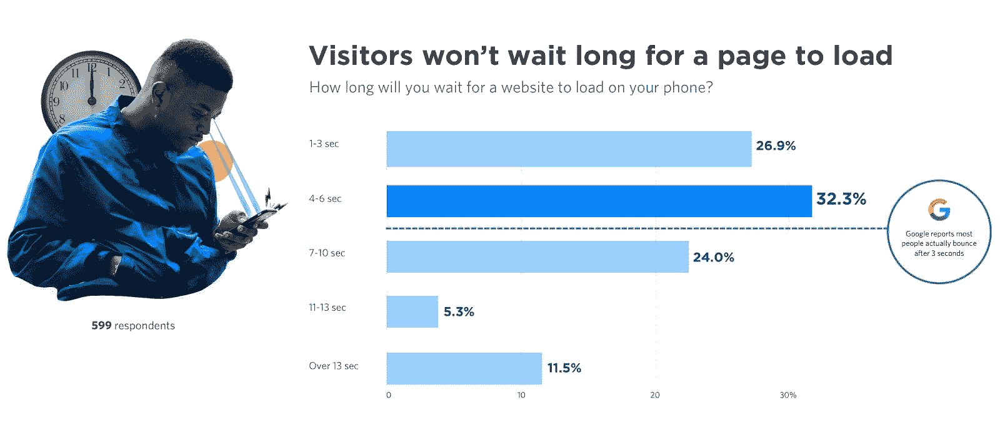
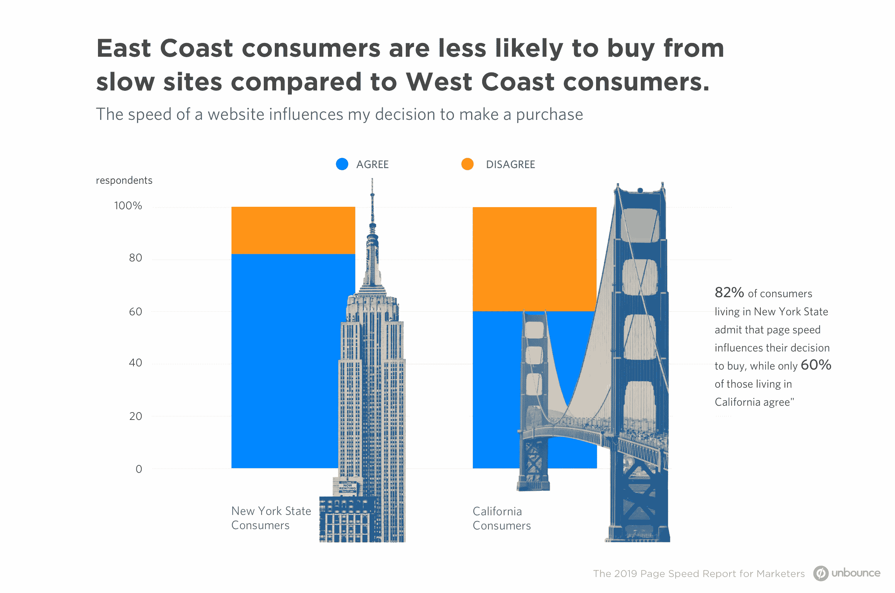
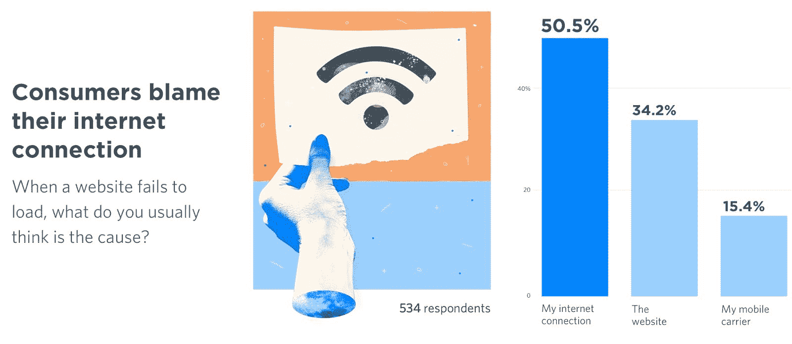

# 2019 年速度的紧迫性:新的研究发现，45%的客户不会从速度慢的网站购买

> 原文：<https://medium.com/swlh/the-urgency-for-speed-in-2019-new-research-finds-45-percent-of-customers-wont-buy-from-a-slow-8f94db4dd1c2>

*由* [*莎拉·古丁*](https://twitter.com/sarahagoods?lang=en) *，公关部经理在发布会上*

我们都经历过网页速度慢的情况。我们已经感受到了这个小图标持续旋转的每一秒钟所带来的挫败感。

我们都知道这种感觉:我们希望那一页打开，我们希望它现在就打开。

作为消费者，我们希望能够浏览网页，购买产品，并快速找到问题的答案——甚至更好。不幸的是，这种期望往往得不到满足。2019 年，网页的平均大小已经膨胀，消费者等待页面打开的时间也随之膨胀。智能手机的速度更慢。在过去的三年里，平均网页大小翻了一番，所以消费者现在平均要等 15 秒才能加载手机页面。

因此，当涉及到让客户满意时，页面速度很重要——慢速页面会产生糟糕的体验，导致购买量减少。但是，虽然我们知道它很重要，但我们并不真正知道它为什么重要(或者重要到什么程度)。我们也不知道哪些类型的人会被这些滞后的页面困扰。或者哪些环境比其他环境更让人不耐烦。我们也不知道消费者在遇到一个速度慢的网站时会有什么反应。在幕后，我们仍然想知道公司是如何优先考虑页面速度的…或者为什么他们没有？

为了弄清其中一些问题，Unbounce 在两项独立的调查中询问了美国和加拿大的 1150 名消费者和营销人员对 2019 年页面速度的看法和行为。

以下是来自[un bounce 2019 年页面速度报告](http://www.unbounce.com/page-speed-report/?utm_medium=referral&utm_source=medium&utm_campaign=page-speed-report&utm_content=lp-page-speed-report)的八项关键发现，这些发现开始深入挖掘上述问题:

# 59%的消费者表示，他们不会等待超过 6 秒的时间来加载页面

我们询问了 750 名普通人，他们要等多久才能加载一个网页，几乎 60%的人说他们不会超过 6 秒。但这并不是谷歌所声称的——实际用户行为显示大多数人在 3 秒钟后会反弹。结果是消费者认为他们比实际上更有耐心。

# Android 用户比 iOS 用户更有耐心

说到耐心，当 Android 用户体验到一个缓慢的网站时，他们说他们会比他们的 iOS 朋友等待更长时间。在那些会等待 1 到 3 秒来加载页面的人中，64%是 iOS 用户，只有 36%是 Android 用户。而那些说他们会等 11-13 秒的人，只有 36.2%是 iOS 用户，而 61.3%是 Android 用户。(由于 iOS 占美国手机的 65%，不耐烦似乎是常态。)

# 45%的消费者承认缓慢的网站降低了他们的购买意愿

当浏览电子商务网站时，消费者非常看重速度。45%的人不太可能进行购买，36.8%的人不太可能在未来返回该网站。12%的消费者甚至会告诉朋友，当他们经历一个缓慢加载网站的挫折时。

# 千禧一代在移动设备上的注意力持续时间比在电脑上短得多

千禧一代渴望即时满足，这并不奇怪，但他们在打电话时尤其不耐烦。18 至 24 岁的年轻人中有 45%表示他们会在电脑上等待 4 至 6 秒，但这个年龄段中只有 26%的人会在手机上等待那么长时间。

# 与西海岸的同行相比，东海岸的人不太可能从慢网站上购物

事实证明，这种刻板印象是正确的——永远忙碌的纽约人比他们在加州的悠闲朋友更不愿意从慢速网站上购物。

在居住在纽约州的消费者中，82%的人承认速度影响他们的购买决定，而居住在加利福尼亚州的消费者中，只有 60%的人同意页面速度影响他们的购买决定。

# 超过 50%的消费者表示，为了更快的加载速度，他们愿意放弃动画和视频

消费者喜欢漂亮的动画和视频，对吗？？结果是，如果他们打算减慢一个网页的速度，有微弱多数的访问者看不出他们有什么价值。事实上，四分之一的消费者说他们也愿意放弃图像！

# 年轻女性对电子商务网站的期望更高

年龄在 18 岁到 24 岁之间的年轻女性中，有更多的人表示，当她们体验到一个缓慢的网站时，她们会关闭标签并停止购物(与同龄男性相比)。在这个年龄段中，86%的女性(相比之下只有 14%的男性)表示，她们不太可能从慢速网站上购物。

# 大多数消费者将他们的互联网连接归咎于缓慢的加载时间(在他们指责网站之前)

大多数人把速度归功于网站所有者无法控制的因素(比如他们的网络提供商)。然而，随着越来越多的人发现慢速网页经常是罪魁祸首，这些慢速网站可能会承担更多的责任。

正如你所看到的，快速页面对公司来说是至关重要的——消费者不太可能从慢速网站购买，而更有可能在遇到滞后页面时查看竞争对手的网站。但是快速页面不仅仅对于可用性和转化率很重要。Andy Crestodina，Orbit Media 的创始人，[最近提醒我们](http://globenewswire.com/news-release/2019/01/22/1703703/0/en/The-Urgency-for-Speed-in-2019-Study-Reveals-Consumers-Are-Less-Likely-to-Buy-From-Slow-Sites.html)事情不仅仅如此——快速网页对环境、发展中国家的慢速连接以及保持互联网高效运行也很重要。

> **研究方法论**
> 
> *Unbounce 开展了两项在线调查，通过谷歌调查利用在线消费者，通过 Typeform 调查平台利用营销人员。这项在线消费者研究调查了加拿大和美国 750 名 18 岁以上的受访者，了解他们的上网习惯以及对网页和手机慢页面的看法。这项营销研究调查了 450 名在加拿大、美国和德国从事营销工作和/或领导营销团队的受访者。我们向这些受访者询问了他们如何优先考虑页面速度，以及他们对谷歌加速移动页面(AMP)的了解。两次调查都是在 2018 年 10 月和 11 月进行的。*

*此处* *阅读 2019 页速报* [*。*](https://unbounce.com/page-speed-report/?utm_medium=referral&utm_source=medium&utm_campaign=page-speed-report&utm_content=lp-page-speed-report)

[*脸书*](https://www.facebook.com/Unbounce/)*|*[*LinkedIn*](https://ca.linkedin.com/company/unbounce)*|*[*Twitter*](https://twitter.com/unbounce)*|*[*insta gram*](https://www.instagram.com/unbounce/)

## 这篇文章发表在 [The Startup](https://medium.com/swlh) 上，这是 Medium 最大的创业刊物，拥有+414，678 名读者。

## 在这里订阅接收[我们的头条新闻](http://growthsupply.com/the-startup-newsletter/)。

