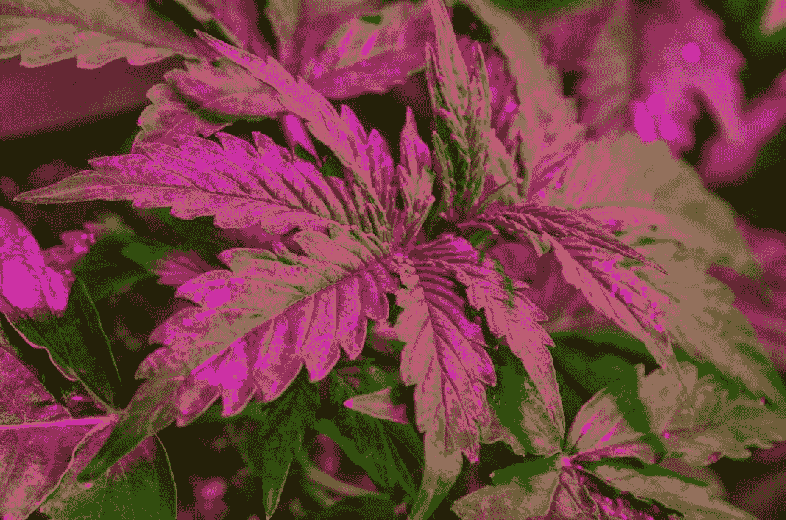

# 美国辅助大麻市场

> 原文：<https://medium.com/swlh/the-us-ancillary-cannabis-market-782bb1a055b8>

*本文原载于* [*绿色基金*](https://thegreenfund.com/the-us-ancillary-cannabis-market)*——澳洲卓越的大麻信息来源。*

在考虑大麻产业时，很容易只考虑该植物的生产者和种植者、他们能生产多少吨、产品质量以及出售大麻的药房。