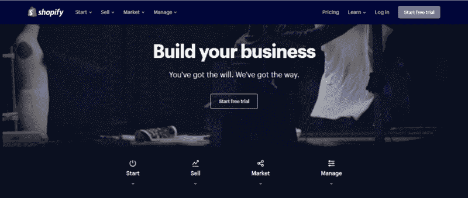
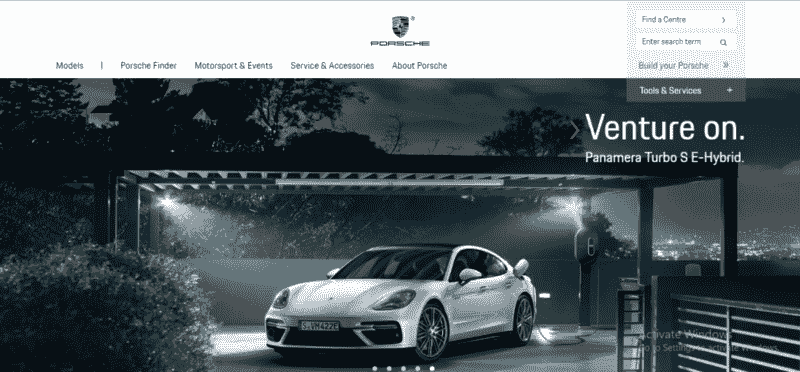

# 2019 年 UX 流行趋势！

> 原文：<https://medium.com/swlh/the-ux-trends-for-2019-8485b6704ed7>

在当今快速发展的技术世界中，当智能手机、平板电脑和其他数字设备已经成为人类生活不可分割的一部分时，用户需要在他/她可能使用的各种数字平台上获得最佳体验是一个典型的理念。

ser 体验涵盖最终用户与公司、其服务和产品互动的所有方面。

用户体验(UX)涉及到对用户的深刻理解，他们需要什么，他们重视什么，他们的能力，以及他们的局限性。UX 还考虑了服务提供商和用户双方的利益。UX 的主要目标是不断即兴创作用户与数字界面的互动质量，以及对你的产品和任何相关服务的感知。模范 UX 的要求:

1.  满足客户的确切需求
2.  简单和优雅
3.  一个真正的 UX 不仅仅是为顾客提供他们想要的东西；必须有一个多学科服务的无缝融合，包括工程，营销，图形和工业设计，界面设计

最近，用户体验已经成为设计程序的核心。企业现在利用商业智能、数据分析和各种其他策略以及多余的用户体验(UX)来为用户创造精心制作的体验，并满足他们的需求。

以下是我对 2019 年 UX 趋势的看法。

# 2019 年 12 大 UX 趋势

1.  反应灵敏的 UX
2.  照片驱动界面
3.  主题和调色板
4.  插图
5.  平面设计→材料设计
6.  推广视频内容
7.  登录页面和视差滚动
8.  个性化 UX
9.  语音激活界面
10.  AR 和可折叠
11.  可变字体
12.  B 型车的 UX 设计

# 1)反应灵敏的 UX

UX for ALL: Responsive UXD

“手机友好”网站的时代已经一去不复返了。在迅速扩张的设计行业，不依赖*设备是最重要的。*企业不再选择为单一平台设计 UX。对于希望在数字体验竞赛中取得成功的企业来说，响应迅速的 UX 是不可避免的。2019 年 UX 设计的目标应该是提供无缝体验，无论交付的设备是什么。

# 2)照片驱动界面

Airbnb using lots and lots of photos without overwhelming

随着手机屏幕变得越来越大，他们的观看体验也发生了变化。焦点可以从仅仅使用矢量和图标转移到实时照片。摄影是设计领域的精髓，2019 年可以期待摄影和 UX 设计的完美结合。目的是不要让用户被成堆成堆的照片淹没。保持足够的页边距、留白、间距和足够的色彩平衡。

# 3)主题和调色板

Theme: Colorful and Balanced

Theme: Contemporary and Bold

颜色是我们感知世界的一个基本组成部分，以至于我们经常认为它是理所当然的。颜色是设计师武器库中最有力的工具之一。它可以成就也可以毁掉一个设计；这可能是吸引观众或让他们迅速离开的决定性因素。目的是使用颜色组合指南让用户欣赏平台的主题。

你可以在这里找到很棒的调色板。

# 4)插图

Source: Asana

在 UXD 中包含插图:手绘数字、矢量、图形、卡通，为您的品牌增添个性和趣味性。插图增加了屏幕的美学价值，增加了外观和感觉，并管理用户连接到他们屏幕上的内容。

# 5)平面设计→材料设计

Material Design: Layers and More Layers

范式转变:实施材料设计

随着 2014 年的推出，材料设计改变了 UX 的设计方式。简单，极简，充满活力但微妙的调色板，排版，都改变了屏幕的外观和感觉。我们现在迫切需要从平淡和明亮的平面设计转向明快、活泼、增加互动性、细节纹理和图案、设计对各种设备的适应性、定制以及以用户为中心的礼貌材料设计。

点击阅读更多关于材料设计[的信息。](https://material.io/design/)

# 6)推广视频内容

Video Content on the Home Page

*敢而做* **或** *不而死。*

推广视频内容是我在 2019 年支持 UXD 的趋势之一。让你的用户在*上阅读 5 段关于我们、为什么是我们、我们做什么的内容，而*使用 1-2 分钟的视频解释你想传达给用户的所有信息。制作视频作为电梯推介。在这 1-2 分钟的视频中，要么是垃圾，要么是交易。清晰、明快、简洁的视频不伤害任何人。我们不会跳过网飞在 YouTube 上的广告

点击观看视频内容[的一个好例子。](https://www.wishpond.com/)

# 7)登录页面和视差滚动

Landing Pages

Porsche Landing Page

Parallax Scrolling on the website

***登录页面*** *:* 登录页面是一个独立的网页，专门为市场营销或广告活动而创建。这是一个访问者“登陆”的地方:P

***视差滚动:*** 一种使用计算机图形学的技术，在这种技术中，背景图像比前景中的图像移动得更慢，从而产生深度和沉浸感的错觉。

[登陆页面](https://blog.hubspot.com/marketing/landing-page-examples-list)和[视差滚动](https://www.creativebloq.com/web-design/parallax-scrolling-1131762)的例子。

# 8)个性化内容

Personalized Suggestions for the User

> 33%的客户放弃业务关系是因为缺乏个性化(埃森哲，2018 年)

用户通常倾向于偏好个性化的界面，以满足他们的便利和口味。最好的部分是，个性化实际上延伸到吸引普遍的人性和需求。根据客户过去在提供个性化用户体验方面的互动来满足客户的需求，是 2018 年年中出现的一种趋势。UXD 中的个性化是动态的。我们的目标是，随着它的学习和适应，个性化您的 UX 产品可以带来富有成效的交易。

# 9)声控界面

> 预计到 2016 年至 2024 年，美国智能虚拟助理市场将以 36.7%的 CAGR 增长

Alexa，Siri，Google Home，Echo，在 UI 和 UX 中造成了巨大的破坏，这是惊人的，并将在 2019 年继续在 UX 设计中引起涟漪。因此，消除通过语音激活界面打字的需求是 2019 年的下一个大趋势。

# 10) AR 和可折叠

Augmented Reality

纯屏幕界面将不会是 UX 设计师在未来一年设计的唯一事物。AR 来了！！！增强现实确实是 2019 年最新 UX 设计趋势的顶峰。最优秀的设计师现在正在尝试让 AR 成为他们应用的一部分。房地产、制造、教育、医疗保健、培训、游戏、电子商务领域的增强现实。

可折叠显示屏现在不再是梦想了！原型已经在这里，华为、三星、Oppo 和 LG 等品牌都准备在市场上大规模推出可折叠显示器。尽管对 UX 的设计来说，这将是一个更大的挑战，因为可折叠屏幕在 UX 的设计中需要巨大的空间，随着原型的推出，这一趋势将会上升。

# 11)可变字体

排版:这听起来可能很简单，但是需要做很多工作，比如选择合适的字体、字体大小、颜色，以及设计文本块、线条和字母之间的空间。

Different Typography as per needs

可读性、可视性和易读性是你在为你的企业决定字体或排版主题时需要关注的三个因素。好的排版让阅读变得毫不费力，而糟糕的排版会让用户失去兴趣。当网上 95%以上的信息是以书面语言的形式出现时，关注你所使用的文本格式是至关重要的。

点击阅读更多关于排版[的内容。](https://uxplanet.org/10-tips-on-typography-in-web-design-13a378f4aa0d)

# 12) UX 商业模式设计

根据你客户的商业模式设计你的 UX:B2B，B2C，C2C 或混合模式是非常重要的。不幸的是，今天许多企业仍然对实施那些正确的 UX 策略的潜力视而不见，这些策略将增加他们的企业价值。当一家企业未能在数字平台上大放异彩时，是时候让你明白在 UX 上投入更多时间对你的组织来说很重要了。正确执行 UX 设计有助于你的企业理解如何解释你的公司和你的产品。这也能让他们对你的品牌有所了解，知道你是否是竞争中的理想人选。当越来越多的用户发现你的网站/应用程序的 UX 令人愉快时，他们会继续回来。

点击这里，听听谷歌的 UX 研究对此有什么看法。

我希望这篇文章能帮助你设计你的用户体验。UXing 快乐！

## 这篇文章发表在[《创业](https://medium.com/swlh)》上，这是 Medium 最大的创业刊物，有+420，678 人关注。

## 订阅接收[我们的头条新闻](https://growthsupply.com/the-startup-newsletter/)。

