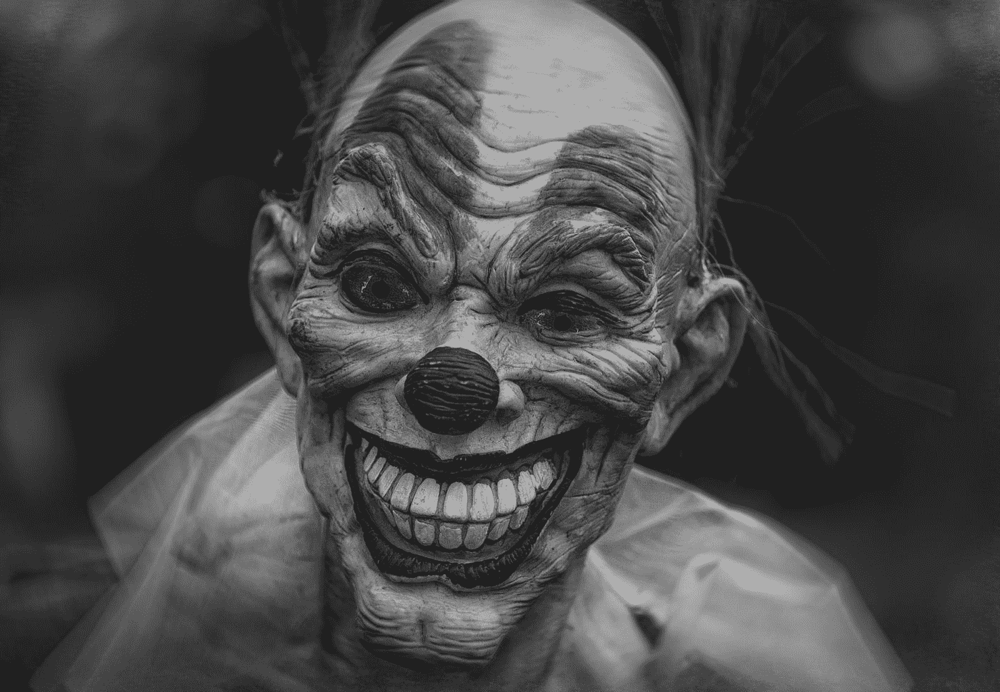

# 你故事中的反派不必定义你的人生。

> 原文：<https://medium.com/swlh/the-villains-in-your-story-dont-have-to-define-your-life-2f75b8ff0c8>

Photo by [Robert Zunikoff](https://unsplash.com/@rzunikoff?utm_source=medium&utm_medium=referral) on [Unsplash](https://unsplash.com?utm_source=medium&utm_medium=referral)

我们的生活中都有那些可爱的人。那些让我们热血沸腾，咬牙切齿，让我们阳光灿烂的日子变得灰暗的人。

> 我们相信，如果我们不曾相遇，我的生活会更好。