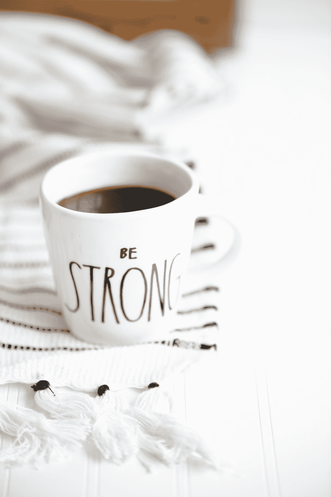

# 心理健康问题的弱点和优势

> 原文：<https://medium.com/swlh/the-weakness-and-strength-of-mental-health-issues-ad6bf5fabbb8>

Photo by [Heather Ford](https://unsplash.com/@the_modern_life_mrs?utm_source=medium&utm_medium=referral) on [Unsplash](https://unsplash.com?utm_source=medium&utm_medium=referral)

你可能会纠结于哪些心理健康问题？

是焦虑吗？抑郁症？创伤后应激障碍？或者你处理的其他精神压力？

它们让你感到虚弱吗？还是它们增强了你的力量？

想一想…