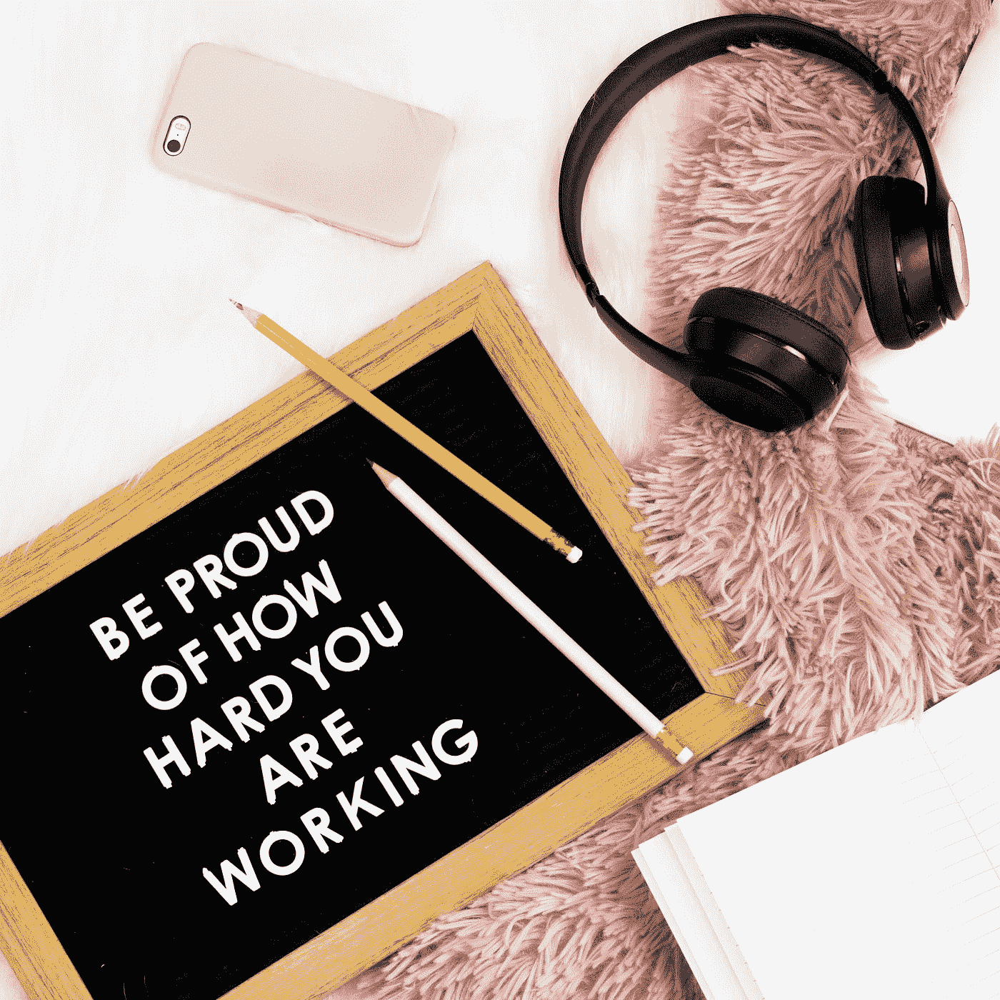

# 我力量中的弱点是一件美丽的事情

> 原文：<https://medium.com/swlh/the-weakness-in-my-strength-is-a-beautiful-thing-9162e7aa732c>

Photo by [Emma Matthews](https://unsplash.com/@emmamatthews?utm_source=medium&utm_medium=referral) on [Unsplash](https://unsplash.com?utm_source=medium&utm_medium=referral)

当人们对我说“你真坚强”时，我总是感到惊讶

具有讽刺意味的是，这些话让我热泪盈眶，我在情感上感到不够“坚强”。

在过去的几周里，我开始意识到别人如何看待我，和我如何看待自己完全不一样。当我照镜子时，我看到疲惫。我看到一张比以前更瘦的脸…