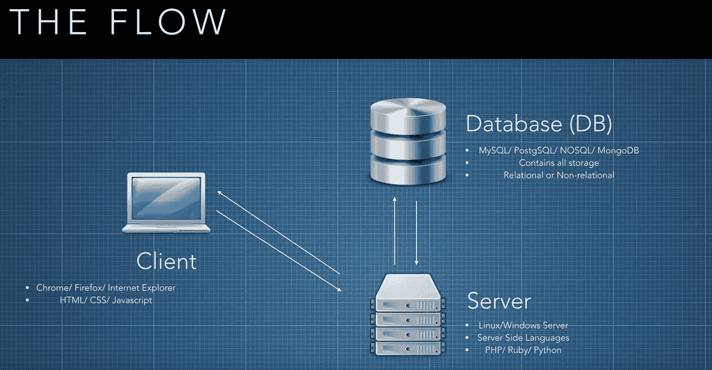

# MVC 应用程序设计理念的内容和原因

> 原文：<https://medium.com/swlh/the-what-and-why-of-the-mvc-app-design-philosophy-a08db0e8c028>

在过去的 7 天左右，我被介绍了一个叫做 Ruby on Rails (Rails)的“网络应用框架”。从本质上来说，Rails 是一个工具的集合，它消除了构建网站的大量重复性工作:生成文件和文件夹，给事物起适当的名字并把它们链接在一起，这太棒了。

## Rails 功能强大，但令人望而生畏(起初)

但是，有很多文件！以及如何将不同类型的代码分成不同类型的许多规则。这让我想知道 Rail 的核心设计理念(被称为“MVC”或模型-视图-控制器)从何而来。为了找到更多关于 MVC 的信息，我看了一个由 [J. Alexander Curtis](https://devmarketer.io/learn/category/code/) 制作的很棒的[视频](https://www.youtube.com/watch?v=1IsL6g2ixak)。我会试着从这篇文章中提取关键要点，并加入一些我自己的见解，但是如果你有 24 分钟左右的时间，我鼓励你去[看看。](https://www.youtube.com/watch?v=1IsL6g2ixak)

A file structure built by Rails: building this common structure from scratch, app after app, would be tedious to say the least.

## MVC 比 Rails 大

因此，需要澄清的是，MVC 并不是一个像 Rails 一样的框架，而只是一个用于构建 web 应用程序的方法论，因此被许多框架使用。事实上，MVC 是如此成功，以至于现在它被用在许多流行的应用程序框架中，包括:

*   Cake(用 PHP 编写的框架)
*   Django (Python)
*   Laravel (PHP)
*   Zen (PHP)
*   代码点火器(PHP)
*   iOS(目标 C 和 Swift)

## 好吧，这很常见，可能相当重要，但为什么要麻烦**？**

MVC 与许多编码实践有着共同的准则——全能的**关注点分离(SoC)** 。简而言之，这要求文件(或类、方法或任何代码集合)应该尽可能缩小责任范围。例如，在最小的尺度上，方法(又名“函数”)应该*理想地*只解决一个单一的任务。如果这个任务可以分成更小的任务，你应该把它分成更小的方法。首先，这种方法意味着调试要简单得多:错误消息倾向于指向更小的代码部分，帮助您更快地找到错误。

因为 MVC 采用了这种 SoC 原则，它继承了这种调试优势，但这并不是以这种方式构建应用程序的唯一好处:

1.  **并行开发**:许多开发人员可以轻松地在同一个项目上工作，因为任何应用程序的某些功能的位置都有明确的定义。
2.  不重复自己更容易:另一个核心开发原则是 DRY(或者“不重复自己”)，清晰地组织你的代码有利于方法被*重用*，而不是*重写*。
3.  **更容易修改:**(这确实是 MVC 采用关注点分离的另一个优势)当你知道它的组件只在需要时相互依赖才能运行，而不是像*纸牌屋一样相互连接，你就可以更容易地添加或更改应用程序的特性:*

An almost perfect metaphor for all of my early code.

## MVC 的架构从何而来？

The real world structure that inspired the MVC file structure. Credit: DevMarketer (YouTube)

我第一次听说 MVC 时没有注意到的一个核心问题是，它的结构是基于现实世界的，也就是说，甚至在一位挪威计算机科学家发明 MVC 之前，硬件是如何建立的。该结构来自于数据如何在三台计算机之间流动(如上)，每台计算机有不同的工作。在 web-app 上下文中，这三台计算机之间有严格的数据流:

1.  “客户端”:(你典型的家用电脑，运行你的网络浏览器，向你展示《权力的游戏》的结局)**向“服务器”发出请求**。
2.  “服务器”(知道数据库语言并具有安全访问权)向数据库请求**适当的数据以满足请求**。
3.  “数据库”找到合适的数据，然后**将其发送回**；这可能是来自一个地方的一个东西(“可爱的小猫图片#12 请”)，也可能是来自数据库中许多位置的许多东西(“所有毛绒绒的小猫图片请”)。
4.  然后，服务器使用这些数据以客户端可以理解的语言填充网页，并将其发送回客户端。
5.  客户端(你的笔记本电脑/浏览器)**然后呈现**你想看的任何东西！

## 我被卖了，那 MVC 怎么分东西？

因此，MVC 采用上述信息流的结构，并将其映射到应用程序的文件结构上。上述三台计算机中的每一台都有一个与之交互的代码对应文件:数据库获取“模型”文件夹中的代码，客户端相关代码在“视图”中，服务器获取“控制器”文件夹:

**数据库→模型:**“模型”文件夹包含与数据库交互相关的代码，它:

*   从数据库中添加和检索项目
*   处理数据库中的数据
*   *只有*与控制器对话

**客户端→视图:**“视图”文件夹包含发送给客户端的代码

*   用户直接与之交互的唯一代码
*   代码**只听**控制器(如下):也就是说，它不做自己的决定(但是发回用户输入)

**服务器→控制器:**‘控制器’文件夹包含代码，这些代码是*处理来自数据库的信息。并在数据发送到视图之前对其进行处理。*

*   实际上，这是谁(或什么)在负责

Database = Model Folder; Server = Controller; Client = View {Credit: DevMarketer (YouTube)}*

一个附带说明是，Rails 和所有框架都有“路由处理”(见上图)。这选择了向哪个“控制器】发送请求的*。事实上，每个模型(read: type 或 *Class* of data)都有自己的控制器；是的，这是更多的**关注点分离**。在 Rails 中，这个路由处理被指定到一个名为“routes.rb”的文件中，它包含在 MVC 结构之外(在 Rails 的“config”文件夹中)，只有在找出哪个控制器(以及相应的模型)应该用于任何给定的请求时才会被引用。*

例如，路由处理器可能会将[www.mywebsite.com/blog](http://www.mywebsite.com/blog)发送到一个名为“BlogPostsContoller”的控制器，该控制器只会与一个名为“Posts”的模型对话，而后者本身只关心处理文本、gif 等内容的代码。这一切是如此奇妙的分离，不是吗？