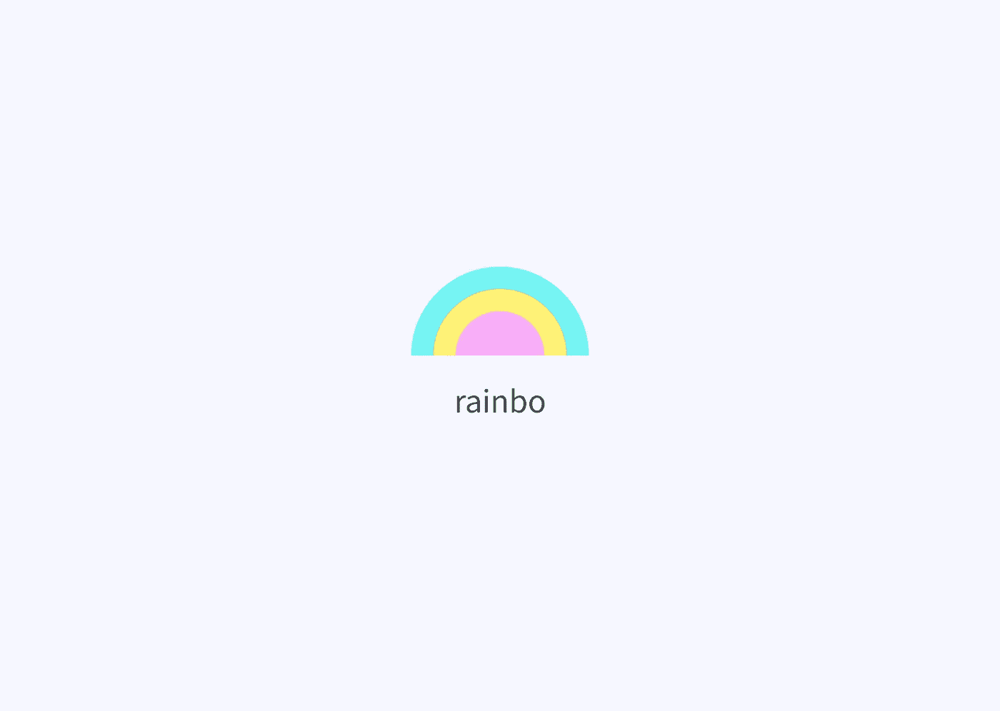

# 设计颜色变体和辅助工具的原因和方法

> 原文：<https://medium.com/swlh/the-why-and-how-of-designing-a-color-variant-and-accessibility-tool-353eaa3ca83b>

作为一名开发人员，为我的设计选择颜色一直是比较困难的任务之一。为了帮助我，我倾向于使用像 [Coolors](https://coolors.co/) 、 [SASS 颜色生成器](http://scg.ar-ch.org/)和[这个颜色对比检查器](https://webaim.org/resources/contrastchecker/)这样的工具。

我的过程看起来像这样:

1.  使用 Coolors 生成调色板
2.  为每种颜色挑选变体…