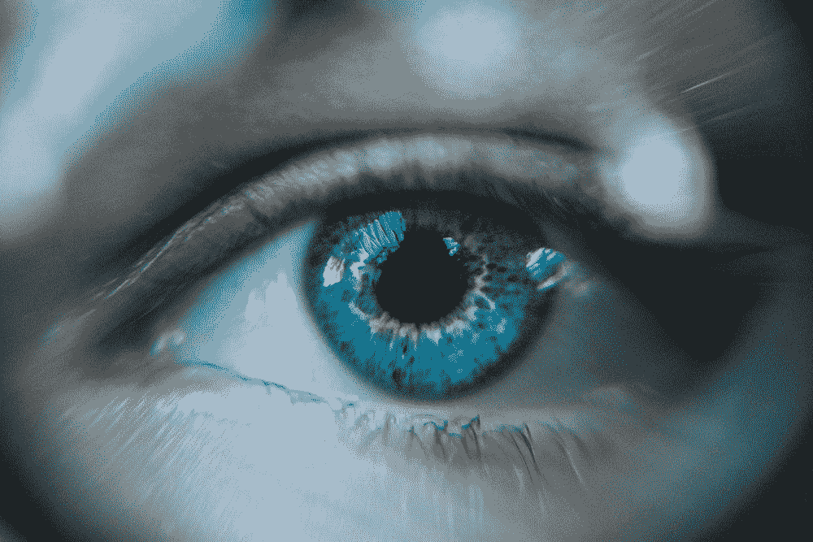

# 心灵之窗

> 原文：<https://medium.com/swlh/the-window-to-the-soul-d80c0947efd2>

## 如何用眼睛提升你的影响力

Photo by [Daniil Kuželev](https://unsplash.com/photos/QRawWgV6gmo?utm_source=unsplash&utm_medium=referral&utm_content=creditCopyText) on [Unsplash](https://unsplash.com/search/photos/eyes?utm_source=unsplash&utm_medium=referral&utm_content=creditCopyText)

## 提升你的演示

你听说过这样一句话:眼睛是心灵的窗户。这听起来很俗气，但当谈到发表一个令人信服的演讲时，你的眼睛可以发挥巨大的作用。