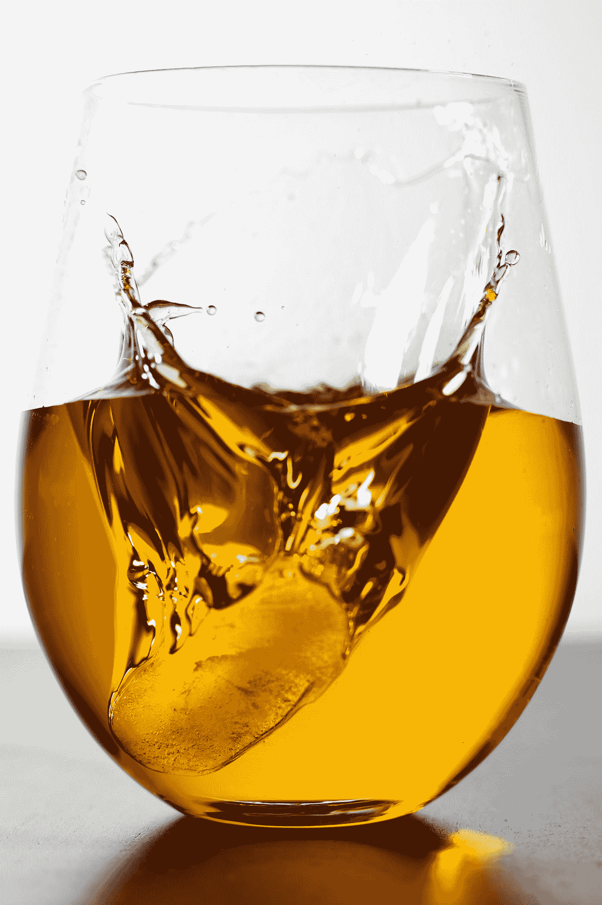

# 世界上第一款人工智能制造的威士忌。

> 原文：<https://medium.com/swlh/the-worlds-first-ai-generated-whiskey-76fe5ab10d91>

感谢微软，还有很多威士忌数据。

Photo by [Mathew Schwartz](https://unsplash.com/@cadop?utm_source=medium&utm_medium=referral) on [Unsplash](https://unsplash.com?utm_source=medium&utm_medium=referral)

一家名为 **Mackmyra** 的瑞典酿酒公司正与微软和芬兰技术咨询公司 **FourKind** 合作，利用人工智能创造一种特殊的威士忌配方。

所以，如果你的愿望是喝点人工智能创造的东西(或威士忌)，你应该庆祝一下。

> 现在，想象一下拥有超过…