# 我收到过的最糟糕的邮件(来自想为我们写作的人)

> 原文：<https://medium.com/swlh/the-worst-emails-ive-ever-received-from-people-who-want-to-write-for-us-6491f5c3a0ea>

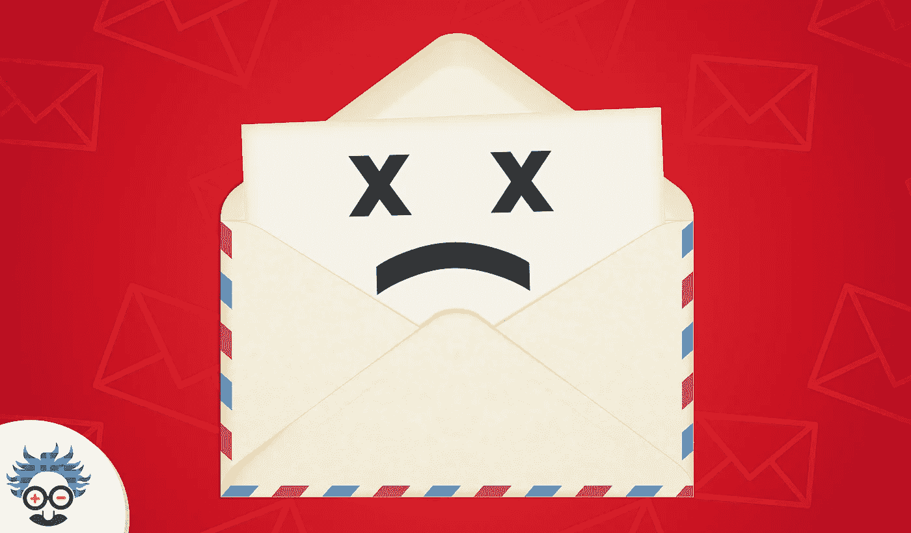

将光标悬停在我们菜单中的“联系人”选项上，您会注意到一个标题为 [*“为我们写作”*](https://www.einsteinmarketer.com/write-for-us/) 的页面。

尽管我们努力把这个页面放在一起，并把它链接到一些权威网站上…

…我们继续收到来自有希望的客座作家的相同的电子邮件“错误”。

在这篇文章中，我将揭示我收到的一些最糟糕的邮件，并强调它们最大的错误。

在我们深入这个博客的核心之前，我需要做出一个承诺…

…你将要阅读的所有内容都真正地进入了我的(或一般询问)电子邮件收件箱。我没有篡改、编辑或编写以下任何通讯。

如果你是内容营销的新手，你的客座博文很少收到回复，或者你只是来见证一些严重的灾难性错误，这将是一次大开眼界的经历。

***BTW:*** *为防止尴尬，以下邮件中的所有姓名、企业和联系方式已被模糊或删减！这些邮件旨在强调客座博文中的错误，而不是侮辱或贬低任何人！*

# 我知道你在挣扎……”

这实际上是我从这个人那里收到的第三封客座博文邮件。放心，另外两个也好不到哪里去。

让我们先来看看简介:

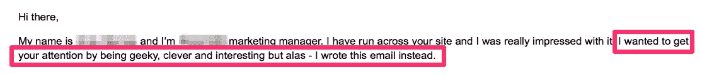

**哈欠***

当有人试图在客座博文推介开始时表现得有趣时，会给人留下俗气、软弱和陈词滥调的印象。我甚至还没有进入内容的核心，就已经处于被动了。

但是，就在你认为事情不会变得更糟的时候…

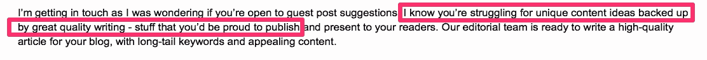

…这是一种侮辱吗？

即使它不是有意贬义的，它仍然会以那种方式出现。

我不知道他们是如何“知道”我们在“挣扎”，但不管怎样，我们继续发布独特的内容，增加我们的受众，并被迫努力将新作者纳入我们的内容日历…

…没有他们的帮助。

***故事的寓意:*** 不要试图搞笑，也不要写任何可以被感知为侮辱的东西。

# '要点'

这封邮件被列入名单有几个原因。当我第一次读它的时候，它真的让我笑出声来(只是一点点)。

这是一个向多个编辑群发邮件的经典例子。我并不反对这种策略，但是如果你打算这么做，请花些时间个性化邮件并完成你的模板。

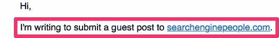

注意到这里的错误了吗？

他们给我发了一封电子邮件，说他们想在另一个网站上发表一篇客座博文。我们是爱因斯坦营销商！我们的名字在您用来联系我们的电子邮件地址中！

但是，这还不是让我震惊的部分。为此做好准备:

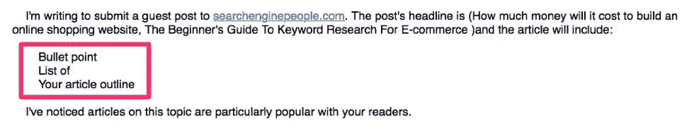

他们要么从某个地方复制并粘贴了这封邮件模板，要么提示自己写一份“你的文章大纲的要点列表”，但实际上并没有这样做…

…更糟糕的是，他们把它留在了那里！

至少他们以一个信息丰富的总结结尾:

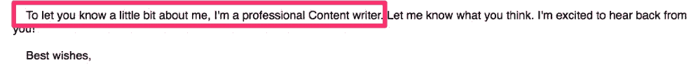

就这样？

创建客座博文推介时，不要宣称或讲述，向编辑展示你是谁。这个人应该至少告诉我他们是谁的“专业内容作者”(哪个企业/品牌)，并证明他们的能力，至少有一个链接到他们的内容。

这个故事的寓意:如果你使用一个模板，确保你为每一个推销都个性化了它。如果你提出主张，就要支持它们！

# 一个热情的作家……”

在我解释为什么这封邮件一打开就让我呻吟之前，看看你是否能发现错误:

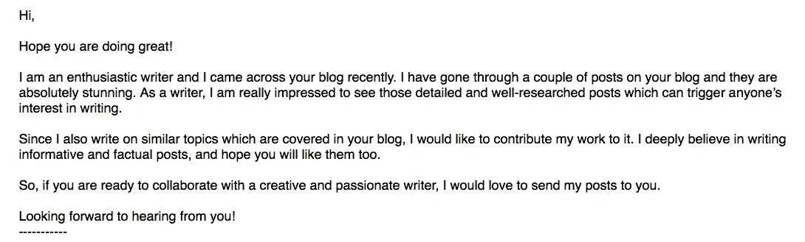

你发现了吗？

对于一个训练有素的人来说，这封邮件没有任何形式的个性化，并且从最广泛的意义上谈论我们的博客。是的，这会让你立刻被编辑列入黑名单，但是这封来自“一个热情的作家”的邮件绝对没有回复的机会…

…事实上，我每周都会收到两三封这样的邮件！

这是一个复制粘贴的模板，很可能来自谷歌首页的一个结果。他们甚至没有去努力插入一个名字，链接或网站。

**这个故事的寓意:**如果你认为复制网上的模板很聪明，那你就错了。事实上，你和其他 10，000 个人做着同样的事情！是的，我读了一遍又一遍！不，我不会回复。

# “偷偷摸摸的峰……”

另一个让自己完全没有机会被(一个理智的人)发表的方法是提出荒谬的请求。

这封邮件简洁明了，虽然它没有包含太多的个性化或对我们博客的兴趣，但它并不是我读过的最糟糕的开篇…

…直到你读到最后一段。

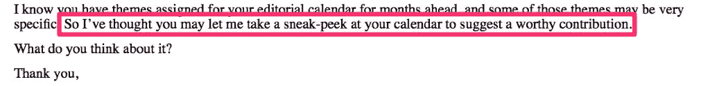

请记住，这是一封来自我从未说过话的人的冰冷的电子邮件…

…然而，他们马上要求“偷看”我的日历。

问这种荒谬的问题告诉我:

1.  他们不知道自己在做什么
2.  他们想对我的内容日历做一些邪恶的事情(例如，复制它)

**这个故事的寓意:**让编辑、内容经理或导演抽出一天的时间来考虑你提交的内容已经足够了！在你们建立起某种关系之前，不要要求其他任何东西。

# 为什么您应该考虑:'

当电子邮件的第一行看起来像这样时，我已经知道这将是一个失败:

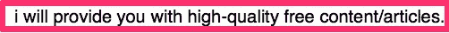

你会吗？

注意小的“I”，用“will”代替“can”，用“free”这个词。更不用说他们还没有自我介绍或者宣布对 [***爱因斯坦有一手***](https://www.einsteinmarketer.com/) 感兴趣。

这个糟糕的开场之后是另一个敲响(更多)警钟的开场:

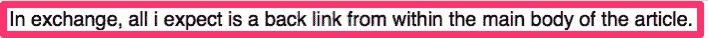

*注意另一个小 case‘I’。*

我最讨厌客座博文中有人要求反向链接(尤其是在第一封邮件中！).

我每天浏览一次所有的访客邮件，至少有 50%的人要求用反向链接来交换内容。

作为客座作者，不要在邮件中浪费空间要求反向链接！如果你出版了，你就会得到它(这是一个保证)。这是一个业余的举动，告诉一个编辑你不在乎观众。

这位客座教授接着列出了“为什么你应该考虑”的 4 个理由。让我们按顺序来看:

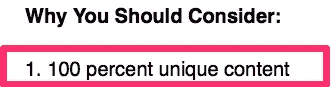

100%独一无二的内容…好吧，我也希望如此。

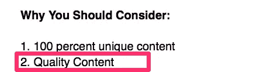

优质内容…好消息…

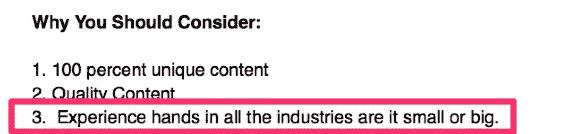

这是什么…？

怎么会有人用这样一句话来兑现“高质量内容”的承诺呢？

***【故事的寓意:*** 永远要检查你的标点和语法，尤其是当你询问是否是客座作者的时候。永远不要要求反向链接，如果你要包含要点，确保它们具体且与你的推销相关。

# '赌场和外汇相关网站'

我经常看到这种类型的邮件，我可以从一大堆不同的例子中挑选。

作为一个流量可观的博客，我们经常被问及是否接受付费来换取赞助商的帖子，(无关的)链接，或者我们是否愿意刊登原生广告。

只需要几秒钟浏览我们的网站，就可以看到我们不接受这些东西。

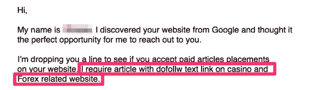

我们的首要任务是我们的观众。这意味着没有可疑的链接，没有无关的内容，最重要的是，他们的需求是我们所做的一切的核心。

诚然，我们团队中没有人回复过这些邮件。如果询问者不愿意研究我们，我们为什么要回复他们的大量邮件呢？

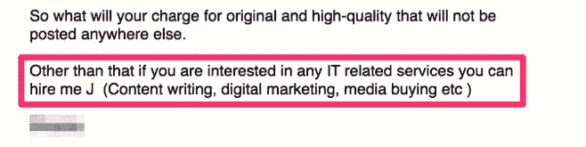

我选择这封电子邮件(超过 100 万封其他邮件)的原因是，在这个询问的结尾，他们给我们提供了雇用他们的机会，后面是一个不寻常的“J”(这与他们的名字无关)。

***故事的寓意:*** (大多数)内容管理者只想接收与他们的受众相关的内容(包括链接)。如果你使用客座博文为客户建立链接，至少先花时间研究一下网站。

# “清爽透明”

我经常从自称“作家”或“作者”的人身上看到的一些东西，是他们写作中的一种巨大的过度补偿。出于某种奇怪的原因，他们尽可能多地使用长词来填充他们荒谬冗长的句子。

这不是好文章。一个熟练的博主、作者或作家可以用尽可能少的话来交流他们的想法。

当我看到一个类似我将要分享的询问时，它告诉了我很多关于潜在贡献者的信息(这些迹象中很少是积极的)。

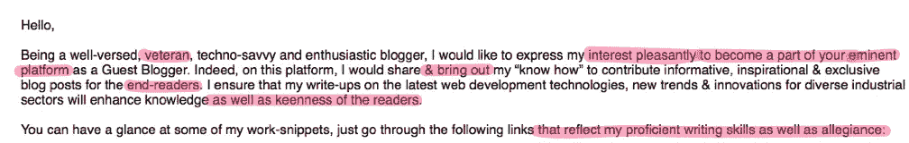

网上竞争如此激烈(尤其是在内容营销方面)，以至于观众的注意力持续时间可能会非常短。当一篇文章写得过分冗长，给人以傲慢的印象时(就像这个推销一样)，它会把读者赶跑。

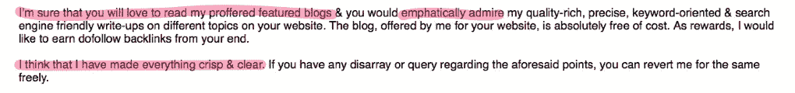

这种推销的悲哀之处在于，你可以看出作者实际上为他们的作品感到自豪。不幸的是，有太多不必要的短语。任何内容经理都知道，他们在试图阅读一篇文章时会经历一场噩梦。

就在你认为事情不会变得更糟的时候，他们要求一个 do-follow 链接…

***故事的寓意:*** 让你的写作尽可能简单。不管是邮件、短文还是博客。读者越容易理解你文章中的思想，你赢得读者的机会就越大。

# “文明幻想中的艺术天赋……”

偶尔，我们会收到一封电子邮件，它是如此的不切实际，以至于把我们都带了回来。这个例子正是…

…但在我们深入了解这篇客座博文之前。我想让你看到邮件的整体(先不要看，我们一会儿会看内容)。

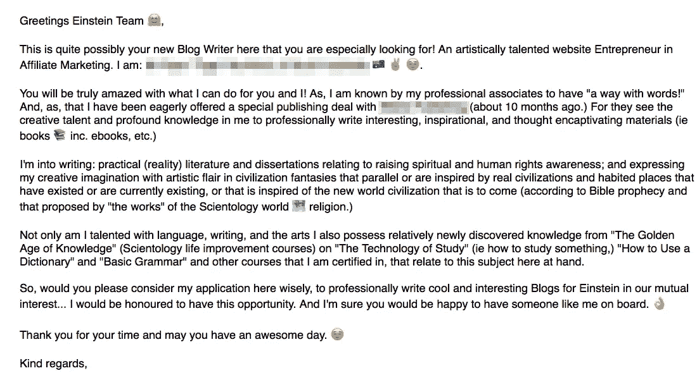

除了表情符号的使用，你注意到的第一件事是什么？

作为一个收到大量电子邮件的人，打开这样的邮件会让我立即呻吟。

太长了，尤其是对客座博文而言。

我并不反对五段式的结构，但是这个调查中的文字太多了。一个完美的客座博文推介大约是上例的 50%。

让我们来看看这封邮件中的一些错误:

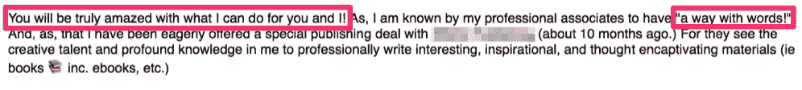

正如其他几封邮件中提到的，作为一个客座博文咨询者，你能做的最好的事情是展示你能做什么，而不是告诉别人。告诉我你有“语言能力”，我会“真的很惊讶”，这并不能证明什么。

通过联系以前的作品，告诉我你对文字有一套。如果你以前没有任何工作，表现出对这个主题的热情，不要告诉我你有多了不起。

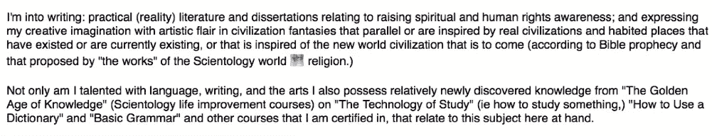

这一部分最明显的错误是它完全缺乏相关性。当你在写任何东西(尤其是电子邮件)时，你应该总是有一个目标读者。

在这种情况下，目标读者是我，这两个段落与我所做的事情完全没有关系。

尽管不符合我在客座博文中的要求，但我可以看出这位邮件人在询问中做了很大的努力，所以我用几个要点回复了这封信…

…至少他愉快地合上了信！

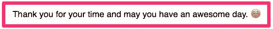

故事的寓意:让你的客人的邮件询问保持简短。确保你证明了任何说法，并保持相关性。

# 结论

本博客中的 8 封邮件并不是为了贬低、伤害或侮辱任何人。它们被包括在内是为了强调所有客座作者应该避免的错误。

作为客座作者，你必须对你要发表的博客表现出兴趣，致力于提高质量并展示你的技能(不要吹嘘它们)。).

任何考虑提交客座博文的人都应该阅读网站的作者指南，研究内容并个性化他们的交流。

问问你自己，是花十分钟发出 50 封邮件却没有收到回复好，还是花十分钟写一封你肯定会收到回复的邮件好？

我知道什么对我有用。

如果您想了解更多关于撰写客座博文的信息，请查看 [***客座博文推介内容总监指南***](https://www.einsteinmarketer.com/guest-post-pitch/) …

…或者看看我们的 [*为我们写的*](https://www.einsteinmarketer.com/write-for-us/) 页面。

## 这篇文章发表在 [The Startup](https://medium.com/swlh) 上，这是 Medium 最大的创业刊物，拥有+426，678 名读者。

## 在此订阅接收[我们的头条新闻](https://growthsupply.com/the-startup-newsletter/)。

