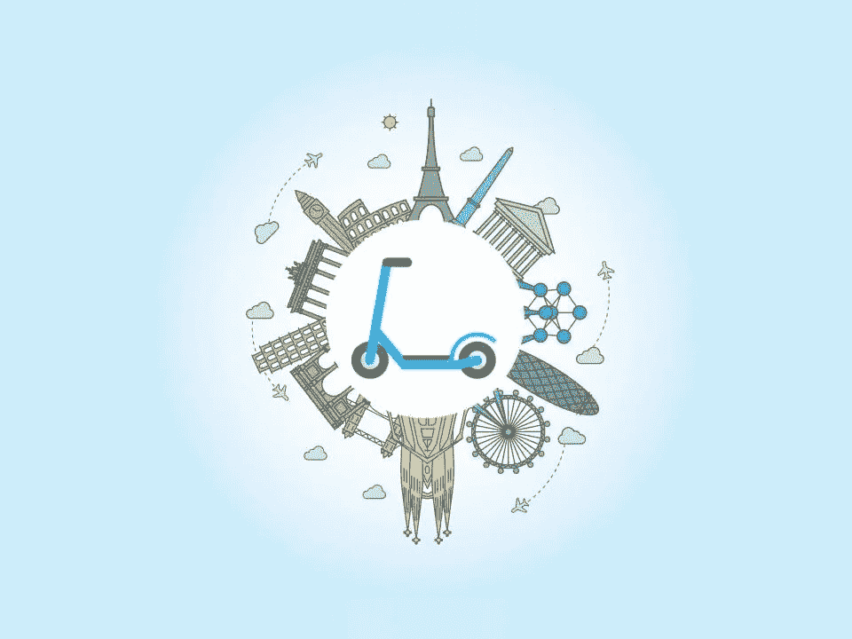

# 非美国滑板车创业年？

> 原文：<https://medium.com/swlh/the-year-of-non-american-scooter-startups-86cf0aa57dff>

## 新的本地微型移动电动滑板车初创公司正在挑战欧洲及其他地区的市场。

Tweet via [Adrien Lelièvre](https://medium.com/u/d507b12f268d?source=post_page-----86cf0aa57dff--------------------------------).

到目前为止，自行车共享和电动滑板车行业一直由中国和美国的初创公司主导。特别是，当你看到滑板车业务时，像 Lime(又名 [LimeBike](https://medium.com/u/881e39a1e63a?source=post_page-----86cf0aa57dff--------------------------------) )和 Bird 这样的公司都起源于加州。甚至像总部设在美国的[优步](https://medium.com/u/b97b1b381b5a?source=post_page-----86cf0aa57dff--------------------------------)、 [Lyft](https://medium.com/u/54708edc644b?source=post_page-----86cf0aa57dff--------------------------------) 和[福特汽车公司](https://medium.com/u/db92c082f24a?source=post_page-----86cf0aa57dff--------------------------------)这样的巨头也在这种新的微型移动趋势上投入了大量资金。

现在，新的滑板车创业公司正在欧洲和美国以外的地方涌现。

他们和他们的美国对手有很多共同点，最重要的是，他们都有一个 4 个字母的名字:)

# 柏林闪电侠

最新的是总部位于柏林的 Flash，由 Delivery Hero 的前创始人 Lukasz Gadowski 领导，在投资方面已经创造了一项纪录:€5500 万美元，是欧洲有史以来最大的“A 轮”融资之一。

c-由加多夫斯基与优步和麦肯锡的资深人士共同创立，这家初创公司打赌，由 [Target Global](https://medium.com/u/d474bc13ba3c?source=post_page-----86cf0aa57dff--------------------------------) 牵头的大笔融资将帮助它设计和制造能够让 Flash 从众多竞争对手中脱颖而出的车辆。

加多夫斯基在接受《金融时报》采访时说:“我们看到的踏板车共享只是一个开始。”。“我们看到的、每个人都在谈论的整个电动交通革命实际上是一场微型交通革命。。。踏板车共享是其中的一部分，也是我们打算如何进入市场的一部分，但它将远远超出这个范围。”

在 2018 年[南方峰会](https://medium.com/u/390d61d997ac?source=post_page-----86cf0aa57dff--------------------------------)上与 [Benjamin Joffe](https://medium.com/u/11dc07b68156?source=post_page-----86cf0aa57dff--------------------------------) 的炉边谈话中，Gadowski 谈到中国和美国的竞争时说:“他们有自己的挑战，也在他们的本土市场上战斗。我们也认为我们可以做得很好。”

“我们不想成为总部设在柏林的金字塔，”他继续说道。“我们有一个双重战略，一是建立自己的市场，二是与当地企业家合作。这是一个我还没有见过的与其他人合作到这种程度的策略。”

关于已经在欧洲站稳脚跟的美国竞争对手 Lime 和 Bird，Gadowski 说:“凭借我们的团队，我们认为我们处于一个独特的位置，可以重复我们在 Delivery Hero 所做的事情，并在该领域建立一个欧洲冠军和全球参与者。”

据英国《金融时报》报道，Flash 已经计划于春季在法国、意大利和西班牙推出数万辆踏板车，并于夏季在欧洲其他地区推出，它并不是欧洲这个微型移动领域唯一的新创企业。

# 荷兰的 DOTT

去年 12 月，dott 在荷兰推出。由 Ofo 前欧洲、中东和非洲负责人 Maxim ROMAIN 联合创立，由 EQT Ventures 和 Naspers Ventures 牵头的 2000 万€初始资金。

“多特的目标是支持充满活力的市中心的发展，没有汽车和污染，”Romain 在 Medium 上的一篇帖子中写道。“为了实现这一目标，我们的目标是通过向城市中的任何人和任何地方提供自行车、电动自行车、电动滑板车甚至可能是货运自行车等轻型车辆，让短途旅行变得更加愉快。”

他补充道:“我们的团队价值观对我们很重要。它们将我们团结在一起，成为我们的道德指南针。”Romain 列举了该公司如何具有“环保意识”、“透明”、“把事情做好”，以及如何像一个“家庭”一样运营。

# 柏林发生了很多事情

欧洲的滑板车实验似乎让投资者感到高兴，柏林市已经是欧洲最大的科技中心之一，与伦敦、巴黎和斯德哥尔摩齐名，正在成为新的滑板车玩家的强大中心。

除了 Flash 之外:

*   去年 11 月，Wind 筹集了 2200 万美元的种子资金，由中国的 Source Code Capital 和欧洲的 HV Holtzbrinck Ventures 领投——但奇怪的是，该公司在 LinkedIn 上的页面显示总部位于旧金山。
*   Tier 在 10 月份筹集了€2500 万美元的资金，由 Northzone 领投，其现有投资者为 Speedinvest 和 T2 Point Nine Capital。

# 在世界的其他地方

欧洲的实验在其他国家一再重复:

*   十月。总部位于墨西哥城的 Grin 是一家由 [Y Combinator](https://medium.com/u/cb8adc841a29?source=post_page-----86cf0aa57dff--------------------------------) 支持的电动滑板车初创公司，它筹集了 4570 万美元的“首轮融资”。此前它已经从[西奈风险投资](https://medium.com/u/866c2f4ffd98?source=post_page-----86cf0aa57dff--------------------------------)、Liquid2 风险投资、 [500 初创公司](https://medium.com/u/c7573f5568b?source=post_page-----86cf0aa57dff--------------------------------)、 [monashees+](https://medium.com/u/6ca7b1224ca8?source=post_page-----86cf0aa57dff--------------------------------) 、Base10 Partners 等公司筹集了资金。
*   9 月，总部位于圣保罗的 Yellow 筹集了 6300 万美元，这是拉丁美洲创业公司有史以来最大的一轮 A 轮融资，由 GGV 资本牵头。
*   以美国 Lyft 为例，今年 9 月，爱沙尼亚打车公司 Taxify 推出了其新品牌滑板车 Bolt。
*   11 月，总部位于瑞典的 VOI——迄今为止唯一一家名字由三个字母组成的初创公司:)——筹集了 5000 万美元的“首轮”融资，由 Balderton Capital 领投，还有 Local Globe、Raine Ventures 和 Vostok New Ventures。
*   11 月，总部位于英国的 Pony，由 [Paula](https://medium.com/u/725dbb4e6577?source=post_page-----86cf0aa57dff--------------------------------) 和 [Clara Vaisse](https://medium.com/u/d7407fe3564e?source=post_page-----86cf0aa57dff--------------------------------) 共同创立，是第一家提供投资自行车所有权计划的自行车共享公司，名为“领养一匹小马”，推出了他们的踏板车。
*   在比利时，Freel 和 Troty 于 2018 年推出。

# 所有的，在欧洲和更远的地方，都在挑战他们当地市场的亿万富翁。

## 这篇文章发表在[《创业](https://medium.com/swlh)》上，这是 Medium 最大的创业刊物，有+414，678 人关注。

## 在这里订阅接收[我们的头条新闻](http://growthsupply.com/the-startup-newsletter/)。

