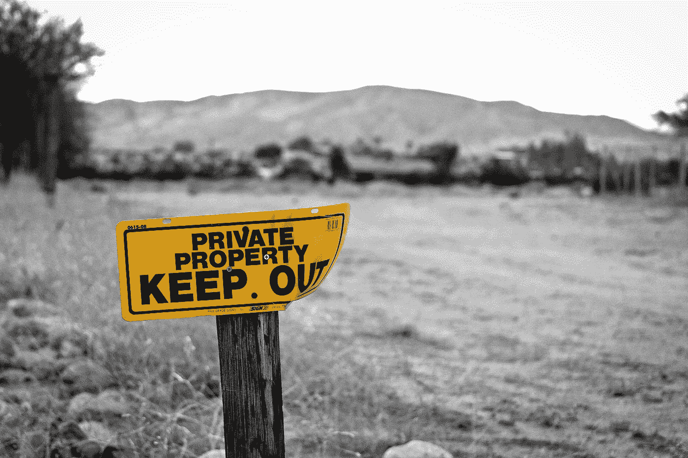
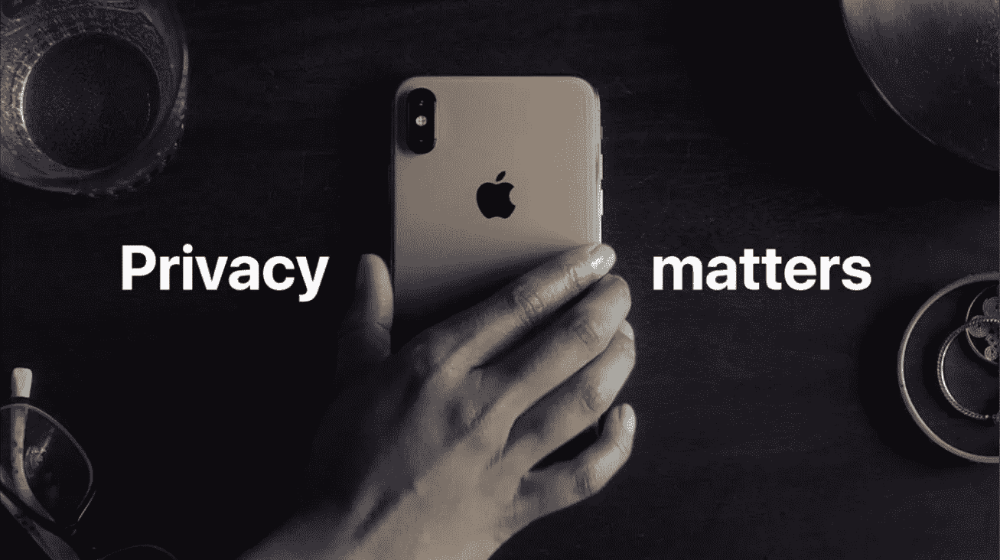
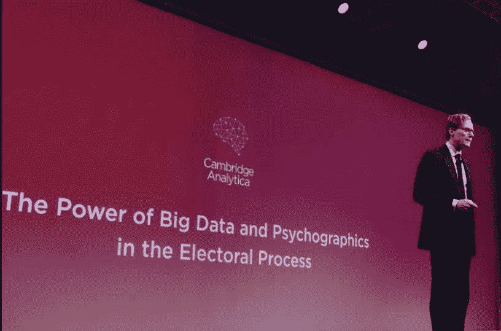

# 隐私年

> 原文：<https://medium.com/swlh/the-year-of-privacy-90962ad942cc>

大约一年前，经常听到一些人(通常是技术专家)解释隐私对他们来说并不重要，因为他们没有什么可隐藏的。最近这种争论越来越少了，但是发生了什么呢？

# 剑桥分析发生了

你可能听说过 Cambridge Analytica，但如果你没有或没有赶上这个故事，让我为你总结一下:在 2018 年的前几个月，有消息称，从 2014 年开始，一个基于个人脸书账户创建心理档案的应用程序收集了大量数据，不仅包括该应用程序的用户，还包括他们的朋友。当时，这种做法是脸书服务条款允许的，但当这款应用的开发者开始与剑桥分析公司(Cambridge Analytica)共享数据时，问题就出现了。剑桥分析公司是一家制作微定位广告的公司，旨在影响 2016 年美国总统大选，使其有利于唐纳德·特朗普。

就在《卫报》和《纽约时报》报道此事的前几天，脸书对该应用采取了行动，这一事实使得对他们服务的信任度直线下降，我们中的许多人开始对他们的隐私变得更感兴趣。

这一丑闻确实震惊了科技行业，迫使政府和公司开始思考他们可以做些什么来保护你的隐私。

# 公司在做什么？

Apple recently released a privacy-focused ad, the first sign of a changing industry. Credit: Apple’s “Private side” commercial

在所有科技公司中，苹果是第一个引领这一趋势的:这一切都始于蒂姆·库克将脸书和谷歌基于广告的商业模式等同于监视，并表示苹果认为隐私是一项基本人权。

就目前而言，这仅产生了两个影响:一系列视频和广告牌广告将隐私宣传为 iPhone 的最大优势之一，以及 Face ID 营销策略的转变，现在这是一种安全功能，而不是一种更实用和未来的解锁手机的方式。

虽然苹果的营销承诺尚未转化为行动，但微软等其他公司已经开始更新产品，通过将 GDPR 要求的功能扩展到非欧盟国家等措施，让用户在数据方面拥有更多控制权。

# 政府在做什么？

剑桥分析公司丑闻与政治联系如此紧密，也对政府政策产生了影响，我们开始看到许多立法者讨论保护消费者数据的政策。

Cambridge Analytica used consumer data to target voters, lawmakers are reacting with better privacy laws

2018 年，欧盟推出了《通用数据保护条例》(考虑到它是在剑桥分析公司的故事爆发之前获得批准的，它来得正是时候)，许多人将其视为创建更先进立法的起点，如将于 2020 年生效的《加州消费者隐私法》。

# 没有数据，我们将如何构建更好的人工智能？

许多科技爱好者担心，更严格的数据监管将导致人工智能研究放缓，因为人工智能算法的训练需要大量数据。我认为，更先进的隐私法不一定会迫使公司收集更少的用户数据，而是以道德和透明的方式使用这些数据，因此人工智能的未来不应该受到威胁。

# 结论

多年来，隐私一直被消费者和选民所忽视，因此也被公司和政府所忽视，但事情开始发生变化:更严格的隐私法正在获得批准，公司正在采取认真的措施来更好地保护你的数据。

还有很多事情要做，但我认为前景非常乐观，这一趋势表明，消费者最终掌握着科技行业的最大权力。