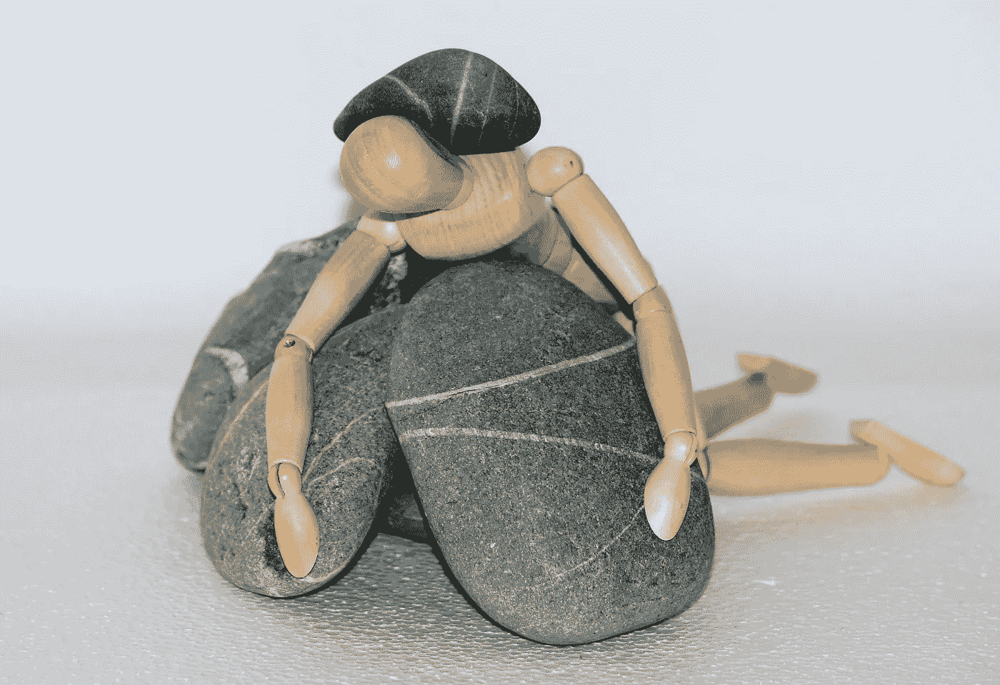

# 有些日子我没有时间写作

> 原文：<https://medium.com/swlh/there-are-days-when-i-have-no-time-to-write-20b4a40f05a3>

## 这不是一个蹩脚的借口。

Image by [Ulrike Mai](https://pixabay.com/users/Counselling-440107/?utm_source=link-attribution&utm_medium=referral&utm_campaign=image&utm_content=980784) from [Pixabay](https://pixabay.com/?utm_source=link-attribution&utm_medium=referral&utm_campaign=image&utm_content=980784)

我有完美的待办事项清单。我会在 Medium 上发表一篇文章，继续下一篇，为我推荐的出版商完成我的工作，发出更多的推介，阅读，学习新的写作技巧。我想我将度过忙碌而富有成效的一天。我很兴奋。