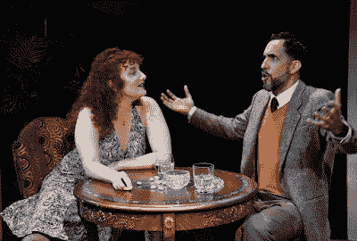

# 在现场剧院没有保证

> 原文：<https://medium.com/swlh/there-are-no-guarantees-in-live-theatre-b87113c2046b>

最近由[优步](https://www.wikiwand.com/en/Uber)和 [Lyft](https://www.wikiwand.com/en/Lyft) 司机发起的为期一天的罢工将注意力集中在[的工作条件上，这种工作条件将雇员与独立承包商](https://www.nolo.com/legal-encyclopedia/are-you-employee-independent-contractor-under-california-law.html)区分开来。20 世纪 90 年代初，当我和我的商业伙伴准备推出面向医疗转录服务的 Alert &时，阅读加利福尼亚州关于该主题的[手册足以让我们不寒而栗。请记住，这是 25 年前的事了，当时软件开始重塑商业世界，由](https://www.wikiwand.com/en/California)[算法](https://www.wikiwand.com/en/Algorithm)驱动的[应用](https://www.wikiwand.com/en/Mobile_app)还没有首次亮相。

将计算机技术的巨大进步与罗纳德·里根就任总统以来的四十年间对工会的打击结合起来，再加上自动化和机器人技术的进步，以及通过互联网将许多技术和/或文书工作外包出去的能力，你会有一个非常可怕的想法，传统工作正以多快的速度从今天的市场上消失。教师、转录员、[编码员、](https://www.wikiwand.com/en/Medical_classification)[律师助理和编辑越来越多地发现他们被迫在](https://www.wikiwand.com/en/Paralegal)[零工经济](https://www.wikiwand.com/en/Temporary_work)中工作，而不是享受[工会工资](https://www.wikiwand.com/en/Union_wage_premium)和机构[工作保障](https://www.wikiwand.com/en/Job_security)的好处。

一旦一个艺术家获得了国家的认可，他们如何留在公众的眼中？虽然一些演员的技能多样化(可能会在画外音、教练和 T2 角色中找到工作)，但小说家或剧作家需要更长的时间来开发新的产业。老话“那太好了，但是你最近为我做了什么？”这意味着那些不(或不能)不断创作新作品来增加他们的[收入流](https://www.wikiwand.com/en/Revenue_stream)的创意人才可能很快就会发现自己被更有才华、更有进取心或[多产的作家](https://www.wikiwand.com/en/List_of_prolific_writers)边缘化。

与其说是一场“[山中之王](https://www.wikiwand.com/en/King_of_the_Hill_(game))的游戏，不如说是一个关于谁会成为下一个所有人都想与之扯上关系的闪亮物体的问题。因此，有创造力的艺术家可能只和他们上一部电影、唱片、广告或舞台表演一样好。这就是为什么我们很高兴看到几位多产的剧作家在旧金山湾区的发展，他们的事业沿着令人印象深刻的轨迹继续前进。

像许多作家一样，在他们可以仅仅依靠一系列成功戏剧的版税生活之前，一些剧作家通过教学、辅导、调酒、服务员和许多其他增加经济保障的来源来补充他们的收入。小湾区剧院公司最近的两部作品让观众可以欣赏两位多产剧作家的新作。

* * * * * * * *

帕特丽夏·米尔顿(Patricia Milton)的最新作品最近在 T4 柏克莱(Berkeley)的 T2 中央歌剧院(Central Works)首演，她已经创作了十几部戏剧。这位有着敏锐幽默感的天才作家经常关注女性赋权的故事，维多利亚时代的女性侦探集体可能是她迄今为止最努力的作品之一。

导演是加里·格雷夫斯(他也负责灯光设计)，服装由塔米·柏林设计，声音由格雷戈里·沙尔彭设计，舞蹈由马塞拉·罗杰斯设计，故事发生在维多利亚时代的伦敦，惊恐的女人们担心开膛手杰克·T21 又开始了一场疯狂的谋杀。

Alan Coyne as PC Henry Crane in a scene from
***The Victorian Ladies’ Detective Collective***
(Photo by: Jim Norrena)

背景是一个由两个中年姐妹经营的“单身女士”寄宿公寓。洛夫蒂·福特斯库([斯泰西·罗斯](http://www.abouttheartists.com/artists/136959-stacy-ross))是一名前女演员，在一次可怕的化学袭击导致严重的皮肤烧伤后，她被迫退出舞台，为此她必须一直戴着手套。虽然她已经不再受欢迎，但 Loveday 相信她的基本智力(结合女演员在准备角色时使用的[批判性思维](https://www.wikiwand.com/en/Critical_thinking)技能)可能会使她成为一名出色的[侦探](https://www.wikiwand.com/en/Detective)。

Stacy Ross as Loveday Fortescue in a scene from
***The Victorian Ladies’ Detective Collective***
(Photo by: Jim Norrena)

她的姐姐瓦莱里娅·亨特(Valeria Hunter，Jan Zvaifler，T9)对 Loveday 的能力持更加怀疑的态度——同样，伦敦警察厅(Scotland Yard)的警官亨利·克雷恩(Henry Crane)也是如此。才华横溢的艾伦·科因在弥尔顿的剧本中扮演了三个角色，分别是咆哮的鹤、居高临下的贾斯珀·沃勒姆-韦恩(特别是谄媚的 T21、手脚麻利的巴特西商人)和容易被激怒的当地屠夫托德，托德专门捕杀流浪猫，并小心翼翼地将它们的肉提供给私人客户。奇怪的是，托德的一个客户是对鸦片上瘾的瓦莱里娅，她喜欢用新鲜的猫肉喂她的哈巴狗。

Alan Coyne as the local butcher, Toddy, in a scene from
***The Victorian Ladies’ Detective Collective***
(Photo by: Jim Norrena)

除此之外，凯蒂·斯莫斯([切尔西·贝尔斯](http://www.abouttheartists.com/artists/424571-chelsea-bearce))，一位美国女演员，在到达[英国](https://www.wikiwand.com/en/Great_Britain)之前，她学会了如何使用[武术](https://www.wikiwand.com/en/Martial_arts)和[装饰扇](https://www.wikiwand.com/en/Hand_fan)的组合来保护自己。凯蒂在南方腹地长大，她帮助教育洛夫戴和瓦莱里娅一些美国口语，如单词“druthers”

随着剧情的开始，两姐妹正为最近发生在她们附近的一连串可怕的谋杀案而焦虑不安(她们的一名房客成功逃脱了袭击者，目前正在住院)。Loveday 渴望参与其中；瓦莱里娅不想和这种疯狂扯上任何关系。

Chelsea Bearce appears as the fan-wielding Katie Smalls
in ***The Victorian Ladies’ Detective Collective***
(Photo by: Jim Norrena)

尽管弥尔顿笔下的人物之间似乎有着令人印象深刻的基因差异(她的男人是虚荣的恶霸，他们大肆吹嘘，但却非常无能；她的女人习惯于使用她们的推理能力作为她们最强有力的防御手段之一)，性别之战在这部戏中是有特定目的的。正如米尔顿在她的程序说明中解释的那样:

> *[*侦探类型*](https://www.wikiwand.com/en/Detective_fiction) *典型地号召一个强壮的男性英雄介入以恢复被犯罪扰乱的秩序。但是当犯罪维护并强化了当前的* [*社会秩序*](https://www.wikiwand.com/en/Social_order) *会发生什么？犯罪抗拒解决方案。我琢磨着* [*童话*](https://www.wikiwand.com/en/Fairy_tale) *的叙述，讲述名人大屠杀和* [*连环杀手*](https://www.wikiwand.com/en/Serial_killer) *的故事，以及关于《死去的女孩》的故事——用恐惧敦促女性安全待在家里，坚持**的叙述。死亡女孩故事是非常受欢迎的故事，在这些故事中，死去的女人是需要解决的问题，失踪或谋杀的问题被认为比女人实际存在的问题更容易解决。女性受害者成为他人投射其恐惧和社会焦虑的画布，她的死亡甚至可能归因于她的鲁莽。我来到剧本前问:这些叙事和侦探体裁是如何交叉的？厌女症如何阻碍女性，并帮助杀手？在无法进入犯罪现场和没有警方合作的情况下，女侦探如何取得成功(鉴于在那个时代缺乏***)呢？”*****

**

*Stacy Ross (Loveday), Jan Zvaifler (Valeria), and
Chelsea Bearce (Katie) star in Patricia Milton’s
***The Victorian Ladies’ Detective Collective***
(Photo by: Jim Norrena)*

> **”这部剧的两个主要灵感来源于《 [*夏洛克的姐妹:英国女侦探，1864-1913*](https://www.amazon.com/Sherlocks-Sisters-Detective-1864-1913-Nineteenth/dp/0754604810/ref=sr_1_7?keywords=Joseph+Kestner&qid=1557962779&s=books&sr=1-7)*作者* [*约瑟夫·a·克斯特纳*](https://www.amazon.com/Joseph-A.-Kestner/e/B001HPH59Q%3Fref=dbs_a_mng_rwt_scns_share) *和* [*唐氏少女:厌女症的逻辑*](https://www.amazon.com/Down-Girl-Misogyny-Kate-Manne/dp/0190933208/ref=sr_1_1?keywords=Down+Girl&qid=1557962937&s=books&sr=1-1) *作者:哲学家* [*凯特·曼妮*](http://www.katemanne.net/) *前一本书探究了维多利亚文学***中的几个虚构的女侦探。这些女人通常年纪较大'* [*爱管闲事的人*](https://www.wikiwand.com/en/Busybody) *. '第二种类型是年轻女子，她为未婚夫洗脱了刑事指控的罪名，但随后消失在婚姻中，再也没有发现。在* **落魄少女** *中，作者让我们把厌女症想成是一套奖励、* [*训斥、*](https://www.wikiwand.com/en/Reprimand) *以及强化女性在社会中严格角色的惩罚。她将厌女症定义为“社会压迫女性的强制手段。”最后，这部剧还得到了美国参议院的* [*布雷特·卡瓦诺*](https://www.wikiwand.com/en/Brett_Kavanaugh) *听证会的通知，在我起草剧本的时候就有电视转播。****

**

*Stacy Ross appears as Loveday Fortescue in
***The Victorian Ladies’ Detective Collective***
(Photo by: Jim Norrena)*

*给米尔顿的剧本“谋杀，她解决了”加字幕实在是太容易了，因为剧本的两大闪光点是其叙事的智慧和每一个情节转折的技巧。作为从[中央作品编剧工作室](http://centralworks.org/about/#showtab=ourmethod)出来的第 63 次世界首演，这部作品有幸得到了湾区最不受重视的三位演员的才华(斯泰西·罗斯、艾伦·科因和简·兹韦夫勒)。*

**

*Jan Zvaifler portrays the opium-addicted Valeria Hudson in
***The Victorian Ladies’ Detective Collective***
(Photo by: Jim Norrena)*

*如果《T4》*《维多利亚女子侦探集体》* 成为弥尔顿最受欢迎、最成功的戏剧之一，我一点也不会感到惊讶。作为一部[时代片](https://www.wikiwand.com/en/Historical_period_drama)，它提供了一些可爱的服装设计机会，而且由于它只需要四名演员，所以它是一部非常划算的作品。我可以很容易地看到无数大学戏剧系和社区戏剧团体以及 LORT 和其他地区戏剧公司正在上演维多利亚时代的女性侦探集体。*

*维多利亚女子侦探集体 的演出将持续到 6 月 9 日，地点在[柏克莱城市俱乐部](https://www.berkeleycityclub.com/)(点击此处获取门票)。*

** * * * * * * **

*三藩市的[定制剧院](http://www.custommade.org/)目前正在旧金山湾区首映[亚伦·波斯纳的](https://www.wikiwand.com/en/Aaron_Posner) 2015 年戏剧，名为[生活糟透了](http://www.custommade.org/life-sucks/)，该剧被宣传为“改编自[安东·契诃夫](https://www.wikiwand.com/en/Uncle_Vanya)[的](https://www.wikiwand.com/en/Anton_Chekhov)万尼亚叔叔”作为一名多产的剧作家、[舞台导演](https://www.wikiwand.com/en/Theatre_director)和[莎士比亚](https://www.wikiwand.com/en/William_Shakespeare)学者，波斯纳还更新了契诃夫的[海鸥](https://www.wikiwand.com/en/The_Seagull)(他在 2013 年将其转化为[愚蠢的鸟](https://www.wikiwand.com/en/Stupid_Fucking_Bird))和[三姐妹](https://www.wikiwand.com/en/Three_Sisters_(play))(在 2017 年被复活为[无姐妹](https://www.studiotheatre.org/plays/play-detail/2016-2017-no-sisters))。*

**

*Evan Sokol (Vanya) and Linda Ayres-Frederick (Babs)
in a scene from ***Life Sucks*** (Photo by: Jay Yamada)*

*因为我之前计划参加[旧金山无声电影节](https://www.wikiwand.com/en/San_Francisco_Silent_Film_Festival)的闭幕之夜，所以我没能赶上 ***【生活糟透了】*** 的开幕之夜，这部电影的导演是[布莱恩·卡茨](http://www.abouttheartists.com/artists/369933-brian-katz)。相反，在接下来的周五，我去看了波斯纳戏剧的演出，在半空的房子前演出。尽管波斯纳的一些妙语连珠获得了很好的反响，但其他一些商业内容却得到了观众令人惊讶的冷淡回应。*

**

*Emily Stone (Ella) and Gabriel Montoya (Aster) in
a scene from ***Life Sucks*** (Photo by: Jay Yamada)*

*虽然软弱的反应可能是由于一些演员，我认为它更有可能是由一系列的噱头引发的，这些噱头一直没有给观众留下深刻印象。*

*   *波斯纳对“他妈的”这个词令人生厌的过度使用比剧作家可能预料的要早得多。*
*   *契诃夫 1899 年戏剧的核心是厌倦和不满，但令人惊讶的是，这些对观众几乎没有影响。*
*   *其他剧作家使用的一个效果更好的花招(让一个角色转向观众说“幕间休息”)以一声无奈的叹息结束了第一幕。*
*   *让每个角色说出他们喜欢或讨厌的三件事，感觉就像被困在了一个[焦点小组](https://www.wikiwand.com/en/Focus_group)里，小组的参与者已经对他们的主持人感到厌倦了。*
*   *让每个角色告诉瓦尼亚([埃文·索科尔](https://www.evansokol.com/))他们在生活中也有抱怨的事情，这看起来更像是一种[干预](https://www.wikiwand.com/en/Intervention_(counseling))，没有丝毫紧急的迹象。*
*   *演出结束时，演员们(甚至比观众们)似乎都松了一口气，因为戏剧结束了。*

**

*Jensen Power (Sonia) and Gabriel Montoya (Aster)
in a scene from ***Life Sucks*** (Photo by: Jay Yamada)*

*加布里埃尔·蒙托亚(Gabriel Montoya)作为紫苑表现最佳，布列塔尼·西姆斯(Brittany Sims)(Pickles)[艾米丽·斯通(Emily Stone)](http://www.abouttheartists.com/artists/370529-emily-stone)(Ella)[戴夫·西库拉(Dave si kula)](http://www.abouttheartists.com/artists/469085-dave-sikula)(教授)尽力为表演注入一些能量。詹森·鲍尔(Sonia)和琳达·艾尔斯·弗雷德里克(Babs)也亲自出现在舞台上。*

**

*Brittany Sims portrays Pickles in ***Life Sucks***
(Photo by: Jay Yamada)*

*将 ***【生活糟透了】*** 比作一部即将被取消的失败的情景喜剧，我一点也不高兴。也许我参加的演出对观众来说只是一个糟糕的夜晚。也许这是一部打破第四堵墙太多次而无法让观众保持兴趣的戏。然而，我的猜测是，波斯纳的剧本可能会有更好的演员和导演。*

**

*Dave Sikula as The Professor in ***Life Sucks***
(Photo by: Jay Yamada)*

**的演出将在定制剧院持续到 6 月 1 日([点击此处](https://app.arts-people.com/index.php?show=89469)获取门票)。**

***原载于*[*https://myculturallandscape.blogspot.com*](https://myculturallandscape.blogspot.com/2019/05/there-are-no-guarantees-in-live-theatre.html)*。***