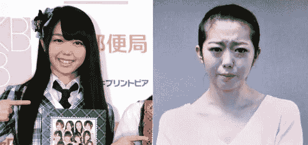
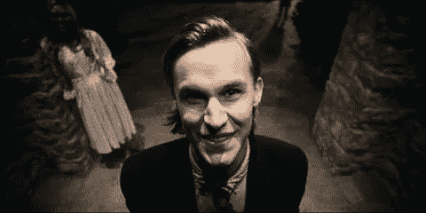
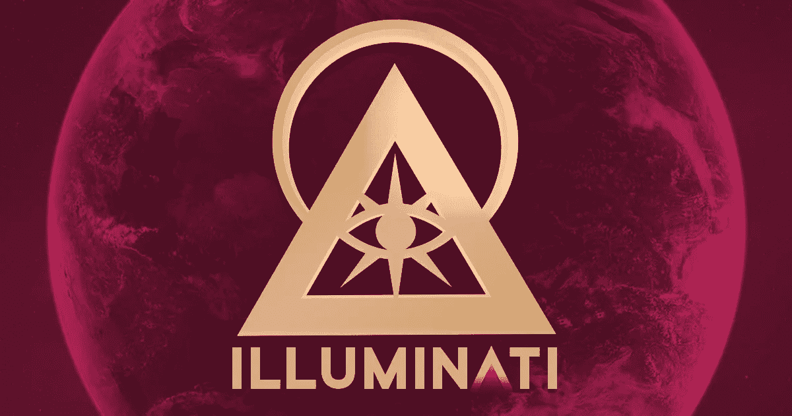

# 粉丝中没有同龄人

> 原文：<https://medium.com/swlh/there-are-no-peers-among-the-fans-ee600d16adc6>

Photo by [Benjamin Balázs](https://unsplash.com/@brenkee?utm_source=unsplash&utm_medium=referral&utm_content=creditCopyText) on [Unsplash](https://unsplash.com/search/photos/hidden-killer?utm_source=unsplash&utm_medium=referral&utm_content=creditCopyText)

一个关于人们是否准备好迎接新范式的故事

在这个世界上，没有人能够确保他真的有能力领导一场范式转变。它是真的发生了还是只是一种幻觉。即使这种改变已经被其他人领导了，而且因为他的记录太差，他正在绝望地挣扎。

有时我们不得不生活在一个悖论中，与我们被教导的一切相矛盾，你看你可以给出一个简单的解释。但是你需要一些同行来确认。

这就是我在库克定理和布尔可满足性问题上的情况。这篇文章将是另一个故事，就像:

 [## 叛逆思想的艰难生活

### 最高效的机器被鄙视。

medium.com](/datadriveninvestor/hard-life-for-a-rebellious-mind-2ea7693ebfe0) 

这种情况在我身上已经发生过好几次了:只要**去寻找同龄人**，你最终会发现一些非常**可疑的粉丝**。

> 要么我表现得像一个至高无上的上帝，没有犯错误(甚至拼写错误)，要么我会被认为是假的。

但是什么是真正的**粉丝**？一个**粉丝**不是爱自己**偶像**的人。在日本，偶像是其他文化对妓女的称呼。

[AKB48 idol begs for fans’ mercy after breaking dating ban](https://www.japantimes.co.jp/news/2013/02/01/national/bad-to-the-bone-akb48-idol-begs-for-fans-mercy-after-breaking-dating-ban/#.XSBOF1ftbIU)

# 粉丝现象

**粉丝现象**并不是粉丝对他们的**偶像**的*爱*的表达，我们可以更好地理解为一种发泄他们内心所有仇恨的方式，因为从他们的**偶像**或他们自己的**生活**中有**他们不支持**的东西。

这正是电影《大清洗》给我们的信息:有时社会允许仇恨言论，只要它有助于改善经济。但是对弱者能公平吗？

The [racist](https://en.wikipedia.org/wiki/Ku_Klux_Klan) is a kind of [fan](https://en.wikipedia.org/wiki/Charles_Manson), not a [chauvinist](https://en.wikipedia.org/wiki/Nicolas_Chauvin).

是什么驱使大众去寻找某种受害者并试图杀死他们？信不信由你，**至上主义**不是最重要的因素:是**粉丝现象**。它包括能够沉迷于一个主题，除了病态地谈论他之外，不能做任何其他事情。以此类推，直到他发疯。

回到科学上来，有可能发现渴望看到问题得到解决的博客作者，他们痴迷于这个问题。然后他们观察一个局外人如何声称有答案。很明显，他们将不得不假装听他说话……但他们真的会这么做吗？

> 女性杀手像种族主义者，不像性别歧视者。你觉得你在我之上吗？我不在乎，我只希望你*尊重*。

局外人的反应越清晰，**博主**的愤怒就越大。渐渐地，它会满足他的执念。几年前，我遇到了一个西班牙人，他甚至没有一年的职业研究，认为他可以遵守一个准则，然后他就对我着迷了。

当我需要一个**同行**时，我最终找到了一个**粉丝**；所以只有两个选择:要么我表现得像一个**至高无上的神**并且没有犯错误(甚至拼写错误)，要么我会被认为是一个骗子。

They need to be in a group…, belong to sth. But his idols are in his conspiracy mind.

显然所有隐藏的困扰的故事结局都很糟糕。出于这个原因，一年后我发现，在一个物理论坛上毫无理由地批评我的人，就是那个不想阅读解决了据我所说的[布尔可满足性问题](/swlh/the-boolean-satisfiability-problem-solved-48ceb5550115)的代码的人。

所以，我的第一个建议是:女性杀手像种族主义者，不像性别主义者。你觉得你在我之上吗？我不在乎，我只希望你尊重我。老实说，我和现实保持距离。

所以，如果你在寻找同事，第一条规则是这些人是否尊重你。

因为我们已经离开了洞穴，有一些基本的规则，每个受过教育的人都能够理解；这就是为什么人们更容易认出不尊重外表的人。诀窍是找出谁是超级马屁精。

显然，一个**同辈**和一个**粉丝**之间的主要区别在于，无论你对**粉丝**说什么，他都继续着他的执念和他的世界。如果这是不合理的，那就不要对他有任何期望。**不要喂巨魔**。

# 结论

当他的偶像从第一刻起就将他遗忘时，他将会痴迷多年。这是正确的做法。