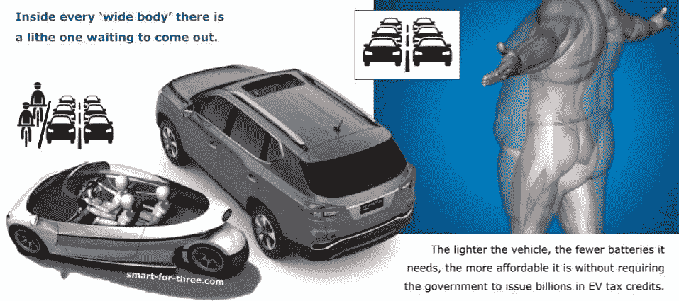

# 汽车的小脚印——人类的一大飞跃

> 原文：<https://medium.com/swlh/there-is-a-light-at-the-end-of-the-car-tunnel-36b0d6de3f7a>

汽车隧道的尽头有光。是迎面而来的 SUV，大灯闪亮？还是我们即将见证不再被烟雾过滤的白昼？问问你自己:当汽车有一个电动马达，是电子控制的，为什么它没有进入下一个阶段:汽车作为一个轮子上的设备？

