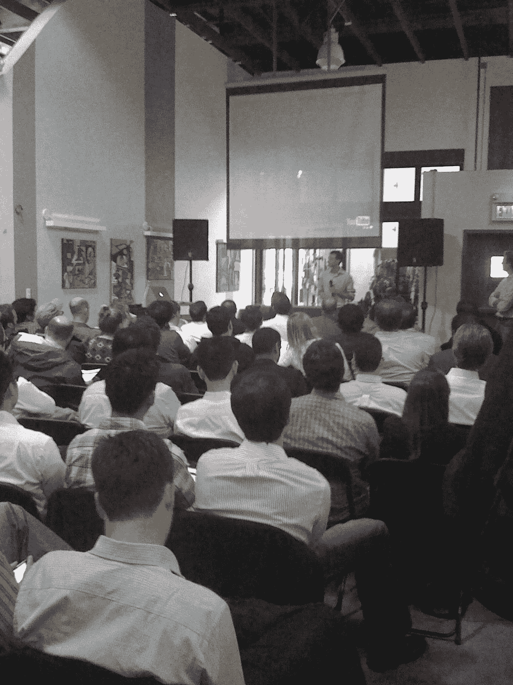
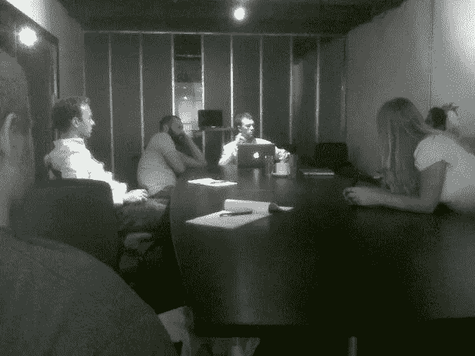

# “快乐和压力之间有明显的联系”——科技创业企业文化访谈之十一

> 原文：<https://medium.com/swlh/there-is-an-obvious-relation-between-happiness-and-stress-tech-startup-culture-interview-11-d2d3eeee24f7>

为了攻读 VU 阿姆斯特丹大学的人类学硕士学位，我正在旧金山进行为期三个月的实地考察，在那里我研究科技初创企业文化。通过像这样的观察、非正式谈话和采访，我试图发现创业背后人们的日常行为和动机。我的重点主要是工作-私人生活的情况以及人类和他们的业务之间的纠葛。

通过我的个人网络，我联系上了布莱恩·施瓦茨，我们在教会区的 Phillz 见面。它是非常拥挤的。无论在哪里，人们都在用笔记本电脑工作。布莱恩解释说，比起在家工作，他更喜欢在咖啡店工作。在平常的日子里，他会在白天转换场地，这样他就可以在两者之间散步来理清思路，精力充沛地继续工作。他说，我需要打破常规的事情，比如接受采访。我很高兴听到那件事。

在过去的几年里，布莱恩一直忙于开发有趣的技术，为公司解决问题。他喜欢创造，喜欢在没有老板的情况下工作，这就是他决定创办自己公司的原因。他看到公司之间合作时会出现问题，所以他创造了这个产品，让人们能够更有效地合作。目前，这项业务仍处于预营收阶段。

Picture provided by Brian Schwartz

虽然布莱恩曾在其他初创公司工作，但这是他创办的第一家公司。最大的区别是钱:现在他做的一切都是靠自己的积蓄。他正在为公司寻找客户。如果你想要钱，你从来不要。如果你有人们想要的东西，他们就会投资。布莱恩所有成功创业的朋友都有这样的关注点。因此，获得客户是主要的重点，资金将随之而来。

当我问布赖恩他工作多少时，他回答说:“总是如此。”。基本上每天都是。时间是流动的，这意味着每天都可以是工作日，但也可以是空闲的一天。大多数时候，他每周工作 7 天，每天工作 8 小时，有时多一些，有时少一些。他不休假。一旦有了几个顾客，我可能会休更多的假。

有时独自工作，而且做得太多，会导致视野狭窄。当你忘记看不同的可能性。做一些打破你一天的事情，比如散步，或者和朋友一起吃午饭，会给你一个不同的心态。它提供了从另一个角度看待事物的机会。

布莱恩来到旧金山创办了一家公司。这是做这件事的最佳地点。我认为在其他城市创办公司同样可行，但在这里你有最大的成功机会:遇到那个会打开你大门的人，就是在湾区这里。没有一个人口密度更高的地区可以提供帮助。他环顾了一下咖啡馆。并且愿意帮忙。很多人从这里起步，有人帮助他们走出困境，所以我认为这是一种非常积极的心态。

当我问布莱恩，他能不能一天不带手机，他回答说:“我能，但我不会。”他看不出一天不带手机有什么价值。他可以离开手机一段时间，只要他想离开手机，但是一整天太长了。

Brian 从早期错误中学到的一个很好的教训是不要在第一次尝试时就希望一切都是完美的。在你得到一个好的产品之前，你必须经过许多草稿。他告诉我这个过程中的一次失败:“我曾经有一个用户做了一件事，一夜之间让我损失了 1000 美元！但这毕竟是有用的，因为我知道我的程序不起作用。现在我可以修复它，在我有很多用户之前。

Picture provided by Brian Schwartz

Brian 认为这不仅适用于产品的构建，也是后续步骤的一部分。与顾客交谈，你只有一次机会获得第一印象。起初，他认为他可以向 2000 个联系人发送一条信息，后来他发现制作一条完美的信息是多么困难。因此，现在他正在尝试更多的迭代:他一次发送一条消息，看看反应，他可以改进什么，每次都稍微调整一下消息，越来越接近一条好消息。

创业经历很有收获。每一个微小的胜利，你都能直接感受到。在谈话的后半部分，他补充道:“还有你感受到的最微小的负面情绪。”当你为另一家公司工作时，你感觉不到这些小步骤。为初创公司工作，一切都会直接影响你。“当某件事没有引起共鸣时……50 个人中有一个人基本上什么都不是，但你仍然能真切地感受到它，”对布莱恩来说，现在正面和负面的比例大约是 50-50。你需要有坚韧的皮肤。“现实是，会有很多挑战你信念的阻力，”他通过会见朋友或家人来应对负面情绪。重要的是不要针对个人对公司进行反馈，尽管这很难做到。

布莱恩和他的公司完全纠缠不清。他一直在思考这个问题，即使是在他不工作的时候。对他来说，建立人们如何适应这个行业，或者他能为这些人做什么的联系是自动发生的。布莱恩过创业生活的首要动力是他能够为自己工作，没有必要只专注于一件事。在初创企业，你会在业务的各个领域产生影响。产生影响是 Brian 的人生目标之一，他觉得在一个不属于自己的公司里做不到这一点。此外，他想最大限度地满足和幸福。他所做的事很重要，帮助了人们。

当我问他有什么爱好时，他笑着说:“建立这个企业。”他过去常打网球，现在想更多地和朋友在一起。他的社交生活肯定受到了创业生活的影响。他想改变这一点，但感觉他已经落后太多，他还不知道如何重新开始。

在创业之初，他意识到社会成本相当高:这里喝一杯，那里吃点东西，时间不花在工作上，所以他试图降低这些成本。现在他意识到，如果你没有爱好和社会交往，你会精疲力尽。你不停工作的时间越长，效率就越低。他看着我。所以我确实感到筋疲力尽。基本上，你需要有自己的生活。我正在努力找回这种平衡。

布莱恩喜欢创造东西。他希望他能画画，但他不会。他在制造产品时发现了创造力。他认为，从长远来看，产品中的创意也能为公司带来更多价值:例如，有趣的屏幕加载。人们可能会争辩说时间没有被很好的利用，但是布莱恩认为时间真的很重要。客户会喜欢那些加载屏幕，而不是其他应用程序和程序所拥有的常规的、正常的、无聊的加载屏幕。

我问布赖恩他是否快乐。“我很满足，”他回答。然后他看着桌子。我当然很开心。他解释说他更喜欢更多的自由时间。融入人际关系、朋友和爱好。工作之外，他可以更快乐。他的工作确实让他很开心，他不想回去为一家公司工作。

Picture provided by Brian Schwartz

我们谈论压力。我会说这是我在回答快乐问题时的犹豫。我很开心，但是压力确实很大。“快乐和压力之间有明显的联系，”

如果 Brian 可以重新开始，他就不会在追求客户之前生产这么多产品。你只需要向人们展示足够的东西，然后让他们告诉你他们的问题是什么，并让产品解决这个问题。更快的走向市场。他在采访中第三次补充道，社交生活很重要。人们不应该在创业时搁置它，因为你需要它。这是创业的一部分。

采访结束了，我们谈论未来几天的计划。我告诉布莱恩我打算去爬街尾的那座山。我问他是否愿意加入，他说愿意。当我们到达山顶时，我们看到一条小路。我们拿着它，发现自己有点卡住了。“你知道，”布赖恩说，“有一项研究是这样的，关于创业公司是如何成为这样的公司的。你选择了一条路，你不确定它是否会成功，但你已经在这条路上投入了太多。你回不去了。但是我们没有沿着小路走，因为我们必须艰难地走下陡峭的山坡。我们走了另一条路，然后沿着正常的路往回走。我问他为什么我们不走这条路，因为我允许他做那个决定。嗯，我不是一个人。我现在也要考虑你的幸福了。

薇薇恩·施罗德
[推特](https://twitter.com/VivienneSchrode)
[LinkedIn](https://www.linkedin.com/in/vivienne-s-6955445a/)

