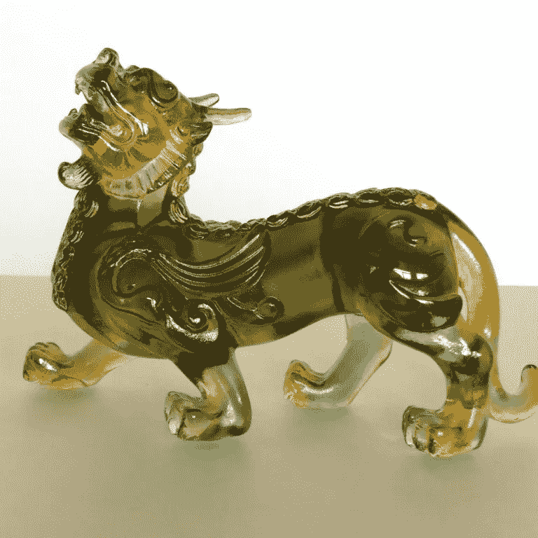

# 没有浪费时间

> 原文：<https://medium.com/swlh/there-is-no-wasting-time-6dcbdd4671c>

My Pi Xiu glass sculpture — photo by Celine Lai

# 时间

> 一系列线性的时刻或经历，一种连续的自然生物或宇宙增长的量度。具有明确目标的阶段性活动的进度衡量单位。

一次又一次，我觉得自己是个失败者。我是一个异卵双胞胎，在我的…