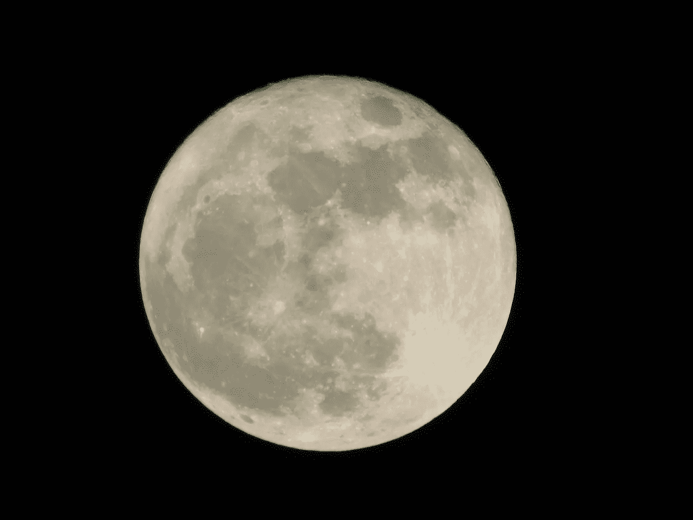

# 月球上可能有千万亿美元

> 原文：<https://medium.com/swlh/there-may-be-a-quadrillion-dollars-lying-about-on-the-moon-3c11a501d0d4>

Photo by [Rachel Moore](https://unsplash.com/photos/Z0V_Xn-FIRs?utm_source=unsplash&utm_medium=referral&utm_content=creditCopyText) on [Unsplash](https://unsplash.com/search/photos/moon?utm_source=unsplash&utm_medium=referral&utm_content=creditCopyText)

太阳风从太阳向四面八方席卷而来。环绕地球的磁场保护地球免受粒子和能量雨夹雪的影响。月球没有这样的保护。在过去的 30 亿年里，它一直受到充满粒子的微风的轰击，因此月球上出现了氦-3。