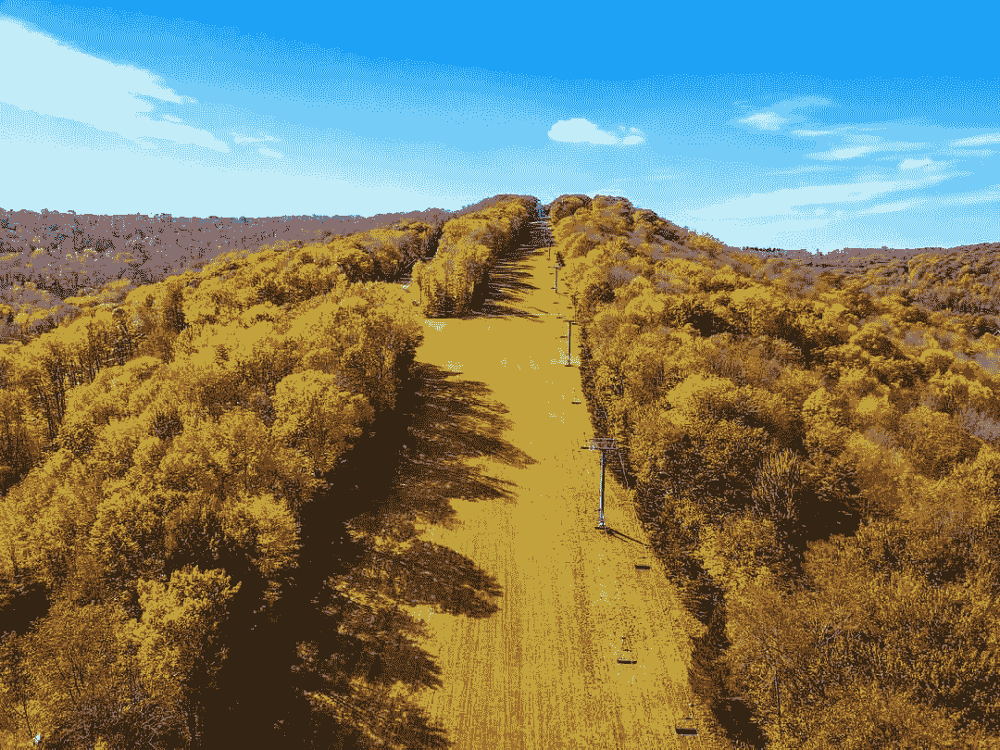

# 在小企业中成长的经历教会了我企业家精神

> 原文：<https://medium.com/swlh/things-growing-up-in-small-business-taught-me-about-entrepreneurship-3c696a71717c>

Autumn Ellicottville, from above. Photo: Me

# 没有比做自己的老板更好的感觉了。

做出独自外出的决定会产生一种大脑混合物，既可怕又令人兴奋(最初大多是可怕的)，这需要更深层次的个人责任感。没有快速致富的方案，也没有一生财务安全的捷径。这是一个不断上升和下降的旋转木马。

我有幸在一个成熟的家族零售环境中长大。这是我父亲建造的房子。(为了那句话，确实是。但如果我不补充一句，我的母亲在持续的成功中发挥了关键作用，那我就失职了。蒂姆基家族以自由企业为荣，因为我的曾祖父、祖父和父亲都称自己为老板。

但你从来没有真正为自己工作过，对吗？你依靠自己的技能和专长来创造人们愿意付费的服务。没有这个，你就赚不到钱。对于那些打算放弃财产去某个遥远的山上出家的人来说，这将会起作用。然而，对我们其余的人来说，不会。

在零售业长大教会了我很多东西。这些经历，再加上(我认为的)父母的良好教养，让我对成功需要付出多少努力有了独特的见解。有商业教训，也有人生教训。如果你想让它起作用，你必须把它们结合起来。

# 没有简单的方法

就是没有。离开一份报酬丰厚、提供健康保险的工作，即使是最雄心勃勃的人物也会失眠。我讨厌陈词滥调，但决定创业需要信念的飞跃。如果你正在寻找一个快速致富的方案(我犯了这个错误——以后会有更多的介绍)，你会猛然醒悟。

任何成功的企业主都会告诉你工作时间长、压力大、自我怀疑。我处于一个独特的位置，一年工作 8 个月，所以当商店关门时，我必须找到替代的收入来源。毕业后，这意味着当我开始在假日谷做兼职营销时，我要去酒吧。在这一点上，它是下沉或游泳——我不能不工作，但我必须有耐心，当我达到我的财务目标。

最初的几年包括，但不限于:不眠之夜，焦虑，大量的自我怀疑，冒名顶替综合症等。等。有几次，我想放弃，我正在做的不够好，或者我永远不会到达我想要的地方。

现在是 2019 年，我仍然没有感觉到我在我想去的地方。但是没关系——如果我觉得我成功了，那就是有问题了。自满和进步不是很好相处，我总是期待着下一个项目或挑战的解决。

# 工作，工作，工作

我父母教给我的最重要的一课是什么？拿起扫帚扫地是再好不过了。当你这么做的时候，不要半途而废。第一次就做对。如果你想让它发生，你必须花时间在自己身上。

在我们商店开门的冬季，这家人每天都工作。这是个苦差事。但这种奉献对我来说很容易，因为我热爱我的工作——前一天是租滑雪板，后一天是卖手套。大多数时候，一个组合。

我从圣博纳文德大学(Go Bonnies)毕业后，获得了整合营销和传播的研究生学位，我将这些技能应用到了我们的商店。更新营销计划，在网站上创建电子商务板块，做一些我父母不知道或者没有时间做的 21 世纪的事情。这给工作量增加了一个全新的层面，但总比花钱请别人来做好。

# 你会失败，这没关系

想象一下这个场景。你住在一个全年开放的度假小镇，每年吸引成千上万的游客。当滑雪胜地的电梯不旋转时，人们来喝酒、庆祝婚礼或只是在好天气里闲逛。你有机会开一家自行车租赁公司，你将在一个位于市中心的建筑里经营(免租金！)第一个夏天。你无法想象它*不起作用，*所以你和你的朋友、现在的商业伙伴一起交了 15，000 美元。

听起来像个成功的故事，对吧？

不对！大错特错。我指的是埃利科特维尔自行车租赁公司，这是我和我的朋友泰勒·伯恩斯决定在 2016 年夏天开办的一家公司。这是一个彻底的失败，我们在第一个夏天后就关门了。

发生了什么事？我们对开一家公司并称之为我们自己的公司非常兴奋，以至于我们完全跳过了市场调查和财务预测等琐碎的事情。我们失败了。我想这么多人会喜欢租自行车，我们在经营一年后会有很多钱。剧透:那没有发生。

但是你知道吗？如果再有这样的机会，我会抓住的。我可能不会像那个夏天那样一头扎进去，但我愿意再次扣动扳机。

# 继续向前看

2019 年的董事会会议室和 1984 年的董事会会议室不一样。保持对行业、我们的客户和整个雪上运动市场的了解，使我们不仅能够保持同步，而且能够稳步前进。这些事情在不断变化，我们在竞争激烈的数字时代生存的唯一方法是适应，同时保持我们的客户已经了解并喜欢的体验。

我从假日谷的自由营销开始了自我创业的旅程，直到今天我还在这样做。我从中磨练出的技能——营销战略、战术、内容创作、社交文案等等——让我的客户多样化了。举个例子:在度假胜地拍同样的照片很无聊，所以我买了一架无人机并拿到了我的飞行员执照。现在，同样的地标正从不同的角度拍摄，导致这些照片被印在画布上(并出售)，导致房地产经纪人要求我拍摄他们的房源。

在企业家的世界里，自满是最大的罪过。在吸取了我在零售业学到的经验并将其应用到我自己的故事中后，我给了自己一个更好的(但不是万无一失的)成功机会。