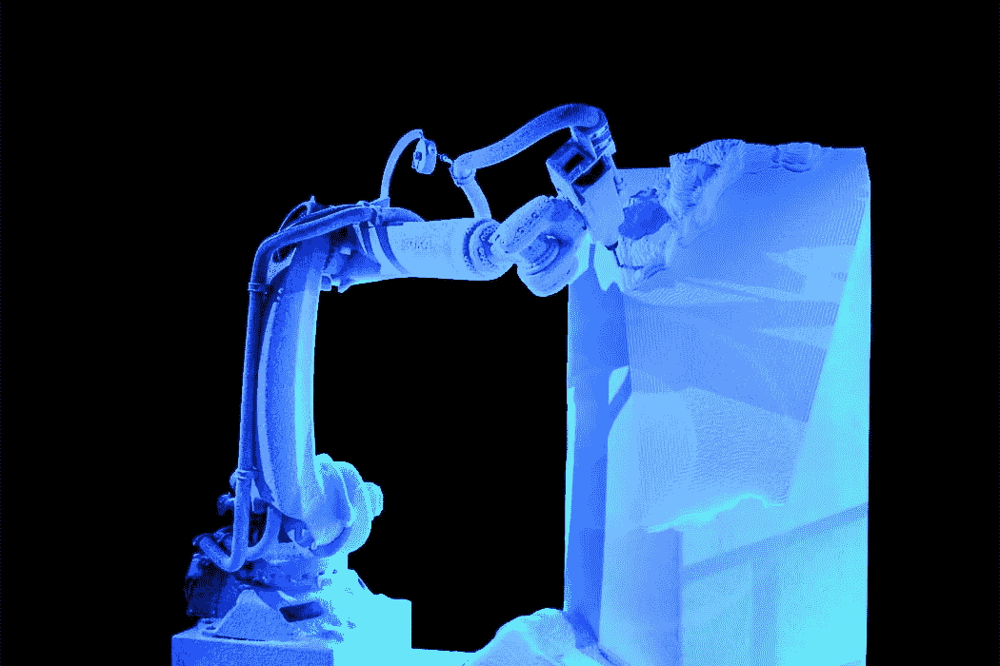

# 物联网——从 IoT 到 ToI

> 原文：<https://medium.com/swlh/things-of-internet-4aa8a613b4dd>

How smart will we be producing in the future?

“物联网”(IoT)是当前发展的一部分，其中“第四次工业革命”将通过“工业 4.0”(Industrie 4.0)发生。这一发展仍处于初级阶段。当算法和人工智能不再仅仅是交流、协调和组织，而是开始自主控制机器人并在云端下生产和物流订单时，会发生什么？这种真正革命性的方法的结果可以被称为“互联网的东西”——缩写为:ToI。

**“工业 4.0”和“物联网”。**

“Industrie 4.0”是德国联邦政府(BMBF)于 2011 年发起的一个德国流行语、词标和营销倡议，是“高科技战略”的一部分。“4.0”意在指第四次工业革命。从最广泛的意义上讲，这是基于“物联网”的工业数字化。网络观念是决定性因素。

在 [BMBF 的网站](https://www.bmbf.de/de/zukunftsprojekt-industrie-4-0-848.html)上是这样描述的:“未来工业项目 4.0 旨在让德国工业为未来的生产做好准备。它的特点是在高度灵活的(大规模)生产条件下，产品具有很强的个性化。客户和业务伙伴直接参与业务和增值过程。生产与高质量的服务相结合。通过更加智能的监控和决策过程，公司和整个增值网络应该能够几乎实时地得到控制和优化”。

“物联网”(IoT)是一个通用术语，用于将真实的和触觉可体验的对象(产品)与虚拟网络链接和耦合。对象和网络在特定的假设下自主通信。根据设定的参数，交换信息并执行动作指令。由物体提供的信息，例如由传感器提供的信息，被传输到网络并在那里被处理。因此，可以从网络对对象执行功能。这种网络兼容对象(产品)也被称为“智能”。现实(物体)和虚拟(程序)之间有一个反馈回路。这在没有用户主动参与的情况下也是可能的。

**模块的变化**

决策已经在算法计算的假设基础上做出。这包括优化分析过程和整合沟通。苹果(Apple)的“Siri”、微软(Microsoft)的“Cortana”或谷歌(Google Now)等聊天机器人是这种对话系统发展到何种程度的生动例子。基本上，结构总是相同的:通过用户界面提出一个“问题”,与数据库进行对比分析，给出相应的“答案”。然而，这些输入和输出不再仅仅是文本性质的，而是可以对用户的环境产生直接影响。

“嘿，Siri，我在车里的时候提醒我。”开始了。“自动驾驶”已经迈出了决定性的一步。通过阅读戴姆勒网站上的相应定义，这一点通过简单的陈述变得很清楚:

> 自动驾驶是指在没有人类驾驶员干预的情况下，车辆在真实交通中自动驾驶到特定目标。(来源:[戴姆勒](https://www.daimler.com/innovation/autonomous-driving/special/definition.html))。

来自博世的“ [VisionX](https://www.bosch-presse.de/pressportal/de/en/bosch-visionx-truck-study-reveals-what-trucks-will-look-like-in-2026-63168.html) ”研究显示了运输物流的发展方向:“自动驾驶货物”找到了自己的路。

> *60%的企业已经实施或计划实施人工智能。*来源:[甲骨文/英特尔](https://www.oracle.com/webfolder/s/delivery_production/docs/FY16h1/doc31/oraclereportIaaS.pdf?elq_mid=56053&sh=&cmid=EMMK160526P00013)

智能生产的未来工厂组织自己的运营:“未来工厂的机器将在很大程度上自行组织，供应链将自动组装，订单将直接转化为制造信息，流入生产流程。然而，在工业 4.0 世界中，人类仍然是不可或缺的——作为创造性的领导者和思想家，他们用自己的智慧“超前思考”，并以软件的形式“教导”机器。”(来源:[西门子](http://www.siemens.com/innovation/de/home/pictures-of-the-future/industrie-und-automatisierung/digitale-fabrik-industrie-4-0.html))

**心态的改变**

市场经济背景下的大多数变化过去和现在都是基于与提高产量和利润有关的优化过程。分析所有内部和外部流程及其相应的与环境相关的影响变量，收集相应的数据，描述流程，筛选出目标变量，并进行相应的评估和优化。由于影响变量的复杂性和数据收集的困难，这不是一项容易的任务。人类发挥作用的领域比只用机器的领域更难评估。关键绩效指标成为衡量成败的标准。如果自主工厂以及大数据和人工智能组织和优化自己，对不可预测的因素做出更快的反应，并在业务管理要求方面取得成功，这个系统将成为成功的典范。

谷歌“ [RankBrain](https://www.bloomberg.com/news/articles/2015-10-26/google-turning-its-lucrative-web-search-over-to-ai-machines) ”专注于人工智能，它为搜索结果的优化生成自己的知识增益。这发生在后台。作为用户界面的搜索掩码是机器和用户之间的唯一接触点，用户主要想要快速和成功的解决方案。此时他对其他任何事情都不感兴趣。在这一点上，无论是真人坐在谷歌前查找一本书，还是人工智能计算答案，对用户来说都无关紧要。“真正的新闻不是谷歌在总体上使用机器学习，也不是这家原本喜欢保持低调的公司在这一点上对其算法的架构给出了不同寻常的开放见解。更具爆炸性的是，迄今未知的“RankBrain”甚至已经被官方确认为搜索结果排名的第三重要因素，并在处理新的搜索查询时比人类得分更高。”(来源:[搜索度量](http://blog.searchmetrics.com/de/2015/11/19/rankbrain/)

2016 年 2 月 1 日，马克·扎克伯格在他的脸书账户上宣布了 WhatsApp 用户[的第十亿名:](https://www.facebook.com/zuck/posts/10102630245039651)

> 现在有 10 亿人在使用 WhatsApp。[……]只有少数几种服务连接着十多亿人。这个里程碑是连接整个世界的重要一步。

10 亿用户不仅表达了一种几乎无法形容的沟通强度，还意味着 10 亿人几乎无条件、毫无保留地向一家公司提供他们所有的联系数据、链接和内容，以进行直接沟通。优化通信的积极效果似乎抵消了可能的负面影响，如数据保护。

在 Adobe 的报告“[体验的未来](https://blogs.adobe.com/digitaleurope/files/2016/07/Adobe-Report-The-Future-of-Experience.pdf)”中，超过一半的受访者表示，数字技术不仅用于保持沟通，还帮助他们“离线”:

> 52%的受访者表示，良好的数字体验让人们不仅能够利用技术与世界联系，还能与世界脱离。

这是在一种数字滤波器的帮助下完成的:

> 一种无形的数字过滤器，创建并保护只有少数人才能进入的私人离线空间。

然而严格来说，这也意味着用户并不是不愿意根据自己的“设置”把决定权交给技术。

一个拥有越来越多信息的越来越复杂的世界也导致了这样一个事实，即人类喜欢隐藏信息，以便不被信息及其行动和接受过程所麻痹。

**物联网**

如果一个人把技术可能性的模块和生产者与使用者的心态结合在一起，他可以假设一个自动生成系统将会发展，这个系统在其操作上的紧密性最终会产生“互联网的东西”(ToI)。即使在今天，仍有产品在生产过程中从未被人的手接触过。然而，如果一个产品的计划、购买、执行、生产和交付都是在没有人工干预的情况下自主创建的，那么我们就可以称之为“互联网事物”。

问题在于，网络——从人类决策(在批准的意义上)中分离出来——如何基于算法和人工智能(云计算)控制它们的生产(机器、机器人)、物流和市场，以及它们如何在这个过程中变得独立。人工智能越来越多地进入生产领域。过程的自动控制及其优化设定了相应的过程。

生产自动化并不新鲜:织布机、蒸汽机、装配线、机器人……大规模生产一直是优化尝试的表现。总是有不同的声音，但是发展是无法停止的。因此，从物联网到物联网的路径只是时间、文化条件和基于市场的努力的问题。“智能工厂”将智能自主地运转。他们将生产适合市场需求的产品。他们可能会非常优秀，甚至可能比人类更优秀。

例如，汽车行业将对接自己的“智能工厂”作为供应商，或者自己启动它们。根据需要，在世界市场上采购、加工、个性化和交付材料。大数据将有助于超越公司界限进行优化。全世界的价格和物流都将被实时查看。模拟通过政治变化和对股票市场的影响发挥作用。微进化(在试错的意义上)被实现，如果成功，转化为创新。这一切在没有人类影响的情况下会越来越多的发生。“智能工厂”自我管理和优化。

一个至关重要的问题是:人类扮演什么角色？

喂，喂，喂！

