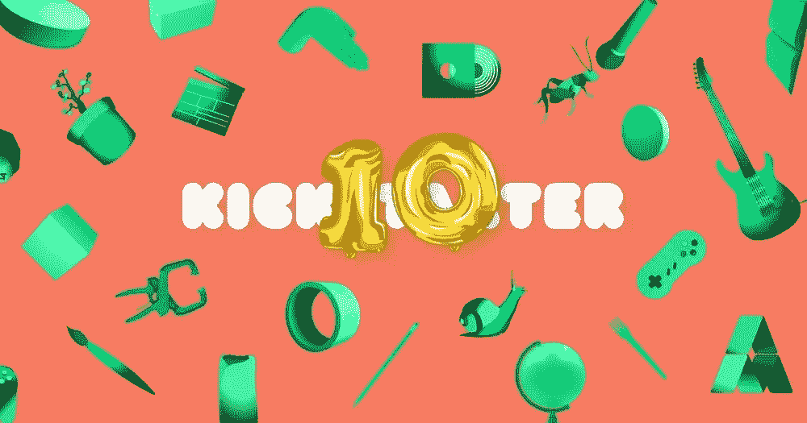

# 推出新的众筹产品之前需要考虑的事情。

> 原文：<https://medium.com/swlh/things-to-consider-before-launching-a-new-product-d6544b12745b>

Kickstarter turns 10 years old.

## 经过 350 多次活动，筹集了 7500 多万美元，这是我的 Kickstarter 启动清单。

我在一家众筹营销机构担任了 4 年的总裁，帮助数百名客户通过 Kickstarter 和 Indiegogo 推出新的硬件产品。我监督每天 Salesforce 收到的所有新产品线索，其中许多是以前没有人见过的，那段时间非常令人兴奋。这让我想起了我爸爸从 Sharper Image 带新目录回家的日子。对于 1990 年后出生的人来说，更清晰的图像是现代的原始触摸，但在当地的购物中心可以找到。里面全是你在西尔斯、Radio Shack、Target 或梅西百货的电子产品区找不到的精心策划的电子产品。布鲁克斯通是最接近的匹配，但不太有同样的天赋，更清晰的图像曾经有过。

在短短 4 年多的时间里，我们帮助众筹客户为尚未生产的产品筹集了超过 75，000，000 美元的预订单。我们是“众筹之王”，每个人都希望我们的团队管理并发起他们的 Kickstarter 活动。我觉得我很有把握选出获胜者，但平心而论，我是最有把握的。

这些是我用来评估我们选择的产品的共同点:

1.  **该产品成功地做了什么？**现在，创业界的一些人将此表述为“你在解决什么问题？”我觉得这既傲慢又愚蠢。
2.  这要花多少钱？“我的新耳机 199 美元！”。很好，Bose、Sony 和 Beats 也是如此，它们做同样的事情，并且在亚马逊上可以以更低的价格买到(明天送货上门)。陷入与知名品牌的价格战可能是致命的，除非你为产品提供独特的旋转或功能。许多客户使用 4 倍的倍数来提出他们的管理系统更新建议项目。简单算一下，如果你的产品成本是 25 美元，你会看到零售价是 100 美元。对于众筹，我们建议最低 30%的折扣，在某些情况下最高 50%，包括免费送货。(始终以 Kickstarter 价格内置免费美国运费！)大多数客户，甚至是赚了 100 万美元的成功客户，都不知道自己的制造成本、BOM，甚至是运往某些有增值税的地区的运费。如果可以的话，去看看这家公司 [Easyship](https://pages.easyship.com/e2t/c/*W5frTHK3K69BQW2lZpGv4tmj-Z0/*W1pvsWL253gKRW5TQJzb86t4qx0/5/f18dQhb0S83d8Z995KN6P51wzHyjJqW8rlp9R5v0zzvN3hHhbBVMsQMVnQ9Qq8--HBkW8-20-G1BXr6bVrBQfk4dQ9_tW7LYTsf2KBRYBW4cywB-2MV0ZDW31qMHm52r46gVHBQD830T-7sW7mG7sD51vX4yW6GXZ5r7d094fW6G7Fbl4DFfS3W6R8rP94DFgf8W1JB0Gc2nTmc8W1n8tQc2ngjLxVGk78J3Mq2rxW2gYvyQ74NrjfVR7wfd9j7zMTW64-8yx1dy3DBMcCPf8YXLtcVdkr_h3L_7hQN7Y9bwd2Nn1CVYN7d296FS3VW8LjG_48n4LYbW1Vtzs95f7npyW3Cdk0d3wv7SmW4bKfrP2KXyh4W2bP4Cy22-XHZW6MjV2y1W5pwKVNrWBL4r5l5jW6b5h926ZgthkW3DqwZY5XrXRrW5fmR--94xz1-W4tkVxb2SmvY0MZpcmq9ZLfWf6kHd3K11) 。所以开始计算营销、费用、运费、折扣和退货。这些加起来很快，为什么你的产品有很好的利润是显而易见的。Kickstarter 平均贡献的最佳点在 99 美元到 129 美元之间。
3.  **via # 1 和#2 目前有竞争对手吗？他们如何比较？**即使你不认为你有一个实力相当的竞争对手，你也有。或者，有一种产品充当人们正在使用的当前解决方案。价值主张是这里的关键。我看到许多很酷的厨房小工具在几十年没有更新的日常设备上添加了独特的内容，表现非常好。没有疯狂的技术，只有创造性的设计，或重新设计，和功能。
4.  你有工作原型吗？这向我表明你已经走了多远，或者离开始还有多远。拥有一个完美的原型是销售接近生产的想法的关键。当你进入一个完整的生产单元时，你的原型肯定会有更新和升级。大多数新闻和媒体出版物不会报道你的产品，除非你有一个工作原型。有太多的产品，他们也已经被未能交付的活动烧毁。关于这一点的未来帖子将会出现…

每个人都有一个想法，或者通常所说的“啊哈”时刻。当我向家人和朋友解释我的“众筹”职业时，总有一个叔叔、表哥或朋友的朋友有了产品想法，迫不及待地问我如何推出它。我的父亲在成长过程中有几十个这样的东西，但可悲的是，他从来没有追求过或者不知道如何追求制造它们。

但是告诉我一个产品想法通常是这个想法就此停止，不再继续。不一定和我在一起，我热爱创意和新产品的咨询，但是创作者不知道下一步该做什么。我所说的*想法停止*是指当有人跟我说他们有一个产品想法时，这就是他们所做的。没有人仅凭一个想法就能在鲨鱼池上成功，你还没准备好投资。在我多年的竞选活动中，我有 4 个客户上了鲨鱼池，其中一个与 Lori 和 Mark (Fizzics)达成了一笔大交易。为了进一步吹嘘,《鲨鱼池》的一位执行制片人联系了我，看看我们的客户渠道中还有谁可以为下一季提供食物。不幸的是，我们的大多数客户都在中国，没有资格参加这个电视节目。

在发起 Kickstarter 活动之前需要考虑的事项的简单清单:

1.  **市场调查**——这种产品有市场吗？面向谁？你的竞争对手是谁？你对此越诚实越好。说你的设计很优秀可能是真的，但这是主观的。你还没有的客户，可能不同意，或者他们同意你，但不同意你提供的价格。做好功课，省得以后痛苦(一些)。
2.  **原型**——这可能会变得很贵，尤其是在处理电动自行车、充电器或塑料制品等硬件产品时。五金产品的模具、工具和其他制造成本非常昂贵。我还没有看到一个可接受的 3D 打印原型，至少从消费者空间模型来看是这样。背包、钱包或包等软线产品更实惠，尤其是如果你能从海外供应商那里采购材料的话。为任何新产品创造一次性成本都很高。然而，你需要一个原型来拍照，并为投资者或 Kickstarter 众筹活动准备好营销材料。
3.  **市场验证** —那么，会有人买这个吗？Kickstarter 和 Indiegogo 已经成为最大的众筹平台，因为它们拥有来自早期采纳者技术人员的大量流量。在我看来，它们仍然是推出新产品、快速吸引客户的最佳平台。我曾经在 Kickstarter 上称这些客户为“苹果族”，或 30 多岁的男性，他们有可自由支配的收入，喜欢购买他们不需要但想要的小玩意，可以等 6 个月到 1 年才能买到，只是为了成为第一个！男性占 Kickstarter 支持者的绝大多数。当你考虑在 Kickstarter 上发布产品以及潜在客户群时，请考虑这一点。
4.  **发起预购活动**——在发起任何活动之前，我都会发起一场预发布数字营销活动。这需要大约 5 万至 1 万美元的预算，用于通过脸书和 Instagram 向“苹果迷”和其他潜在客户投放定向广告。第一个目标是为您的产品发布获取电子邮件注册。为什么？所以你可以在第一天就有成千上万的人在你门口排队。如今，当你看到 Kickstarter 上的活动写着“1 小时内资金到位”时，任何人都不会感到惊讶。他们应该说“在 4-6 周内花费 1 万美元的广告后，在 1 小时内获得资金，营销团队擅长优化脸书广告，并使用从其他 Kickstarter 活动中获得的数据来锁定你。”在之前的活动中，大约 70%的 Kickstarter 支持者是回头客。如果您无法为预发布活动收集到 3000 封关于这些特定演示的“高质量”电子邮件，我强烈建议您推迟发布。可能是你的营销资产，可能是你的营销团队，或者事实上，可能是你的产品没有引起 Kickstarter 受众的共鸣。你需要和你的团队一起解决这个问题。

这是一个小型的、人手不足的杂货清单，用于发起众筹活动，我没有涉及的其他主题是公关(5k-15k 美元/月)。)，营销服务(5000-10000 美元费用+广告支出)，以及为众筹活动融资，众筹活动可以轻松达到 10 万美元以上，或者为寻求达到 7 位数大关的活动提供 10%的资金。在我从事众筹的 4 年时间里，我们有 18 次活动的金额超过了 100 万美元，这是客户对定价低至 45 美元、高至 1000 美元以上的产品的平均营销支出。