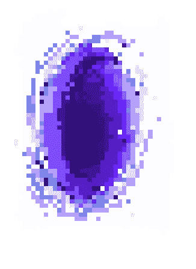

# 用门户思考

> 原文：<https://medium.com/swlh/thinking-with-portals-47c5a0a3d155>

关于 React 门户的帖子

您是否曾经想要将子组件渲染到一个 [DOM](https://developer.mozilla.org/en-US/docs/Web/API/Document_Object_Model/Introduction) 节点中，该节点存在于父组件的 DOM 层次结构的 之外的 ***？你有没有尝试过创建一个模态，但是却弄乱了你所有的 CSS？都不知道我在说什么？去过那里。***

按照惯例，当我们呈现一个 React 组件时，它作为最近的父节点的子节点被挂载到 DOM，并被约束到我们在。直升机家长多吗？

然而，随着 React 16 中门户的增加，子组件现在能够与讨厌的父组件“脱离”。但是，他们并不是完全自由的；通过门户呈现的组件保留了普通 React 子组件的行为。

这是因为子节点和门户存在于**反应树**中，而不管它们在 **DOM 树**中的位置。在 [React 文档](https://reactjs.org/docs/portals.html#event-bubbling-through-portals)中了解更多信息。

 [## 门户-反应

### 门户提供了一种一流的方法来将子节点呈现到一个 DOM 节点中，该节点存在于…

reactjs.org](https://reactjs.org/docs/portals.html) 

## 等等，但是为什么？

由于 DOM 在 React 中的结构(`<App />`是`
`的孩子)，我们的组件不可避免地变得嵌套很深，随着 React 应用程序的增加，情况更是如此。如果我们试图在其中一个嵌套组件中创建一个弹出窗口(或类似的东西)，我们将会遇到一些 CSS 问题，即 [z 索引](https://developer.mozilla.org/en-US/docs/Web/CSS/z-index)和[溢出](https://developer.mozilla.org/en-US/docs/Web/CSS/overflow)。

门户让我们能够在不同的 DOM 下，甚至在不同的窗口中呈现组件。使用门户，我们不再需要担心我们的弹出窗口(和应用程序的其他部分)会受到 CSS 限制的影响。

## 好吧，那怎么做？

让我们来看一下如何给我们的应用程序添加工具提示。

1.创建可重用的门户组件:

*   在我们的`constructor()`中，我们将组件包装在一个`
`中。然后，我们使用`componentDidMount`和`componentWillUnmount`将它放到 DOM 上，并适当地将其从 DOM 中移除。
*   在我们的`render()`中，我们调用`ReactDOM.createPortal()`，它接受 JSX 进入门户的参数，以及目标目的地。
*   注意，我们的`render()`实际上并没有返回任何东西。相反，我们设置这个组件是为了在其他地方做一些事情。

2.创建可重用的工具提示组件:

*   我们用一个布尔值初始化组件，并编写事件处理程序，通过鼠标悬停来切换工具提示
*   当鼠标悬停在门户上时，门户“打开”并显示工具提示，否则门户“关闭”并隐藏工具提示
*   `this.props.children`和`this.props.text`在我们使用以下组件时定义:

在 CodePen 中:

通过一些额外的 CSS，我们可以让工具提示显示在其他地方。我们甚至可以修改门户组件，在每次鼠标经过时在新窗口中打开工具提示。

## 总结:

*   门户允许我们在 DOM 树中的任何地方插入一个子容器，并且可视化地“逃离”一个父容器(比如模态、工具提示、弹出窗口)
*   使用门户渲染的组件表现得像普通的 React 子组件，因为它仍然存在于 React 树中

**关于可访问性的重要说明:** [管理门户的键盘焦点](https://reactjs.org/docs/accessibility.html#programmatically-managing-focus)，并在创建模态时遵循[模态创作实践](https://www.w3.org/TR/wai-aria-practices-1.1/#dialog_modal)。

阅读更多关于门户网站/查看更多示例[此处](https://hackernoon.com/using-a-react-16-portal-to-do-something-cool-2a2d627b0202)和[此处](https://codeburst.io/reacts-portals-in-3-minutes-9b2efb74e9a9)。