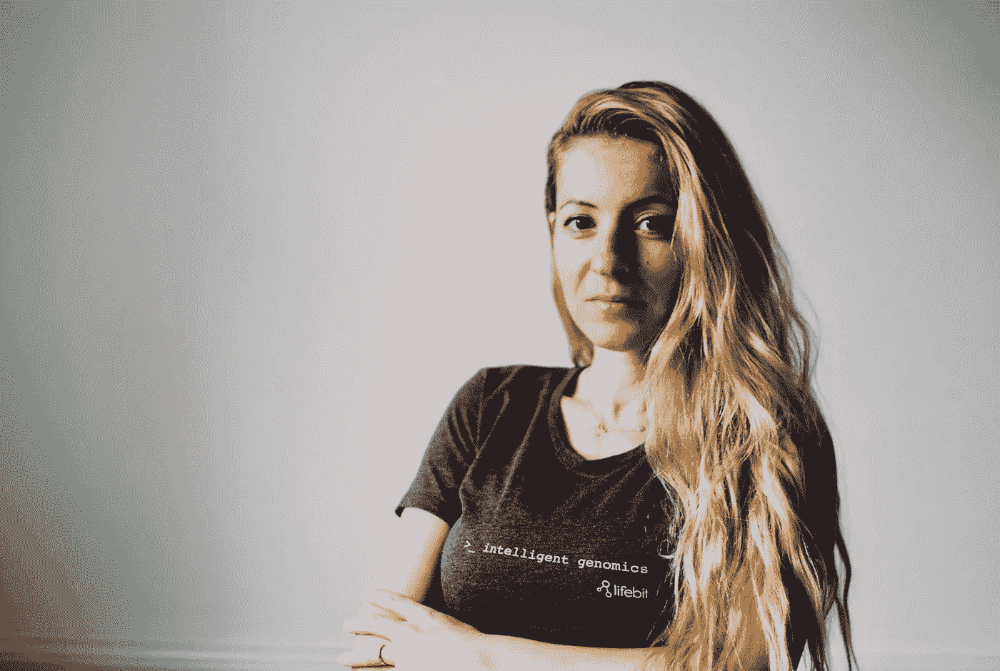

# 这位生物技术初创公司的联合创始人开了 167 次会，在两个月内筹集了 300 万美元。以下是 Maria Chatzhou 的做法。

> 原文：<https://medium.com/swlh/this-biotech-startup-co-founder-had-167-meetings-and-raised-3m-in-two-months-1db1c64fb20c>

在两个月内筹集 300 万美元听起来像是一个梦想，但是[生命比特生物科技](https://lifebit.ai/about)的创始人兼首席执行官 Maria Chatzou 博士说，她只有一种方法可以实现它:绝对的奉献。

[我在伦敦采访她](https://soundcloud.com/user-2586856/how-i-raised-it-with-maria-chatzou-of-lifebitai-on-8222018)，当时她正在两次会议之间穿过伦敦的天使社区。(那不正是创业生活的完美写照吗？)

“这不是一份工作，”玛丽亚说。“这是一种生活方式。我需要说的是，在接下来的三四个月里，我不会做任何其他事情。”

Maria 的公司 Lifebit Biotech 是围绕分析 DNA 而建立的，供研究人员、其他生物技术公司、制药行业和政府机构使用。提取 DNA 是一个相对快速、自动化和廉价的过程。但是分析来自 DNA 的数据更具挑战性。

“要真正获得任何有意义的东西，都需要大量的时间、金钱和痛苦，”玛丽亚说。"这就是为什么基因数据没有被用于任何临床应用."

玛利亚和她的联合创始人巴勃罗·彼尔托博士在巴塞罗纳攻读博士学位并在基因法规中心工作时相识。他们意识到，他们可以通过构建一个可以处理巨大数据集的人工智能工具来简化分析 DNA 数据的过程。

玛丽亚和巴勃罗建立了“一个成熟的认知系统”，使各小组能够更快、更经济地了解他们从 DNA 中提取的数据，玛丽亚表示，这些数据对从研究到设计个性化药物的一切都很有用。

**震撼科技明星的剧本**

Lifebit 入选 2017 年 [Techstars 伦敦](https://www.techstars.com/programs/london-program/)公司。玛丽亚和巴勃罗利用他们通过加速器建立的联系，开始了一轮疯狂的筹款。

玛丽亚说，许多企业家试图细化他们的搜索，并试图找到他们认为最适合他们公司的少数投资者。“我没有那样做，”她说。

相反，玛丽亚的策略是会见…每个人。

“我按照 Techstars 的剧本讲述了如何筹集资金，非常成功，”Maria 说。"第一阶段是提高意识，尽可能多地结识新朋友。"

她为自己的第一轮融资安排了 117 次与投资者的会面，“如果你仔细想想，这太疯狂了，”玛丽亚说。她又参加了 50 次第二轮会谈，最终确定了几份最适合 Lifebit 的条款清单。

玛丽亚指出，现在不是自满的时候。

“到了第三阶段，就是完成投资协议，把钱存入银行，”Maria 说。“很多人低估了第三阶段。很多事情都可能出错，多到足以毁掉你的公司。”

最后，她的努力得到了回报。

“经过两个月的筹款，我的种子期，我们筹集了 300 多万美元，”玛丽亚说。

**提炼再提炼**

由于大多数投资者都不是遗传学家，玛丽亚经常把重点放在向他们介绍 Lifebit 的技术上。不断改写她的信息带来了清晰。

“我利用每一次会议，为对基因组市场有不同理解的投资者提炼我的信息。这对我同样有帮助，因为我必须在不同的层次上投球，”玛丽亚说。

因为她经常与投资者会面，Maria 觉得她可以不抱太多期望地接近他们。

“我没有说，‘我能从中得到什么？’相反，我会说，‘我是来告诉你我在做什么，并真正了解你在努力做什么，’”玛丽亚说。

她说，关系是投资的底线。当她与投资者建立关系时，他们把她介绍给其他人。会见伦敦和剑桥的几乎所有投资者意味着几乎每个人都知道 Lifebit。

一旦事情有了进展，Maria 就不再需要出去开会了。

她表示:“归根结底，投资者喜欢携手合作，追求真正的大目标。”。

Maria 和 Pablo 希望他们与英国投资者的关系能够在明年某个时候开始他们在美国的首轮融资时对他们有所帮助。

**幕后有点乱**

玛丽亚希望她能告诉年轻时的自己不要压力太大，要明白筹集资金是一个过程。

她说，关注故事和关系。“尽可能诚实。投资者完全可以看透你。”

Maria 指出，人们对看似天衣无缝的筹款过程印象深刻，但他们不应该低估所付出的努力。

“听起来太完美了，一切都进展得太快了，”玛丽亚说。“相信我。有太多的工作必须在幕后进行。”

*本文根据*[*Foundersuite.com*](https://foundersuite.com/)*的* [*我是如何筹集到资金的播客*](https://soundcloud.com/user-2586856/how-i-raised-it-with-maria-chatzou-of-lifebitai-on-8222018) *中的一集改编，讲述了那些已经筹集到资金的创业公司创始人的幕后故事。*

## 这篇文章发表在 [The Startup](https://medium.com/swlh) 上，这是 Medium 最大的创业刊物，拥有+427，678 名读者。

## 在这里订阅接收[我们的头条新闻](https://growthsupply.com/the-startup-newsletter/)。

