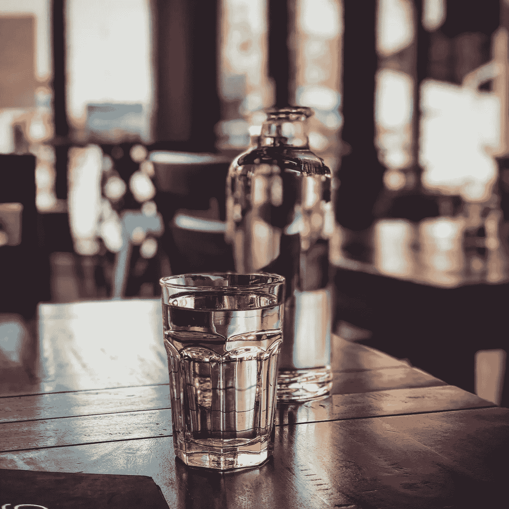

# 这家创新的公司拥有在 CBD 饮料市场取得成功的公式

> 原文：<https://medium.com/swlh/this-innovative-firm-has-the-formula-to-succeed-in-cbd-beverage-market-5c503bfd5f3e>

许多美国饮料公司被迫旁观加拿大将娱乐性大麻使用合法化。不甘示弱的是，美国较大的知名品牌也一直在与大麻种植者建立联系，以创造新的产品线，期待加拿大自己的产业带来的繁荣。

2018 年 9 月，可口可乐(纽约证券交易所代码:KO)对加拿大大麻公司 Aurora Cannabis (TSX: ACB)的健康品牌饮料创意产生了浓厚兴趣。一种可以缓解痉挛、疼痛和炎症的健康饮料被推出。10 月底，[可口可乐](https://www.businessinsider.com/coca-cola-shoots-down-cbd-rumors-2018-10)宣布退出交易，并声明目前他们不会在大麻饮料市场寻求联盟。

一个潜在的原因是对 2018 年美国农业法案结果的担忧，不确定性是商业的诅咒，往往会迫使保守主义者采取行动。现在历史性的农业法案已经被[签署成为法律](https://www.forbes.com/sites/jordanwaldrep/2019/01/03/how-cannabis-just-took-a-step-towards-legalization-in-the-us-farm-bill/#379701806608)，新条款的一部分已经颁布了大麻的完全合法化，这提供了大麻的药用价值而不会让使用者兴奋。这一项立法有可能引发北美 CBD 的复兴。

**CBD 饮料**

基于大麻的饮料并不新鲜。大麻饮料存在于美国市场，并且出现在大麻合法化的州。尽管如此，很少有公司能够在这个领域留下自己的印记。部分原因是因为大麻的负面含义，对 CBD 饮料的重新关注可能会改变一切。

碱水公司是一家领先的饮料公司，也是仅有的几家有实际计划的公司之一。碱性水在 2018 年 11 月报告了超过 310 万美元的销售额，这是公司历史上最高的[月销售额](https://ir.thealkalinewaterco.com/press-releases/detail/214/the-alkaline-water-company-reports-highest-monthly-sales-in)。这是在之前的**该公司甚至已经开始发布他们的 CBD 饮料系列，2019 年的数字可能会更令人印象深刻。**

将含有大麻的饮料重新归类为健康饮料表明，该公司对消费者想要什么有第六感。产品线 A88 有大麻衍生的，起泡的 CBD，和注入维生素的 CBD 产品线。

他们在饮料方面的其他创新想法包括基于维生素的能量水和天然调味水。桃子芒果，黑莓柠檬，血橙和西瓜的口味给消费者提供了选择和健康的选择。碱水公司与内华达州有联系，总部设在亚利桑那州，这使它比试图打入该市场的加拿大公司具有广泛的优势。

该公司着眼于未来，通过与加拿大的世界选择装瓶公司签订新的联合包装协议，扩大了其国际销售战略。预计加拿大将在 2019 年 10 月之前使 CBD 饮料合法化，沃特世在 TSX 的上市将使他们处于利用这一新兴市场的最佳位置。

最大的新闻发生在碱性水公司与美国营养品公司达成许可协议的时候。碱性水收到的回报列表中的生物量和提取与 ANP 的 GMP 认证和 FDA 注册。与此同时，碱也接受 R & D、配方和制造。

WTER 也实现了一个里程碑，在纳斯达克上市。这一成就让该公司接触到了无法投资于初级公司的机构投资者，并将其列为值得关注的公司。

利用纳斯达克的势头，该公司预计将通过主导新的 CBD 饮料市场来进一步推动增长计划。例如，A88 注入饮料部门公司(A88 注入)将包括以下产品:大麻衍生的 CBD 注入碱性 88 水；闪闪发光的 CBD 碱性 88 水；和注入维生素的 CBD 碱性 88 水。在 A88 注入式产品线下，消费者可以期待基于维生素的“能量”Alkaline88 水和天然风味的 Alkaline88 水(具有黑莓、血橙、西瓜和桃子芒果等风味)。

碱性水公司还与 Infusion Biosciences，Inc .签订了技术许可协议，预计将推出即饮的天然大麻提取物(CBD)配方。与[美国营养产品](https://ir.thealkalinewaterco.com/press-releases/detail/203/a88-infused-beverage-division-inc-and-american)的生产协议有望扩大新的 A88 输注产品线，为其最近宣布的每个产品扩展的开发提供“一站式商店”。ANP 将在其最先进的设施内提供 A88，其中包含制造、配方研发、生物质和提取。

# **农业法案改变了一切**

农业法案为饮料生产商提供了一个难以置信的机会。大玩家正在寻求进入该领域，Canopy 的增长受益于 Constellation Brands 投资 40 亿美元的合资企业。 [Canopy](https://www.usatoday.com/story/news/2018/08/01/molson-coors-developing-cannabis-drink-canadian-consumers/881927002/) 正在酝酿一个名为 Tweed and Tonic 的项目，预计将于 2019 年底推出这种饮料。

与大麻不同，CBD 部门现在站在安全的法律基础上，预计仅在美国 CBD 饮料部门就价值 6 亿美元。水很有可能成为这个市场的主导者。他们在美国拥有超过 47，500 个零售点的现有分销网络，具有全国装瓶能力。他们将能够利用这一令人印象深刻的影响力迅速主导一个几乎没有其他公司预测到的市场。

很难想象有哪家公司比碱性水公司(Alkaline Water Co .)更能有效地定位自己，该公司将在 2019 年爆发。

## 这篇文章发表在 [The Startup](https://medium.com/swlh) 上，这是 Medium 最大的创业刊物，拥有+430，678 名读者。

## 订阅接收[我们的头条](https://growthsupply.com/the-startup-newsletter/)。

