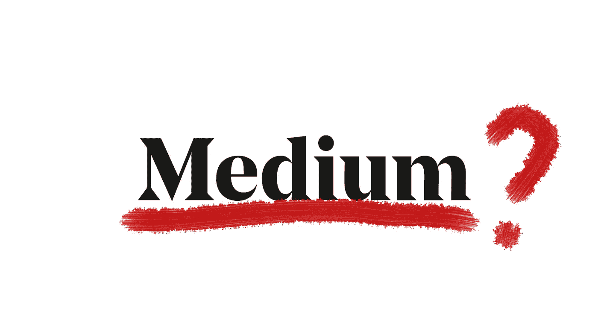

# 这就是杀死灵媒的东西

> 原文：<https://medium.com/swlh/this-is-whats-going-to-kill-medium-a41f87b3e77c>

## 这就是我取消会员资格的原因

一年多前，当我开始在 Medium 上写作时，我很兴奋。事实上，我非常兴奋。我很激动。
我被激励了。我很受鼓舞。我受到了启发。

我从未如此渴望写作。

# 激情和超能力

在我生命的早期，人们总是向我寻求帮助。当时，我不确定是我的好建议还是我倾听的能力让陌生人接近了我。

后来，我意识到这是一种天赋。我实际上称它为[我的超能力](/swlh/this-is-how-i-discovered-my-superpower-b2f1a67fb100)。
我和人们有一种特殊的联系。我们在更深的层次上联系。
也许是因为我一直有帮助别人的热情。

几年来，我试图找到正确的方法来帮助尽可能多的人。我不想只是偶尔这样做。于是我开始写作。找到自己的声音不是问题，因为我清楚地知道自己想说什么。但是我仍然不知道如何去帮助那些需要我帮助的人。我一直在寻找一个平台，让来自世界各地的人们聚在一起谈论生活。希望学习、成长和参与更广泛讨论的人。

# 然后我偶然发现了媒介

我从一开始就经历了成功。当我说成功时，我的意思是我正在实现我的目标。我在个人简介中自豪地宣布的目标— **帮助人们开始或继续他们的自我实现之旅。短短几个月内，我已经有了数百名粉丝，并且拥有越来越多的观众和读者。最好的回报是我设法帮助了成千上万的人。**

我立即支付了会员费，因为我想支持 Medium。
我相信干净、无广告的平台是正确的选择。
*(我甚至把* [*写到这里*](/swlh/why-0-is-never-really-free-250ba824f65f) *)。)*

我在 Medium 上最初几个月写的大多数文章都是经过策划的。我甚至因为一个策展人特别喜欢的作品而获得了 100 美元的奖金。
我的第十篇文章，[为什么拥有 0 美元比拥有 1 美元好得多](/swlh/why-having-0-is-much-better-than-having-1-15729410c2d1)，在短短几个小时内获得了 1000 多次掌声，是当月(2018 年 3 月)最受欢迎的媒体文章之一。这也标志着我与初创公司的第一次合作，在我看来，这是媒体上最好的出版物。

# 但是后来事情发生了变化。

那是 2018 年末的某个时候。我开始有更少的评论和掌声。当我看到统计页面时，我震惊了。观众/读者数量大幅下降。

我的一些文章在最初的 24 小时内只有不到 100 次浏览。
考虑到我的数百名粉丝和这家初创公司的 40 多万名粉丝，**这些参与度数据非常糟糕。**
基本上就是说我的文章几乎没有印象。
我并不孤单。我注意到，许多其他作家，有些拥有成千上万的追随者，对他们的一些新文章几乎没有任何掌声。如果你是一名媒体作家，你可能知道我在说什么。

当我刚加入 Medium 时，我每天至少会阅读几篇有趣的文章，都是新作家写的。但在 2018 年底，我只能找到我已经关注的作家的东西。
所以我决定接触灵媒。一些工作人员和策展人过去一直和我联系，所以我想他们会乐意帮忙。令我惊讶的是，我得到的答案并不确凿。事实上，今天我可以有把握地说，这些都是一般性的反应。
Medium 没有准备好处理直接接触，或者只是不够关心。

我开始注意到一个模式。
这并不突然，但 Medium 已经慢慢开始专注于他们的合作伙伴计划。
可以理解。作为一名作家和一名拥有会员资格的读者，我自己也投入其中。
但是 Medium 并没有真正关注我在合作伙伴计划中看到的好处——高质量的内容、社区和独特的声音。

# 一切都是为了钱

Medium 发给我的所有合作伙伴计划通知和简讯都只关注一件事:钱。

> 基于 2019 年 1 月的会员参与度:
> 
> 58.9%为会员写了至少一个故事的作者或出版物**赚了钱。**
> 
> 8.1%的活跃作者**收入超过 100 美元**。
> 
> **8390.03 美元是作者赚得最多的**，4290.43 美元是单个故事赚得最多的**。**

在这份月度总结中，没有提到新会员的数量或 Medium 上的读者总数。只是钱。通过说一个作家赚了 8390.03 美元，媒介发出了一个明确的信息。这有点像彩票广告，显示中奖者站在他新买的豪宅中的私人泳池旁。毕竟，每个作家的春梦都是通过写他们想写的东西来赚取美元。

但是并不是所有的作家都是来赚钱的。
或者至少，他们不把它放在优先地位。一些作家在这里是为了创造品牌知名度，而像我这样的其他人只是为了曝光。
我宁愿一篇特定的文章有另外 1000 名读者，也不愿多赚十几块钱。
简而言之——金钱不是成千上万媒体作家的主要动机。然而，对于媒体来说，它是唯一的。这就是为什么他们毫不费力地试图让作者只为会员“锁定”他们的文章。

# 目的是什么？

理论上，Medium 提出的基于版税的模式没有任何问题。然而，事实上，还有很多问题需要解决。
首先，没有人真正知道 Medium 上有多少成员。我们无法判断流量随着时间的推移是在增长还是在减少。通过猜测，似乎后者是真的。
其次，我们不知道 Medium 上有多少付费会员。这一点至关重要，因为作者有权知道媒体赚取的利润中有多少与他们分享。这是全部吗？仅仅是一半吗？

就像优步和他们的司机或者苹果音乐和他们的艺术家一样，没有作家，Medium 就不会存在。这就是为什么作家也有权知道他们每篇小说能得到多少报酬，以及报酬是如何计算的。统计应该表明一个作者得到了 X 金额的钱，基于 Y 和 z。读者数量？阅读文章所花的时间？回归读者？点击率更好？出版约定？)

没有透明度，媒体就不能指望得到作者的信任或忠诚。另一个竞争者是否应该建立他们自己的平台，一个付费更多或流量更大的平台——为什么作家应该留在媒体上？

无论我如何看待它，我不断意识到媒体的唯一目的是赚钱。然后更多。从那时起，我开始对媒体感到失望。

# 要么被策划，要么迷路

如果你是 Medium 的一名作家，那么你可能知道策划的文章获得了超过 600%的观众和读者。
这意味着如果一篇文章没有被策划或展示，它就注定要失败。直到最近，还没有办法知道你的文章是否已经被策展人审核过。但最近，Medium 联系了我，说他们将测试一项新功能，一旦馆长审核了作者的文章，他们就会收到通知。太好了。

不过，有一个条件。
策展人只会审查 Medium 计量付费墙中的文章。简而言之——对公众开放的文章将只对作者的追随者开放。只有会员的文章将被审查和推广。这证实了我担心的增长趋势。
**媒介与内容质量无关。它与钱有关。**

所有的作家都希望他们的文章是精心策划的。所以可以肯定的是，迟早所有的文章都会只对会员开放。当然，那是中等的意图。他们相信，他们拥有的会员专用文章越多，他们卖出的会员资格就越多。
**在我看来，他们错了。事实上，这就是杀死 Medium 的原因。**

# 没有价值=没有成员资格

展望不久的将来，很容易预测可能会发生什么。
唯一留在媒体上的付费会员将是作家。
由于缺乏透明度，我们无从知晓。

和其他人一样，我在为任何服务付费之前都会先寻找一个价值。作为一名读者，我愿意每月付费阅读文章的唯一原因是，如果这些文章被证明是高质量的，并且我无法在其他地方阅读它们。
不幸的是，我不相信 Medium 会提供这种服务。

如果所有文章都被锁定，加入媒体的将主要是作者，而不是读者。作家们的动机是赚钱，仅此而已。唯一可以肯定的是，这将导致文章超载。
而且不一定是好的。有些是半生不熟的，有些是错误百出的。
自然，这将进一步拉低平均质量。

这正是我取消会员资格的原因。
而且恐怕大多数读者都会跟风。读者会看穿它，他们会选择在不同的网站或直接在他们喜欢的作家的博客上获得每日阅读。

# 金钱>优质内容

我不反对 Medium 盈利。但不是不惜一切代价。
**只关注金钱是以牺牲优质内容为代价的。** 扼杀创造力。真的就这么简单。

我想知道 Medium 是否正在变成另一个 99%热衷于赚钱，1%热衷于产品的行业。
这让我想起了我的一篇文章: [*你的创业是需要还是贪婪？*](/swlh/is-your-startup-a-need-or-a-greed-b5f28982fbb1)

媒体目前的议程违背了我的一切信念。我经常写我们对金钱的痴迷。它是如何让我们变得不理性的。它是如何支配数十亿人的生活的。事实上，我最近的一篇文章，我们是金钱的奴隶，然后我们死去。简而言之，如果处理得当，金钱是一个强大的工具。但这就是它的全部——一个工具。当我们把金钱理想化时，我们就成了金钱的奴隶。我们离充实的生活越来越远。

最终，媒介并没有给作者一个真正的选择。
虽然有两种选择，但有一种是我们无法选择的。
要么你发表一篇“开放”的文章而没有新的关注者，要么你发表一篇“锁定”的文章而有机会被报道。
这不公平，也不真实。
我加入 Medium 时，并不认为这就是我想要的。

# 放弃还是屈服？

为了我们大家的利益，我希望灵媒会听。我仍然致力于我的目标。我仍然被驱使着。我将继续帮助人们过上更加充实的生活。

我不想放弃媒介。
但是坦白地说，我不确定我是否能继续为这个平台做出贡献。
与此同时，当我在考虑我的选择时，我会继续为我的 Youtube 频道制作新的自我提升视频:****。****

****有一种方法可以继续发展合作伙伴计划，同时保持其质量——限制仅限会员的文章。**
有几种方法可以做到。
例如，作家在加入合作伙伴计划之前，需要得到媒体的策展人或工作人员的批准。这可能取决于许多因素。我想到了一些想法——关注者数量、高参与度统计数据以及特定领域的专长。
或者，Medium 的策展人或选定的出版物可以接受向会员专区提交的特定文章。通过这种方式，付费会员将获得价值(优质内容)，作家将获得更多报酬。**

# **最后一个想法。**

**不管你是读者还是作家，我并不是要你离开媒体。但是如果有什么事情困扰你，你应该说出来。不要忘记每个声音都很重要。我仍然记得我第一次看《一只虫子的生活》时的感受。就像那些蚂蚁一样，我们大多数人有能力在生活的各个方面做出积极的改变。即使在这里，在媒介上。**

## **想保持联系吗？**

**在推特[推特](https://twitter.com/saaroron)、 [Youtube](https://www.youtube.com/channel/UC4211nC0IOB0FS6eGWM7x7g) 或[脸书](https://www.facebook.com/signoflifeSOL/)上关注我，或者注册我的邮件列表。👇
*(我已经基本涵盖了我上面的激励措施，所以当我说我的内容是免费的并且没有垃圾邮件或代销商优惠时，你可以相信我！)***

****

## **这篇文章发表在 [The Startup](https://medium.com/swlh) 上，这是 Medium 最大的创业刊物，有+431，678 人关注。**

## **订阅接收[我们的头条](https://growthsupply.com/the-startup-newsletter/)。**

****