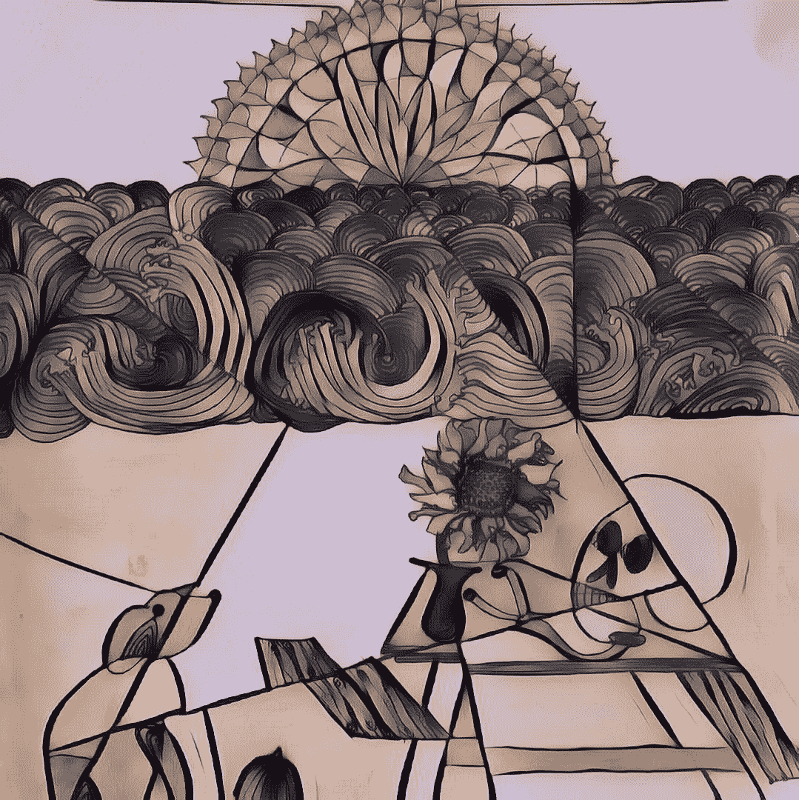

# 这就是为什么每个人都应该有自己的老鼠

> 原文：<https://medium.com/swlh/this-is-why-everyone-should-have-their-rat-f5a7217774ac>

和其他精神病学的故事。

VANITAS by Ruinarte

在精神健康领域工作，我们看到的事物有不同的规律。有些人病得很重，有些人病得很重，还有些人一成不变地寻找答案。后者可以同时具备前者的两种品质，也可以两者都不具备。这个答案有不同的形式。对一些人来说，它是药片的形状，对另一些人来说，它是一个他们觉得可能有帮助的标签…