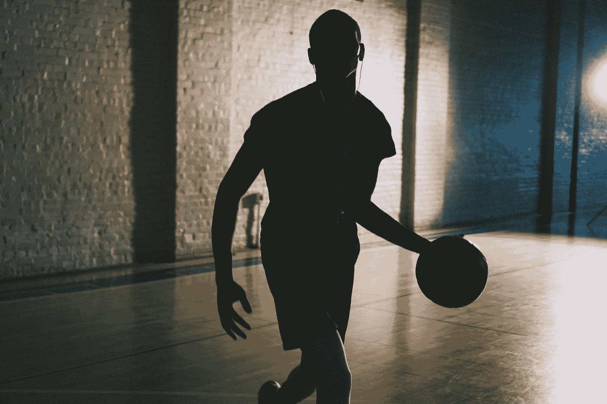

# 这就是为什么我讨厌自我怀疑

> 原文：<https://medium.com/swlh/this-is-why-i-hate-self-doubt-7d03866163f1>

## 承认这个过程是艰难的，会让旅程变得轻松一些。

Photo by [Tom Pottiger](https://unsplash.com/@tompottiger?utm_source=medium&utm_medium=referral) on [Unsplash](https://unsplash.com?utm_source=medium&utm_medium=referral)

我十几岁的时候在运动中度过。这是我从小就过的生活。然而，随着时间的推移，我开始讨厌那种生活。不是这项运动，而是球队的指挥者。这是高中篮球挑战自信的一部分…